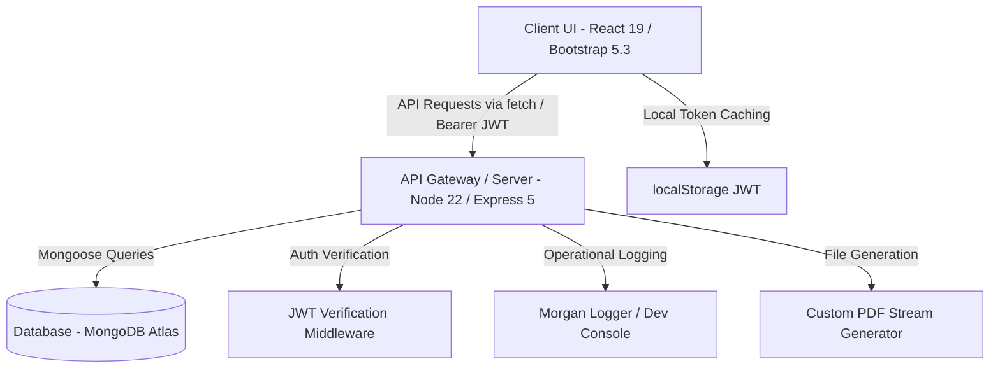
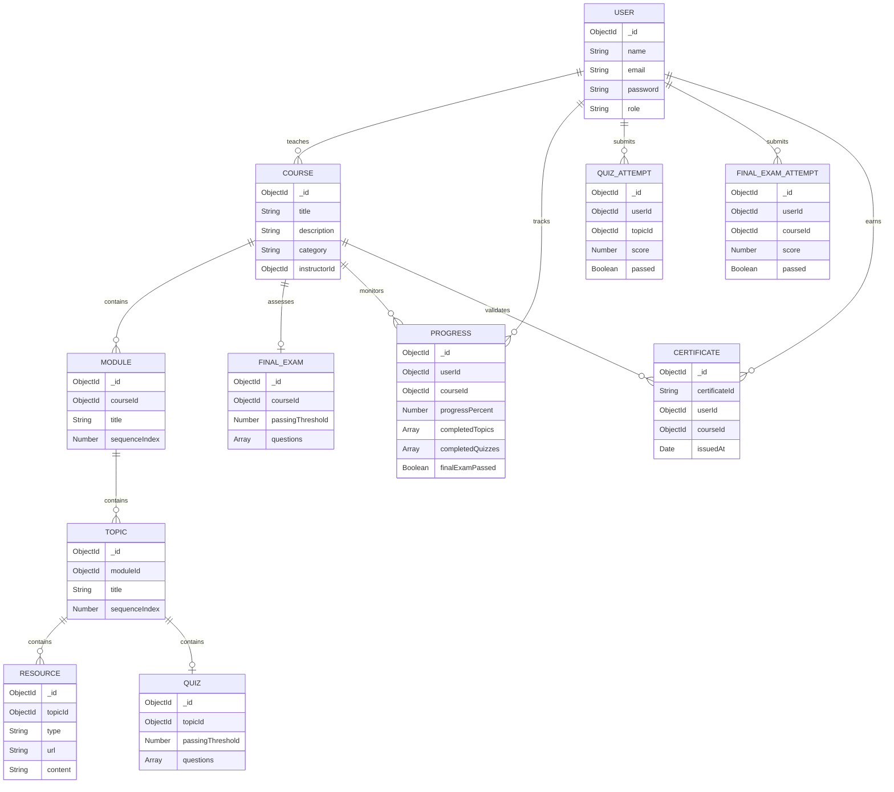

# LMS System Architectural & Structural Analysis Report
**Prepared by:** Senior Software Architect  
**Project:** Learning Management System (LMS)  
**Date:** June 17, 2026

---

## 1. Executive Summary

### Overall System Health: 4.5 / 10
The Learning Management System (LMS) has a clean, decoupled logical structure based on the MVC design pattern, utilizing a modern web stack (React 19 + Bootstrap 5.3 in the frontend; Node.js 22 + Express 5 in the backend; MongoDB Atlas in the database layer). However, the implementation is currently in a fragile, pre-production state. The backend is riddled with architectural shortcutting—such as manually dropping critical unique email indexes upon database connection, performing resource-intensive calculations in Node memory instead of using database aggregation engines, and deploying a brittle custom PDF binary byte builder. 

On the frontend, pages show visual maturity but suffer from code bloatedness, inline `<style>` injections inside render loops, lack of debouncing on inputs, and raw browser `alert()` popups. In addition, the frontend test suite has been checked in with a 100% recorded failure rate in its log.

### Key Focus Areas before Feature Addition
1. **Security Hardening**: Re-introduce database constraints for emails, sanitize CRUD API payloads against NoSQL Injection, and introduce rate limiting on authentication routes.
2. **Performance Optimization**: Move analytics calculations from in-memory JavaScript processing to optimized MongoDB aggregation queries. Introduce input debouncing for course viewer personal notes.
3. **Refactoring Code Quality**: Relocate inline style blocks to `index.css` and replace the custom PDF builder with a reliable library. Split the bloated 1,000+ line `CourseViewer.jsx` into smaller, focused components.

---

## 2. System Architecture Overview

The system is deployed as a classic decoupled client-server architecture with an external MongoDB cloud cluster:

### 1. Frontend Layer
* **Framework**: React 19, initialized with Vite.
* **Styling**: Bootstrap 5.3 + custom styles in `index.css`.
* **State Management**: Context API (`AuthContext.jsx` for user sessions; `ProgressContext.jsx` for enrollment state).
* **Routing**: Client-side routing managed by `react-router-dom` with role-based route guards (`ProtectedRoute` & `GuestRoute` inside `App.jsx`).

### 2. Backend Layer
* **Runtime**: Node.js 22 LTS with Express.js 5 framework.
* **Structure**: Model-View-Controller (MVC) with separating routes (`src/routes`), controllers (`src/controllers`), services (`src/services`), and models (`src/models`).
* **Security & Utility Middlewares**: Morgan (request logging), CORS (Cross-Origin Resource Sharing), Helmet (HTTP security headers), `authMiddleware` (JWT verification & role enforcement), and `validator` (NoSQL Injection filter and parameter verification).

### 3. Database Layer
* **Technology**: MongoDB Atlas cloud cluster.
* **Object Mapping**: Mongoose schemas enforcing constraints, relational references, and auto-generated timestamps.

### 4. Authentication Flow
Authentication is managed via stateless JSON Web Tokens (JWT). Upon registration or login, the server issues a JWT signed with the `JWT_SECRET` (which defaults to `'secret'` if not provided in env). The token contains the user's Mongoose `_id` and `role`. The frontend caches this token in `localStorage`, appending it as a `Bearer` token in the `Authorization` header of all subsequent API calls via `apiRequest` in `frontend/src/services/api.js`.

---

## 3. Feature & Module Inventory

The application contains six core modules. Below is a complete structural inventory mapping each feature to its UI pages, backend controllers, Mongoose models, and routing endpoints:

### Module 1: User Onboarding and Authentication

#### Feature 1.1: User Registration
* **Frontend UI**: [Register.jsx](file:///Users/apple/ai-assistant-coding/09JunePractice/LMS/frontend/src/pages/Auth/Register.jsx)
* **Backend Route**: `POST /api/auth/register` in [authRoutes.js](file:///Users/apple/ai-assistant-coding/09JunePractice/LMS/backend/src/routes/authRoutes.js#L11)
* **Controller**: `authController.register` in [authController.js](file:///Users/apple/ai-assistant-coding/09JunePractice/LMS/backend/src/controllers/authController.js)
* **Service**: `authService.register` in [authService.js](file:///Users/apple/ai-assistant-coding/09JunePractice/LMS/backend/src/services/authService.js)
* **Mongoose Model**: `User` in [User.js](file:///Users/apple/ai-assistant-coding/09JunePractice/LMS/backend/src/models/User.js)
* **Logic**: Saves `name`, `email`, hashes `password` using `bcrypt` (10 rounds) in pre-save hook, and assigns the role (`Learner` or `Instructor`).

#### Feature 1.2: User Login
* **Frontend UI**: [Login.jsx](file:///Users/apple/ai-assistant-coding/09JunePractice/LMS/frontend/src/pages/Auth/Login.jsx) & [InstructorLogin.jsx](file:///Users/apple/ai-assistant-coding/09JunePractice/LMS/frontend/src/pages/Auth/InstructorLogin.jsx)
* **Backend Route**: `POST /api/auth/login` in [authRoutes.js](file:///Users/apple/ai-assistant-coding/09JunePractice/LMS/backend/src/routes/authRoutes.js#L12)
* **Controller**: `authController.login` in [authController.js](file:///Users/apple/ai-assistant-coding/09JunePractice/LMS/backend/src/controllers/authController.js)
* **Service**: `authService.login` in [authService.js](file:///Users/apple/ai-assistant-coding/09JunePractice/LMS/backend/src/services/authService.js)
* **Mongoose Model**: `User` in [User.js](file:///Users/apple/ai-assistant-coding/09JunePractice/LMS/backend/src/models/User.js)
* **Logic**: Compares password via `bcrypt.compare`. Generates JWT token containing `{ id, role }`.

#### Feature 1.3: User Profile Management
* **Frontend UI**: [Profile.jsx](file:///Users/apple/ai-assistant-coding/09JunePractice/LMS/frontend/src/pages/Auth/Profile.jsx) & [InstructorSettings.jsx](file:///Users/apple/ai-assistant-coding/09JunePractice/LMS/frontend/src/pages/Auth/InstructorSettings.jsx)
* **Backend Route**: `GET /api/auth/profile` and `PUT /api/auth/profile` in [authRoutes.js](file:///Users/apple/ai-assistant-coding/09JunePractice/LMS/backend/src/routes/authRoutes.js#L13-L14)
* **Controller**: `authController.getProfile` & `authController.updateProfile`
* **Service**: `authService.getProfile` & `authService.updateProfile`
* **Mongoose Model**: `User` in [User.js](file:///Users/apple/ai-assistant-coding/09JunePractice/LMS/backend/src/models/User.js)
* **Logic**: Enforces role restrictions; retrieves or updates name/email details, throwing validation errors if payload is invalid.

---

### Module 2: Course & Curriculum Management

#### Feature 2.1: Course Creation and Management
* **Frontend UI**: [CourseCreator.jsx](file:///Users/apple/ai-assistant-coding/09JunePractice/LMS/frontend/src/pages/Course/CourseCreator.jsx) & [CourseManagement.jsx](file:///Users/apple/ai-assistant-coding/09JunePractice/LMS/frontend/src/pages/Course/CourseManagement.jsx)
* **Backend Route**: `POST /api/courses`, `PUT /api/courses/:id`, `DELETE /api/courses/:id` in [courseRoutes.js](file:///Users/apple/ai-assistant-coding/09JunePractice/LMS/backend/src/routes/courseRoutes.js#L9-L12)
* **Controller**: `courseController.createCourse`, `courseController.updateCourse`, `courseController.deleteCourse` in [courseController.js](file:///Users/apple/ai-assistant-coding/09JunePractice/LMS/backend/src/controllers/courseController.js)
* **Service**: `courseService` in [courseService.js](file:///Users/apple/ai-assistant-coding/09JunePractice/LMS/backend/src/services/courseService.js)
* **Mongoose Model**: `Course` in [Course.js](file:///Users/apple/ai-assistant-coding/09JunePractice/LMS/backend/src/models/Course.js)
* **Logic**: Implements course details CRUD operations, verifying that only the owning instructor can modify or delete. Deleting a course triggers cascade deletes for all modules, topics, resources, and progress lists.

#### Feature 2.2: Curriculum Design
* **Frontend UI**: [CourseBuilder.jsx](file:///Users/apple/ai-assistant-coding/09JunePractice/LMS/frontend/src/pages/Course/CourseBuilder.jsx), [CreateModuleTopic.jsx](file:///Users/apple/ai-assistant-coding/09JunePractice/LMS/frontend/src/pages/Course/CreateModuleTopic.jsx), [CurriculumReorder.jsx](file:///Users/apple/ai-assistant-coding/09JunePractice/LMS/frontend/src/pages/Course/CurriculumReorder.jsx), [ModuleManagement.jsx](file:///Users/apple/ai-assistant-coding/09JunePractice/LMS/frontend/src/pages/Course/ModuleManagement.jsx), & [GlobalModuleManagement.jsx](file:///Users/apple/ai-assistant-coding/09JunePractice/LMS/frontend/src/pages/Course/GlobalModuleManagement.jsx)
* **Backend Route**: `POST /api/courses/:id/modules`, `PUT /api/modules/:moduleId`, `DELETE /api/modules/:moduleId`, `PUT /api/courses/:id/curriculum/reorder`, `POST /api/modules/:moduleId/topics` in [courseRoutes.js](file:///Users/apple/ai-assistant-coding/09JunePractice/LMS/backend/src/routes/courseRoutes.js#L15-L19)
* **Controller**: `courseController` functions
* **Service**: `courseService` functions
* **Mongoose Models**: `Module` in [Module.js](file:///Users/apple/ai-assistant-coding/09JunePractice/LMS/backend/src/models/Module.js) & `Topic` in [Topic.js](file:///Users/apple/ai-assistant-coding/09JunePractice/LMS/backend/src/models/Topic.js)
* **Logic**: Handles structural grouping of courses. Sequence indexes are saved explicitly to determine order.

#### Feature 2.3: Content & Resource Management
* **Frontend UI**: [ResourceManagement.jsx](file:///Users/apple/ai-assistant-coding/09JunePractice/LMS/frontend/src/pages/Course/ResourceManagement.jsx)
* **Backend Route**: `POST /api/topics/:topicId/resources`, `PUT /api/resources/:id` in [courseRoutes.js](file:///Users/apple/ai-assistant-coding/09JunePractice/LMS/backend/src/routes/courseRoutes.js#L22-L23)
* **Controller**: `courseController.addResource` & `courseController.updateResource`
* **Service**: `courseService.addResource` & `courseService.updateResource`
* **Mongoose Model**: `Resource` in [Resource.js](file:///Users/apple/ai-assistant-coding/09JunePractice/LMS/backend/src/models/Resource.js)
* **Logic**: Links resources (Video, Notes, Document, Reference) to a Topic. Enforces format limits (URLs must have `http:`/`https:` protocol; Notes must contain string content).

---

### Module 3: Enrollment & Progress Tracking

#### Feature 3.1: Course Discovery and Enrollment
* **Frontend UI**: [CourseCatalog.jsx](file:///Users/apple/ai-assistant-coding/09JunePractice/LMS/frontend/src/pages/Course/CourseCatalog.jsx), [CourseDetails.jsx](file:///Users/apple/ai-assistant-coding/09JunePractice/LMS/frontend/src/pages/Course/CourseDetails.jsx), & [EnrollmentSuccessful.jsx](file:///Users/apple/ai-assistant-coding/09JunePractice/LMS/frontend/src/pages/Course/EnrollmentSuccessful.jsx)
* **Backend Route**: `POST /api/courses/:id/enroll` in [progressRoutes.js](file:///Users/apple/ai-assistant-coding/09JunePractice/LMS/backend/src/routes/progressRoutes.js#L8)
* **Controller**: `progressController.enroll` in [progressController.js](file:///Users/apple/ai-assistant-coding/09JunePractice/LMS/backend/src/controllers/progressController.js)
* **Service**: `progressService.enrollInCourse` in [progressService.js](file:///Users/apple/ai-assistant-coding/09JunePractice/LMS/backend/src/services/progressService.js)
* **Mongoose Model**: `Progress` in [Progress.js](file:///Users/apple/ai-assistant-coding/09JunePractice/LMS/backend/src/models/Progress.js)
* **Logic**: Creates a `Progress` document initializing `progressPercent: 0`, linking the `userId` and `courseId`.

#### Feature 3.2: Learner Progress Tracking
* **Frontend UI**: [LearnerDashboard.jsx](file:///Users/apple/ai-assistant-coding/09JunePractice/LMS/frontend/src/pages/Dashboard/LearnerDashboard.jsx) & [CourseViewer.jsx](file:///Users/apple/ai-assistant-coding/09JunePractice/LMS/frontend/src/pages/Course/CourseViewer.jsx)
* **Backend Route**: `GET /api/courses/:id/progress` and `POST /api/topics/:topicId/complete` in [progressRoutes.js](file:///Users/apple/ai-assistant-coding/09JunePractice/LMS/backend/src/routes/progressRoutes.js#L9-L10)
* **Controller**: `progressController.getProgress` & `progressController.completeTopic`
* **Service**: `progressService.getCourseProgress` & `progressService.markTopicComplete`
* **Mongoose Model**: `Progress` in [Progress.js](file:///Users/apple/ai-assistant-coding/09JunePractice/LMS/backend/src/models/Progress.js)
* **Logic**: Tracks completed topics list. Percentage complete is recalculated as: `Math.round((completedTopics.length / totalTopics) * 100)`.

#### Feature 3.3: Sequential Access & Locking System
* **Frontend UI**: [CourseViewer.jsx](file:///Users/apple/ai-assistant-coding/09JunePractice/LMS/frontend/src/pages/Course/CourseViewer.jsx) navigation sidebar.
* **Backend Route**: Server validation inside `progressService.getTopicDetails`, `progressService.markTopicComplete`, `progressService.getTopicAssessment`, and `progressService.submitQuizAssessment`.
* **Logic**: Topics are ordered based on Module index and Topic index. The server fetches this ordering (`getSortedCourseTopics`). If a user attempts to access Topic index $N$, the server verifies that Topic $0$ through $N-1$ are present in the user's `completedTopics` field. Access is blocked with a `403 Forbidden` error if any pre-requisites are missing.

---

### Module 4: Evaluation Engine

#### Feature 4.1: Topic-Level Quiz Assessments
* **Frontend UI**: [QuizInterface.jsx](file:///Users/apple/ai-assistant-coding/09JunePractice/LMS/frontend/src/pages/Course/QuizInterface.jsx) & [AssessmentResults.jsx](file:///Users/apple/ai-assistant-coding/09JunePractice/LMS/frontend/src/pages/Course/AssessmentResults.jsx)
* **Backend Route**: `GET /api/topics/:topicId/assessment` and `POST /api/topics/:topicId/assessment/submit` in [progressRoutes.js](file:///Users/apple/ai-assistant-coding/09JunePractice/LMS/backend/src/routes/progressRoutes.js#L14-L15)
* **Controller**: `progressController.getTopicAssessment` & `progressController.submitQuizAssessment`
* **Service**: `progressService` helpers
* **Mongoose Models**: `Quiz` in [Quiz.js](file:///Users/apple/ai-assistant-coding/09JunePractice/LMS/backend/src/models/Quiz.js) & `QuizAttempt` in [QuizAttempt.js](file:///Users/apple/ai-assistant-coding/09JunePractice/LMS/backend/src/models/QuizAttempt.js)
* **Logic**: Evaluates array of answers. Computes grade score percentage. Logs the attempt. If grade score exceeds `passingThreshold`, the topic is pushed into `completedTopics`.

#### Feature 4.2: Course-Level Final Examination
* **Frontend UI**: [FinalExamReady.jsx](file:///Users/apple/ai-assistant-coding/09JunePractice/LMS/frontend/src/pages/Course/FinalExamReady.jsx) & [FinalExam.jsx](file:///Users/apple/ai-assistant-coding/09JunePractice/LMS/frontend/src/pages/Course/FinalExam.jsx)
* **Backend Route**: `GET /api/courses/:id/final-exam` and `POST /api/courses/:id/final-exam/submit` in [progressRoutes.js](file:///Users/apple/ai-assistant-coding/09JunePractice/LMS/backend/src/routes/progressRoutes.js#L16-L17)
* **Controller**: `progressController.getFinalExam` & `progressController.submitFinalExam`
* **Service**: `progressService` helpers
* **Mongoose Models**: `FinalExam` in [FinalExam.js](file:///Users/apple/ai-assistant-coding/09JunePractice/LMS/backend/src/models/FinalExam.js) & `FinalExamAttempt` in [FinalExamAttempt.js](file:///Users/apple/ai-assistant-coding/09JunePractice/LMS/backend/src/models/FinalExamAttempt.js)
* **Logic**: Locked until all curriculum topics are completed. Evaluates final exam questions; if score exceeds threshold, updates `progress.finalExamPassed = true`, rendering the user certificate-eligible.

---

### Module 5: Certification Management

#### Feature 5.1: Automatic Certificate Generation and Download
* **Frontend UI**: [CourseCompletion.jsx](file:///Users/apple/ai-assistant-coding/09JunePractice/LMS/frontend/src/pages/Course/CourseCompletion.jsx) & [CourseCertificate.jsx](file:///Users/apple/ai-assistant-coding/09JunePractice/LMS/frontend/src/pages/Course/CourseCertificate.jsx)
* **Backend Route**: `GET /api/courses/:id/certificate` in [progressRoutes.js](file:///Users/apple/ai-assistant-coding/09JunePractice/LMS/backend/src/routes/progressRoutes.js#L18)
* **Controller**: `progressController.getCertificate`
* **Service**: `certificateService.generateCertificatePDF` in [certificateService.js](file:///Users/apple/ai-assistant-coding/09JunePractice/LMS/backend/src/services/certificateService.js)
* **Mongoose Model**: `Certificate` in [Certificate.js](file:///Users/apple/ai-assistant-coding/09JunePractice/LMS/backend/src/models/Certificate.js)
* **Logic**: Confirms progress and final exam pass status. Creates a unique `Certificate` record mapping the user, course, unique identifier, and date. Generates raw PDF bytes utilizing [pdfGenerator.js](file:///Users/apple/ai-assistant-coding/09JunePractice/LMS/backend/src/utils/pdfGenerator.js) and returns a binary PDF file stream for download.

---

### Module 6: Progress & Analytics Dashboard

#### Feature 6.1: Instructor Progress & Performance Analytics
* **Frontend UI**: [InstructorDashboard.jsx](file:///Users/apple/ai-assistant-coding/09JunePractice/LMS/frontend/src/pages/Dashboard/InstructorDashboard.jsx) & [CourseAnalytics.jsx](file:///Users/apple/ai-assistant-coding/09JunePractice/LMS/frontend/src/pages/Course/CourseAnalytics.jsx)
* **Backend Route**: `GET /api/courses/:id/analytics` in [courseRoutes.js](file:///Users/apple/ai-assistant-coding/09JunePractice/LMS/backend/src/routes/courseRoutes.js#L26)
* **Controller**: `analyticsController.getCourseAnalytics` in [analyticsController.js](file:///Users/apple/ai-assistant-coding/09JunePractice/LMS/backend/src/controllers/analyticsController.js)
* **Mongoose Model**: Evaluated via in-memory aggregates of `Progress`, `User`, `QuizAttempt`, and `FinalExamAttempt`.
* **Logic**: Compiles enrollment details, course completion rate average, average topic quiz grades, and average final exam grades for the course dashboard.

---

## 4. Database Summary

The database uses structured schemas with targeted references. Below is the relational structure of the MongoDB collections:

### Relational Schema Definitions

1. **User Schema**: Enforces unique lowercase trim strings on email addresses. Encapsulates passwords hashed with `bcrypt`.
2. **Course Schema**: Root of curriculum. Holds reference to the `instructorId` from `User`.
3. **Module Schema**: Relates to `Course` (`courseId`). Order determined by `sequenceIndex`.
4. **Topic Schema**: Relates to `Module` (`moduleId`). Order determined by `sequenceIndex`.
5. **Resource Schema**: Relates to `Topic`. Schema includes conditional validators: `URL` is required unless the resource is of type `Notes`, and `content` is required only for `Notes`.
6. **Quiz Schema**: 1-to-1 relationship with `Topic` (`topicId`). Contains embedded sub-document array for questions.
7. **QuizAttempt Schema**: Relates to both `User` and `Topic`. Stores grades and completion flags.
8. **FinalExam Schema**: 1-to-1 relationship with `Course` (`courseId`). Contains course evaluation questions.
9. **FinalExamAttempt Schema**: Relates to `User` and `Course`.
10. **Progress Schema**: Evaluates progress state. Contains a compound index `{ userId: 1, courseId: 1 }` to guarantee unique enrollments per learner.
11. **Certificate Schema**: Stores generated completion records. Contains unique indexes to prevent double certificates.

---

## 5. Technical Debt & Risk Report

A thorough review of the current implementation highlights several vulnerabilities, inefficiencies, and code quality concerns that should be resolved:

### 1. Security Flaws (Critical Risk)
* **Index Deletion Hack on Startup**: In [db.js](file:///Users/apple/ai-assistant-coding/09JunePractice/LMS/backend/src/config/db.js#L9), the backend explicitly drops the `email_1` unique database index on startup. Furthermore, [User.js](file:///Users/apple/ai-assistant-coding/09JunePractice/LMS/backend/src/models/User.js#L10-L17) omits the `unique: true` constraint. This enables multiple registrations using the same email address, resulting in account collision and login hijackings.
* **Missing Rate Limiting**: The project lacks rate limiting. No packages (such as `express-rate-limit`) are present in `package.json` or initialized in `app.js`, leaving login and registration vulnerable to brute-force credential attacks.
* **API Validation Gaps**: Input validation for NoSQL query injections (`validateRegister`, `validateLogin` in [validator.js](file:///Users/apple/ai-assistant-coding/09JunePractice/LMS/backend/src/middlewares/validator.js)) is applied only on authentication routes. Course creation, modules, topics, and resources lack parameters sanitization.
* **JWT Storage in localStorage**: Storing authorization tokens in browser localStorage makes the frontend vulnerable to token hijacking if cross-site scripting (XSS) occurs.

### 2. Performance & Scalability Issues (Medium-High Risk)
* **In-Memory Analytics Computations**: In [analyticsController.js](file:///Users/apple/ai-assistant-coding/09JunePractice/LMS/backend/src/controllers/analyticsController.js), the backend executes a mock aggregation call but completes all actual calculations (completion percentages, average exam and quiz scores) in Node application memory. It loads full database arrays of enrollments and attempts via `.find()`. As enrollment increases, this design will exhaust memory and block the Node process event loop.
* **Lack of Text Debouncing**: In `CourseViewer.jsx`, the personal notes input textarea updates the local state on every keystroke. This causes full re-renders of the large 1,000+ line component, introducing input lag on lower-powered devices.
* **Missing Database Indexes**: There are no explicit database indexes for foreign reference keys like `moduleId` (in Topic) and `topicId` (in Resource), leading to collection scans as database size grows.

### 3. Code Quality, Integrity & Architecture (Medium Risk)
* **Brittle PDF Byte builder**: [pdfGenerator.js](file:///Users/apple/ai-assistant-coding/09JunePractice/LMS/backend/src/utils/pdfGenerator.js) manually compiles PDF files by arranging raw byte positions, stream bodies, and cross-reference offsets. Any change in character encoding, special symbols, or parenthesis inside a user name or course title will corrupt the byte offsets, breaking the PDF structural formatting.
* **Bloated Front-End Components**: [CourseViewer.jsx](file:///Users/apple/ai-assistant-coding/09JunePractice/LMS/frontend/src/pages/Course/CourseViewer.jsx) is nearly 1,100 lines long, combining layout, sidebars, markdown text parsing, iframe rendering, and exam submission logic.
* **Inline styles in React render loops**: Pages like `Login.jsx` and `CourseDetails.jsx` define styled string variables and inject them inside render loops using `<style>` tags. This forces the browser rendering engine to rebuild CSS OM trees on every state update.
* **Crude Alerts and Confirmations**: Critical user actions (such as deletion or error dialogues) trigger raw browser `alert()` and `confirm()` blocks. This degrades the user experience.

### 4. Testing Suite Failures
* **Frontend Tests checked in as Failed**: The file [frontend-test-log.md](file:///Users/apple/ai-assistant-coding/09JunePractice/LMS/frontendbackup/frontend-test-log.md) registers a 100% failure rate for frontend tests. This indicates test configurations (such as mock routers and JSDOM environments in Vitest) have desynchronized.
* **Mocked Backend Aggregations**: The 130 passing backend tests rely on extensive database mocks, masking the performance degradation present in the in-memory aggregate controller logic.

---

## 6. Impact Analysis for Future Enhancements

As detailed in the `docs/brd_new_features.md`, the client requires five additional features. Below is the architectural impact analysis, detailing which existing systems, schemas, and routes will be affected by these additions:

### 1. Unified Course Announcement System
* **Required Backend Schema**: Create an `Announcement` model (referencing `Course` and `User`).
* **Existing Backend Routes Affected**: Add `POST /api/courses/:id/announcements` and `GET /api/courses/:id/announcements`.
* **Frontend Impact**:
  * **Instructor side**: Update `CourseBuilder.jsx` or course dashboards to include an announcement creation widget with priorities (`Info`, `Warning`, `Urgent`).
  * **Learner side**: Add a notifications bell dropdown in [Navbar.jsx](file:///Users/apple/ai-assistant-coding/09JunePractice/LMS/frontend/src/components/common/Navbar.jsx). Add rendering logic inside [CourseViewer.jsx](file:///Users/apple/ai-assistant-coding/09JunePractice/LMS/frontend/src/pages/Course/CourseViewer.jsx) to display flashing top-banner alerts for `Urgent` announcements.
* **Risk & Dependencies**: Need to handle notification dismissals (could store dismissed announcement IDs in the user schema or local storage to prevent banner fatigue).

### 2. Assignment Grading & Feedback Portal
* **Required Backend Schemas**: Create `Assignment` (linked to `Topic`) and `Submission` (linked to `Assignment` and `User`) models.
* **Existing Backend Routes Affected**: Add endpoints to create/update assignments (instructors), upload files (learners), list student submissions (instructors), and save grading outcomes.
* **Frontend Impact**:
  * **Learner side**: Integrate file-uploader elements inside `CourseViewer.jsx` on topics containing assignments. Restrictions (PDF, ZIP, DOC formats up to 10MB) must be validated. Build a "Grades Center" tab in the Learner Dashboard.
  * **Instructor side**: Build a grading dashboard within the course creator portal.
* **Risk & Dependencies**: Storage of student submissions (PDF/ZIP files). Relying on local storage for files is impossible; an uploads folder on the server or cloud storage integration (such as AWS S3 or Cloudinary) is necessary. High security risk from malicious uploads.

### 3. Topic-Specific Q&A & Doubt Resolver
* **Required Backend Schema**: Create `Doubt` model (linked to `Topic` and `User`) tracking an array of nested answers.
* **Existing Backend Routes Affected**: Add endpoints to submit doubts, retrieve thread lists for a topic, and submit answers (instructors marking official responses).
* **Frontend Impact**:
  * **Learner side**: Add a collapsible sidebar drawer widget in `CourseViewer.jsx` containing the search field and Q&A chat layout.
  * **Instructor side**: Create a central "Doubt Alert Center" listing unresolved doubts in [InstructorDashboard.jsx](file:///Users/apple/ai-assistant-coding/09JunePractice/LMS/frontend/src/pages/Dashboard/InstructorDashboard.jsx).
* **Risk & Dependencies**: In-app performance degradation if chat threads load synchronously on every topic navigation. Queries must be paginated.

### 4. Interactive Quiz Feedback & Explanations
* **Required Backend Schema updates**:
  * Update `Quiz.js` to add an optional `explanation` string to each question object.
  * Update `Quiz` to include a release rule status enum: `['Always', 'OnPassing', 'AfterDeadline']`.
* **Existing Backend Routes Affected**: Update quiz submission evaluation (`submitQuizAssessment` in [progressService.js](file:///Users/apple/ai-assistant-coding/09JunePractice/LMS/backend/src/services/progressService.js#L220)) to conditionally return the questions explanation based on the release rule.
* **Frontend Impact**:
  * Update [AssessmentBuilder.jsx](file:///Users/apple/ai-assistant-coding/09JunePractice/LMS/frontend/src/pages/Course/AssessmentBuilder.jsx) (Instructor) to accept explanation inputs.
  * Update [AssessmentResults.jsx](file:///Users/apple/ai-assistant-coding/09JunePractice/LMS/frontend/src/pages/Course/AssessmentResults.jsx) (Learner) to render the explanation alongside missed questions.
* **Risk & Dependencies**: Explanations must not leak to the client if the user fails the quiz and needs to retake it (unless configured in release rules). This requires careful server-side screening.

### 5. Gamification and Custom Badges
* **Required Backend Schema**: Create a `Badge` schema (linked to `Course` with titles, descriptions, and criteria trigger rules).
* **Existing Backend Routes Affected**: Add endpoints to fetch unlocked badges. Integrate checks inside `submitQuizAssessment` and `submitFinalExam` to trigger badge unlocks when goals are met.
* **Frontend Impact**:
  * Add Toast notifications in the UI for badge unlocks.
  * Update [Profile.jsx](file:///Users/apple/ai-assistant-coding/09JunePractice/LMS/frontend/src/pages/Auth/Profile.jsx) to display a grid of earned badges.
* **Risk & Dependencies**: Badges need pre-defined trigger checking code. The logic must be decoupled to prevent performance lag during exam submissions.

---

## 7. Reusable Modules & Architectural Strengths

Despite its technical debt, the application has several modular elements that will simplify the implementation of future features:

1. **Role Verification Guard (`verifyRole`)**: The middleware in [authMiddleware.js](file:///Users/apple/ai-assistant-coding/09JunePractice/LMS/backend/src/middlewares/authMiddleware.js) allows role-based route locking. This is reusable for restricting new instructor dashboards and student grading portals.
2. **Unified API Client (`apiRequest`)**: The frontend `apiRequest` in [api.js](file:///Users/apple/ai-assistant-coding/09JunePractice/LMS/frontend/src/services/api.js) automatically injects JWT credentials and handles errors, making integration of new feature requests quick and consistent.
3. **Sequential Logic Solver (`getSortedCourseTopics`)**: Located in [progressService.js](file:///Users/apple/ai-assistant-coding/09JunePractice/LMS/backend/src/services/progressService.js#L12), this function resolves topic ordering and handles dependency checks. It is reusable for locked features (like badges or assignments).
4. **Structured Error Wrapper (`AppError` & `errorMiddleware`)**: The central error handling patterns on the backend ensure that database or validation issues do not leak stack traces to the client.

---

## 8. Summary of Architectural Decisions & Recommendations

To maintain codebase health during phase 2 development, we recommend implementing the following actions:

1. **Pre-requisite Refactoring (Immediate)**:
   * **Fix database constraints**: Set `unique: true` on email indexes in Mongoose and remove the startup index drop in [db.js](file:///Users/apple/ai-assistant-coding/09JunePractice/LMS/backend/src/config/db.js).
   * **Align HTTP codes**: Update auth failure codes from `410` to `401`.
   * **Optimize Analytics**: Convert the analytics controllers from JavaScript loops to native MongoDB aggregate pipelines.
2. **File Storage Strategy**: Before implementing the Assignment Portal, decide on a storage strategy (such as integrating Amazon S3 or a local server upload directory) to handle file submissions.
3. **Modularize Frontend**: Extract `QuizBoard` and auxiliary views from the massive `CourseViewer.jsx` into separate components before adding the doubt-drawer code.
