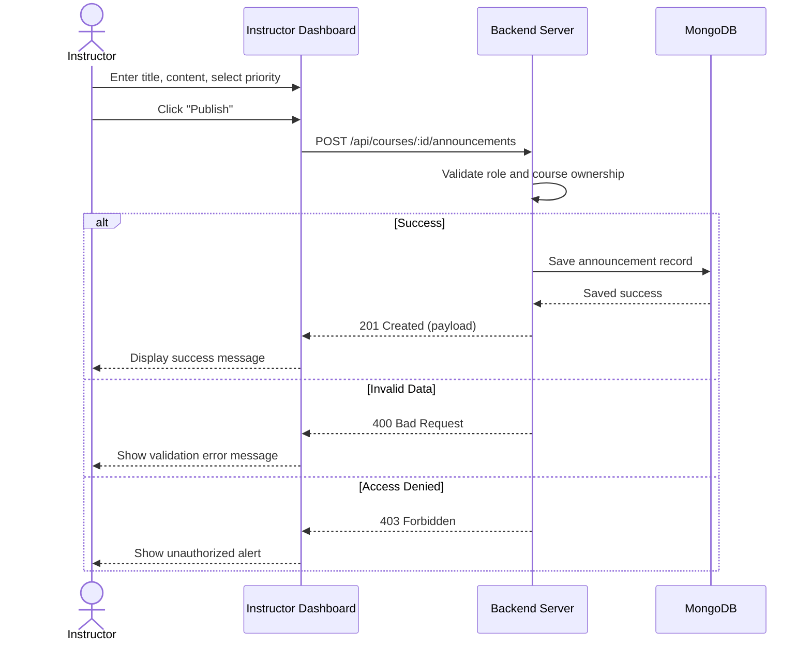

# User Flow 01: Course Announcement Creation

## 1. Actors
* Primary Actor: **Instructor**
* Supporting Systems: **LMS Database (MongoDB)**, **Notification Delivery System**

## 2. Preconditions
1. The instructor is authenticated and has a valid JWT session.
2. The instructor owns the specified course.
3. The parent course must exist in the database.

## 3. Main Success Flow
1. The instructor navigates to their Course Dashboard.
2. The instructor clicks the "Create Announcement" button.
3. The instructor inputs a Title, Content, and selects a Priority level (`Info`, `Warning`, or `Urgent`).
4. The instructor clicks "Publish".
5. The system validates the inputs, records the current timestamp, and saves the new announcement.
6. The system alerts enrolled students by incrementing notification indicators on their navigation headers.

## 4. Alternate Flows
* **A1: Draft Mode / Cancel**: The instructor clicks "Cancel" instead of "Publish". The inputs are discarded, and the instructor returns to the Course Dashboard.

## 5. Exception Flows
* **E1: Unauthorised User**: A user without Instructor role attempts to invoke the creation API. The server responds with `403 Forbidden` and blocks the write.
* **E2: Missing Title/Content**: The instructor attempts to submit with blank inputs. The frontend flags validation warnings; if bypassed, the backend responds with `400 Bad Request`.
* **E3: Non-Owner Alteration**: An instructor who does not own the course attempts to publish. The system responds with `403 Forbidden`.

## 6. Business Rules
* The announcement Title must be between 3 and 100 characters.
* The announcement Content must be between 10 and 1000 characters.
* The Priority level must be exactly one of: `Info`, `Warning`, or `Urgent`.

## 7. Screens Involved
* **Course Creator / Builder Dashboard**
* **Announcement Editor Modal**

## 8. API Touchpoints
* `POST /api/courses/:id/announcements`

## 9. Notifications/Events
* **Notification Broadcast Event**: An async task registers notification log rows matching user enrollments.

## 10. KPI References
* **KPI-F02**: Notification Delivery Success (Target: 100%)
* **SLA Target**: Standard Write Routes (P95 < 300ms)

## 11. User Flow Diagram

