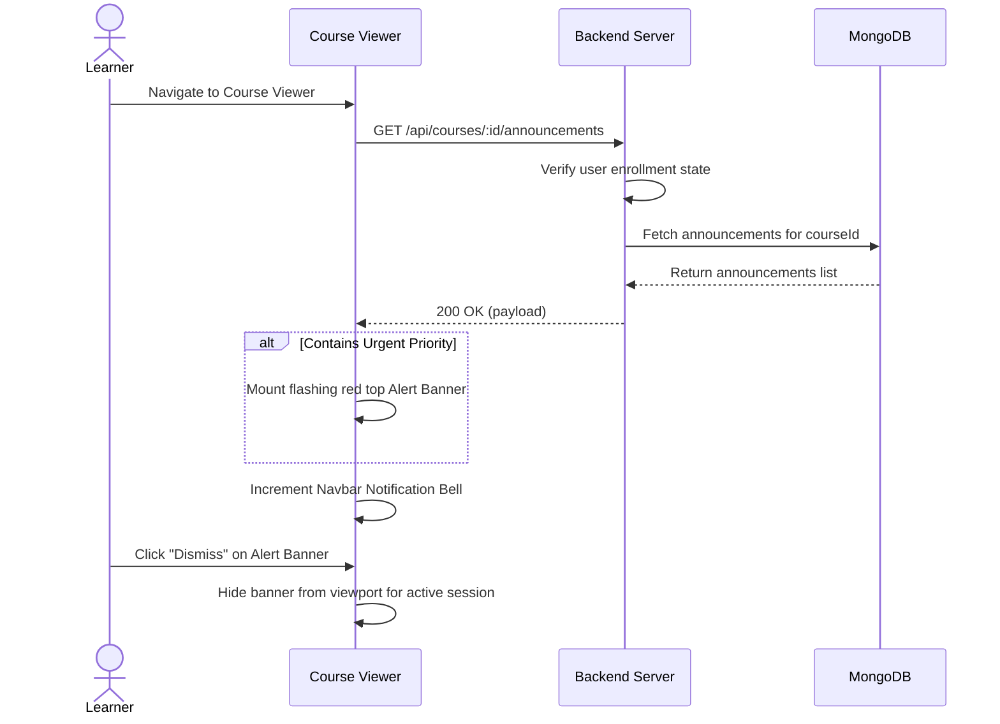

# User Flow 02: Course Announcement Display and Dismissal

## 1. Actors
* Primary Actor: **Learner**
* Supporting Systems: **LMS Frontend Client**, **LMS Database (MongoDB)**

## 2. Preconditions
1. The learner is logged in and has a valid JWT session.
2. The learner is enrolled in the specified course.

## 3. Main Success Flow
1. The learner loads the Course Viewer page.
2. The page fires an API call to retrieve active course announcements.
3. The system detects an announcement with `Urgent` priority.
4. The frontend mounts a flashing red alert banner at the top of the viewport.
5. The Navbar Bell notifications indicator increment count by 1.
6. The learner reads the announcement.
7. The learner clicks the "Dismiss" close icon on the banner.
8. The client state updates, hiding the banner for the rest of the learner's active session.

## 4. Alternate Flows
* **A1: General Read**: The announcement is of priority `Info` or `Warning`. The navbar bell increments, but no alert banner is rendered on the course details layout.

## 5. Exception Flows
* **E1: Unauthenticated request**: The client calls the fetch API without JWT header. The server responds with `401 Unauthorized` and returns no announcements.
* **E2: Enrolls access breach**: Learner attempts to request announcements from a course they did not enroll in. The server returns `403 Forbidden`.

## 6. Business Rules
* Banners flagged as `Urgent` must show on every load until dismissed by the student.
* Dismiss action must only affect the local frontend session; it does not delete the record from MongoDB.

## 7. Screens Involved
* **Learner Dashboard**
* **Course Catalog / Details Page**
* **Course Viewer Canvas**

## 8. API Touchpoints
* `GET /api/courses/:id/announcements`

## 9. Notifications/Events
* **Dismiss Event**: Closes alert banner from viewport.

## 10. KPI References
* **KPI-F01**: Announcement Display Latency (Target: < 100ms)
* **SLA Target**: Standard Read Routes (P95 < 150ms)

## 11. User Flow Diagram

