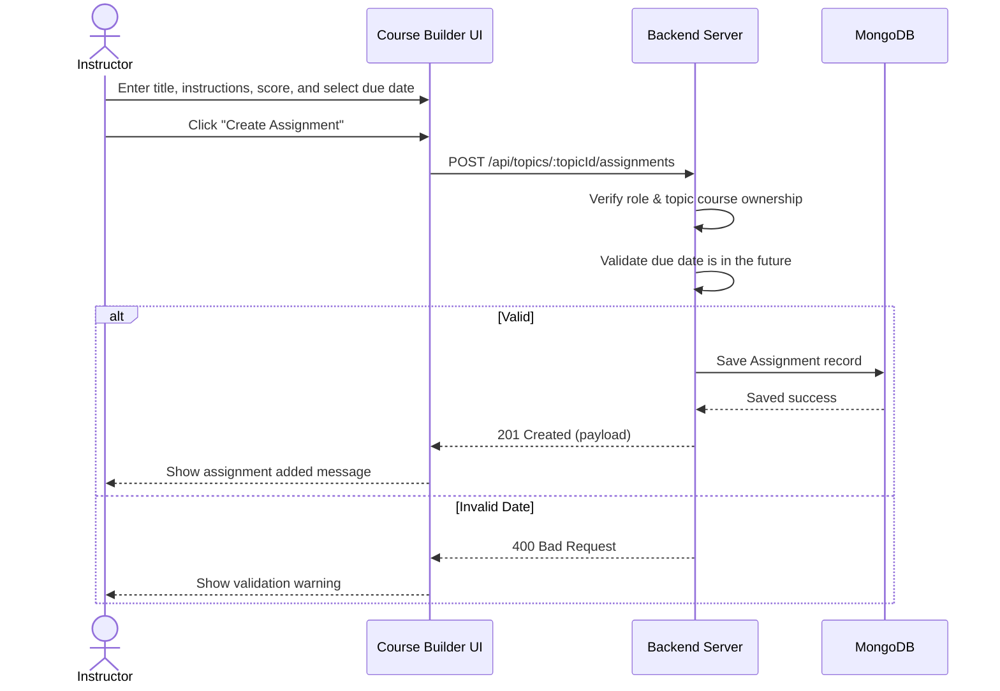

# User Flow 01: Assignment Creation

## 1. Actors
* Primary Actor: **Instructor**
* Supporting Systems: **LMS Database (MongoDB)**

## 2. Preconditions
1. The instructor is logged in and has a valid JWT session.
2. The instructor owns the specified course curriculum.

## 3. Main Success Flow
1. The instructor navigates to their Course Builder dashboard.
2. The instructor selects a curriculum topic and clicks "Add Assignment".
3. The instructor enters the Assignment Title, Description, Max Score, and selects a Due Date.
4. Optionally, the instructor uploads a reference/rubric file.
5. The instructor clicks "Create Assignment".
6. The system validates parameter inputs and uploads reference files.
7. The system saves the `Assignment` record linked to the topic ID.
8. The system updates the course curriculum view.

## 4. Alternate Flows
* **A1: Cancel changes**: Instructor clicks "Cancel" prior to saving. The form contents are discarded.

## 5. Exception Flows
* **E1: Past Due Date**: The instructor sets a deadline that is behind the current timestamp. The system returns `400 Bad Request` and blocks the creation.
* **E2: Course Ownership Violation**: An instructor tries to append an assignment to a course they do not own. The server returns `403 Forbidden`.

## 6. Business Rules
* The Assignment Title is required.
* Max Score must be a positive integer (default is 100).
* The Due Date (if provided) must be in the future relative to the server time.

## 7. Screens Involved
* **Course Builder Panel**
* **Assessment / Assignment Editor Layout**

## 8. API Touchpoints
* `POST /api/topics/:topicId/assignments`

## 9. Notifications/Events
* **Curriculum Updated Event**: Refreshes topic listing metadata.

## 10. KPI References
* **SLA Target**: Standard Write Routes (P95 < 300ms)
* **KPI-B04**: Weekly Assignment Submission Volume

## 11. User Flow Diagram

