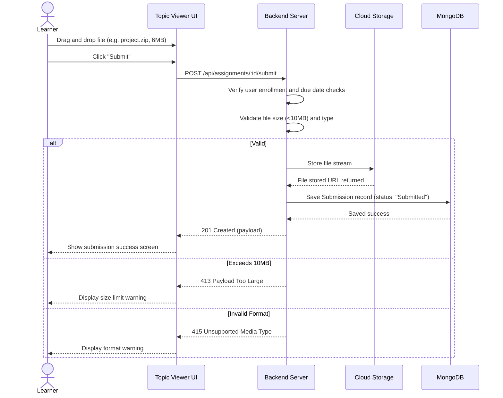

# User Flow 02: Assignment Submission

## 1. Actors
* Primary Actor: **Learner**
* Supporting Systems: **LMS Frontend Client**, **Multer Upload Middleware**, **S3/Local Cloud Storage**, **LMS Database (MongoDB)**

## 2. Preconditions
1. The learner is logged in.
2. The learner is enrolled in the course.
3. The topic containing the assignment has been unlocked sequentially.
4. The assignment due date has not passed.

## 3. Main Success Flow
1. The learner loads the Topic page inside the Course Viewer.
2. The learner reads the assignment requirements and clicks the "Submit Project" area.
3. The learner selects a file (e.g. `final_project.zip`, size 6MB).
4. The learner clicks "Submit".
5. The frontend runs a size check, maps the file into form-data, and initiates the upload.
6. The backend uploads the file to storage, sniffs the file headers for validation, and creates a `Submission` record with status `Submitted`.
7. The page re-renders, displaying a "Submission Received" success notification.

## 4. Alternate Flows
* **A1: Resubmission**: The instructor set the assignment parameters to allow retakes. The student uploads a new version, overriding the previous attempt.

## 5. Exception Flows
* **E1: Size limit exceeded**: The student uploads a 12MB ZIP. The server rejects the stream with `413 Payload Too Large`.
* **E2: Forbidden file type**: The student uploads a `.exe` or `.sh` script file. The server rejects the request with `415 Unsupported Media Type`.
* **E3: Late Submission**: The user calls the submit endpoint past the due date. The server checks the timestamp and returns `403 Forbidden`.

## 6. Business Rules
* Uploads must be restricted to extensions: `.pdf`, `.zip`, `.doc`, or `.docx`.
* Maximum file payload is restricted to exactly **10MB**.
* Only one active submission can exist per student-assignment map.

## 7. Screens Involved
* **Course Viewer (Topic Panel)**
* **Assignment Dropzone Overlay**

## 8. API Touchpoints
* `POST /api/assignments/:assignmentId/submit`

## 9. Notifications/Events
* **File Uploaded Event**: Triggers file verification pipelines.

## 10. KPI References
* **KPI-F03**: Assignment Upload Success Rate (Target: > 99.5%)
* **SLA Targets**: File Upload/Multipart Routes (P95 < 2000ms)

## 11. User Flow Diagram

