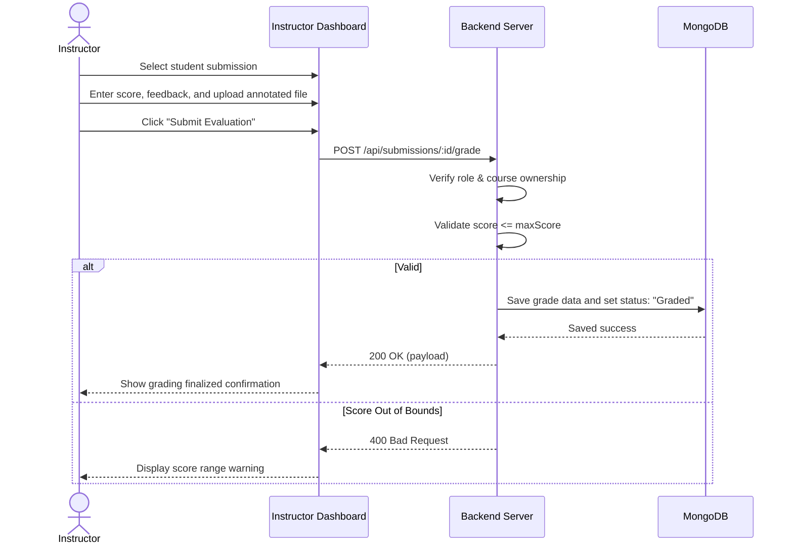

# User Flow 03: Assignment Grading and Feedback

## 1. Actors
* Primary Actor: **Instructor**
* Supporting Systems: **LMS Frontend Client**, **LMS Database (MongoDB)**

## 2. Preconditions
1. The instructor is logged in.
2. The student has submitted their assignment.
3. The instructor owns the specified course.

## 3. Main Success Flow
1. The instructor opens the Course Submissions Dashboard.
2. The instructor filters submissions by assignment name.
3. The instructor selects a student row.
4. The instructor downloads and reviews the student's submission.
5. The instructor inputs a numeric Score, types feedback comments, and optionally attaches an annotated feedback file.
6. The instructor clicks "Submit Evaluation".
7. The system saves the grading details, updates the submission status to `Graded`, and saves files.
8. The learner's Grades center updates with the evaluation result.

## 4. Alternate Flows
* **A1: Score Adjustment**: Instructor updates an already graded assignment. The system logs the change and overrides the score.

## 5. Exception Flows
* **E1: Score Out of Bounds**: The instructor inputs "110" for an assignment whose max score is set to 100. The system rejects the post with `400 Bad Request`.
* **E2: Course Ownership Violation**: An instructor who does not own the parent course tries to post a grade. The server returns `403 Forbidden`.

## 6. Business Rules
* The Grade must be a number between 0 and the assignment's `maxScore`.
* Text feedback is required when grading.
* The submission status must update from `Submitted` to `Graded`.

## 7. Screens Involved
* **Instructor Submissions Portal**
* **Grading & Evaluation Modal**

## 8. API Touchpoints
* `POST /api/submissions/:submissionId/grade`

## 9. Notifications/Events
* **Grade Published Event**: Alerts the learner that their assignment has been graded.

## 10. KPI References
* **KPI-F04**: Grading Turnaround Latency (Target: < 48 hours)
* **SLA Targets**: Standard Write Routes (P95 < 300ms)

## 11. User Flow Diagram

