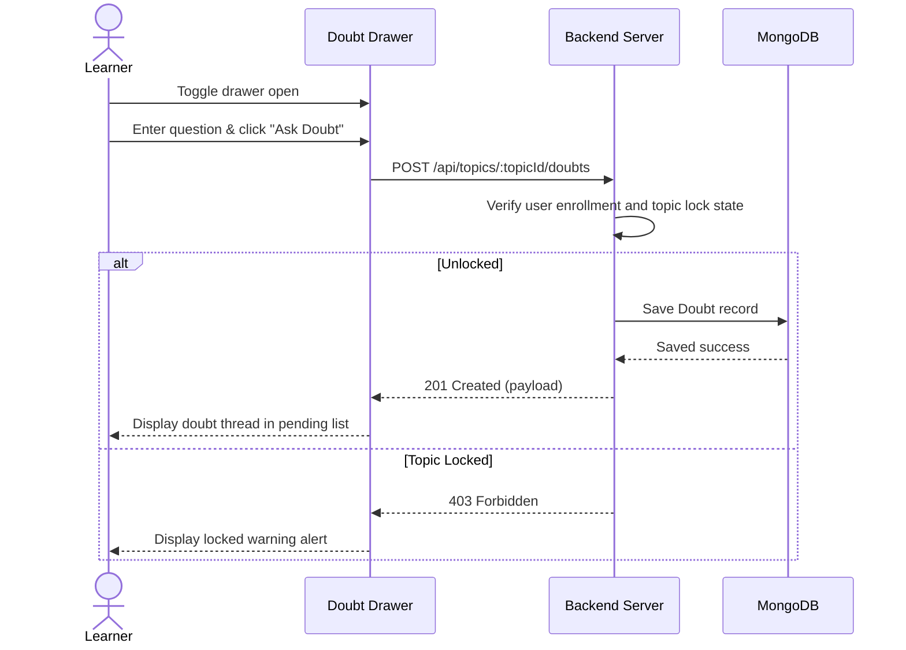

# User Flow 01: In-context Doubt Submission (Doubt Drawer)

## 1. Actors
* Primary Actor: **Learner**
* Supporting Systems: **LMS Frontend Client**, **LMS Database (MongoDB)**

## 2. Preconditions
1. The learner is logged in.
2. The learner is enrolled in the course.
3. The topic has been unlocked sequentially.

## 3. Main Success Flow
1. The learner navigates to the lesson details page in the Course Viewer.
2. The learner clicks the "Doubt Solver" drawer button.
3. The collapsible side drawer slides out from the right viewport boundary.
4. The learner types a question (e.g. "What is the purpose of bcrypt.genSalt(10)?").
5. The learner clicks "Ask Doubt".
6. The system validates input length and checks enrollment state.
7. The system saves the `Doubt` record in MongoDB.
8. The drawer list updates, showing the new question in a "Pending" unresolved state.

## 4. Alternate Flows
* **A1: Search peer doubts**: The learner inputs a search query into the search bar inside the drawer. The drawer updates to filter previously resolved doubt threads matching the query keywords.

## 5. Exception Flows
* **E1: Locked Topic Access**: The learner attempts to submit a doubt to a locked topic by bypassing frontend controls. The server validation blocks the post, returning `403 Forbidden`.
* **E2: Empty Doubt Payload**: The student submits a blank question. The system rejects the request with `400 Bad Request`.

## 6. Business Rules
* Question text is required and must contain between 5 and 500 characters.
* Doubts are contextual to the topic where they are created; queries must only pull doubts matching the `topicId`.

## 7. Screens Involved
* **Course Viewer Canvas**
* **Doubt Resolver Side Drawer**

## 8. API Touchpoints
* `POST /api/topics/:topicId/doubts`
* `GET /api/topics/:topicId/doubts`

## 9. Notifications/Events
* **New Doubt Posted Event**: Alerts the course instructor.

## 10. KPI References
* **KPI-F05**: Doubt Thread Load Time (Target: P95 < 200ms)
* **SLA Targets**: Standard Write Routes (P95 < 300ms)

## 11. User Flow Diagram

