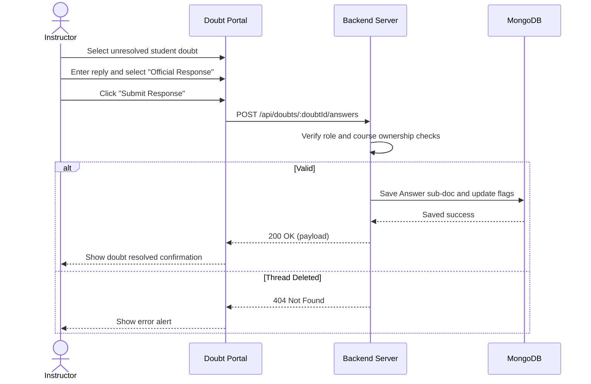

# User Flow 02: Doubt Thread Management & Official Responses (Doubt Portal)

## 1. Actors
* Primary Actor: **Instructor**
* Supporting Systems: **LMS Frontend Client**, **LMS Database (MongoDB)**

## 2. Preconditions
1. The instructor is logged in.
2. The student has submitted a doubt thread.
3. The instructor owns the course associated with the thread.

## 3. Main Success Flow
1. The instructor loads the Central Doubt Alert Center.
2. The instructor views unresolved doubts sorted in ascending chronological order.
3. The instructor selects a doubt and reads the student's question.
4. The instructor types an answer.
5. The instructor checks "Mark as Official Response".
6. The instructor clicks "Submit Response".
7. The system appends the answer sub-document, sets `isResolved = true` and `isOfficial = true` flags, and saves changes.
8. The student's doubt drawer updates to show the resolved status and the official reply pinned at the top.

## 4. Alternate Flows
* **A1: General response**: Instructor replies to a thread without selecting the "Official Response" checkbox. The reply is appended, but the thread status remains pending unless the instructor explicitly marks it as resolved.

## 5. Exception Flows
* **E1: Access Violation**: An instructor who does not own the parent course attempts to respond. The backend rejects the request with `403 Forbidden`.
* **E2: Doubt Not Found**: The instructor attempts to reply to a thread that was deleted by the student. The server returns `404 Not Found`.

## 6. Business Rules
* Only instructors can tag answers as `isOfficial = true`.
* Official replies must be sorted first in the answers array payload returned to learners.

## 7. Screens Involved
* **Instructor Dashboard (Doubt Center)**
* **Doubt Thread Dialog**

## 8. API Touchpoints
* `POST /api/doubts/:doubtId/answers`

## 9. Notifications/Events
* **Doubt Resolved Event**: Dispatches alert to the learner who submitted the doubt.

## 10. KPI References
* **KPI-B03**: Doubt Resolution Rate (Target: > 85% in 24 hours)
* **SLA Targets**: Standard Write Routes (P95 < 300ms)

## 11. User Flow Diagram

