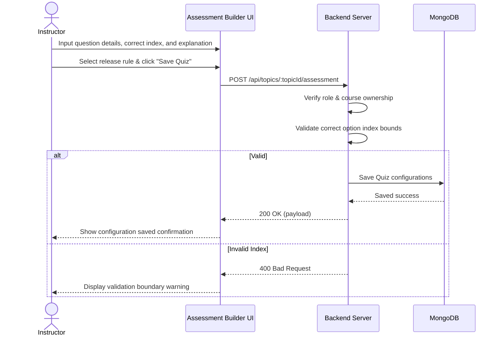

# User Flow 01: Quiz Question Rationale Setup

## 1. Actors
* Primary Actor: **Instructor**
* Supporting Systems: **LMS Database (MongoDB)**

## 2. Preconditions
1. The instructor is logged in.
2. The instructor owns the specified course.

## 3. Main Success Flow
1. The instructor opens the Course Assessment Builder page.
2. The instructor enters the question details (Question text, Option choices, Correct option index).
3. The instructor inputs an optional text Explanation/Rationale explaining why the correct choice is correct.
4. The instructor selects a Release Rule from the dropdown (`Always`, `OnPassing`, `AfterDeadline`).
5. The instructor clicks "Save Quiz".
6. The system validates inputs and saves changes to the `Quiz` schema.

## 4. Alternate Flows
* **A1: Final Exam Setup**: The instructor configures explanations for the final exam instead of a topic-level quiz, saving details to the `FinalExam` collection.

## 5. Exception Flows
* **E1: Index out of bounds**: The instructor sets the correct option index to a position that does not exist in the options array. The server returns `400 Bad Request`.
* **E2: Ownership Violation**: Instructor tries to modify a quiz in a course they do not own. The server returns `403 Forbidden`.

## 6. Business Rules
* Option count must be at least 2.
* Correct Option Index is zero-indexed and must be less than the length of the options array.
* Release rules must be restricted to the schema enum values.

## 7. Screens Involved
* **Assessment Creator / Editor**
* **Assessment Builder Dashboard**

## 8. API Touchpoints
* `POST /api/topics/:topicId/assessment`
* `POST /api/courses/:id/final-exam`

## 9. Notifications/Events
* **Assessment Configured Event**: Updates curriculum metadata.

## 10. KPI References
* **SLA Targets**: Standard Write Routes (P95 < 300ms)
* **KPI-B05**: Retake Pass Rate Improvement

## 11. User Flow Diagram

