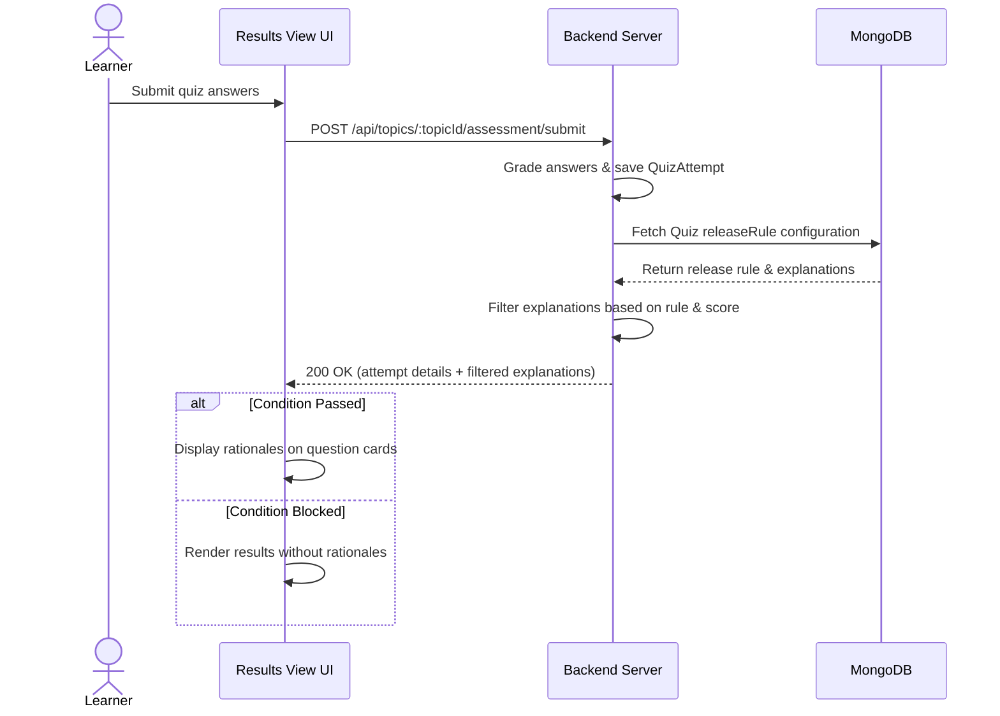

# User Flow 02: Quiz Attempt Review with Explanations

## 1. Actors
* Primary Actor: **Learner**
* Supporting Systems: **LMS Frontend Client**, **LMS Database (MongoDB)**

## 2. Preconditions
1. The learner is logged in.
2. The learner has submitted a quiz or final exam attempt.
3. The release rules configured by the instructor are satisfied.

## 3. Main Success Flow
1. The learner completes a quiz and clicks "Submit Quiz".
2. The server grades the answers, records the `QuizAttempt` and score details, and checks release rule status.
3. The server populates the correct answer index and `explanation` strings in the response body payload since conditions are met.
4. The client redirects to the Assessment Results screen.
5. The page displays the score percentage, highlights incorrect selections, and renders the instructor rationales next to each question card.

## 4. Alternate Flows
* **A1: Rule Restricted (Failed attempt)**: Release rule is set to `OnPassing`. The learner fails the quiz. The server saves the attempt but leaves `explanation` fields as null in the response payload. The client displays the score and retake button, but explanations are hidden.

## 5. Exception Flows
* **E1: Session Timeout during submission**: The client session expires during grading. The server responds with `401 Unauthorized` and does not save progress.
* **E2: Explanations extraction leak**: A user intercepts query responses prior to submission. The GET endpoints do not populate correct answer indicators, blocking network sniffing leaks.

## 6. Business Rules
* Pre-submission queries `/api/topics/:topicId/assessment` must not expose solutions or explanations.
* Rationales are exposed post-submission only when the release rules criteria are satisfied.

## 7. Screens Involved
* **Quiz Interface Canvas**
* **Assessment Results view**

## 8. API Touchpoints
* `POST /api/topics/:topicId/assessment/submit`
* `POST /api/courses/:id/final-exam/submit`

## 9. Notifications/Events
* **Quiz Attempt Finalized Event**: Recalculates progress percent if passed.

## 10. KPI References
* **KPI-F06**: Quiz Explanation Mask Integrity (Target: 100%)
* **KPI-B05**: Retake Pass Rate Improvement (Target: > 75%)
* **SLA Targets**: Standard Read Routes (P95 < 150ms)

## 11. User Flow Diagram

