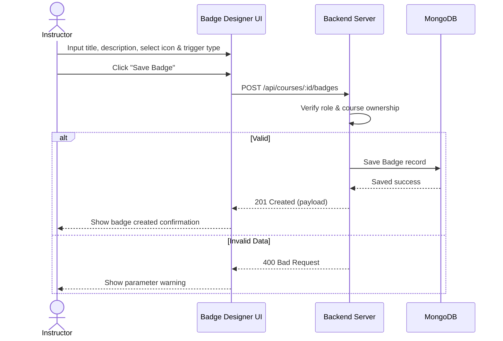

# User Flow 01: Custom Badge Designer

## 1. Actors
* Primary Actor: **Instructor**
* Supporting Systems: **LMS Database (MongoDB)**

## 2. Preconditions
1. The instructor is logged in and has a valid JWT session.
2. The instructor owns the specified course.

## 3. Main Success Flow
1. The instructor opens the Course Customizations dashboard.
2. The instructor clicks "Create Custom Badge".
3. The instructor enters the Badge Title, Description, triggers the icon uploader, and selects a Trigger Type (`CourseCompletion`, `PerfectQuizzes`, `FastTrack`).
4. The instructor clicks "Save Badge".
5. The system validates parameter inputs and saves the new `Badge` record to MongoDB.
6. The dashboard displays the new badge configuration in the course list.

## 4. Alternate Flows
* **A1: Cancel configuration**: The instructor cancels creation, reverting to dashboard views.

## 5. Exception Flows
* **E1: Course Ownership Violation**: An instructor attempts to add a badge to a course they do not own. The server returns `403 Forbidden`.
* **E2: Invalid parameters**: The instructor leaves title or trigger type fields empty. The server returns `400 Bad Request`.

## 6. Business Rules
* The Trigger Type must belong to the schema-defined enum criteria.
* Each course can support multiple custom badge mappings.

## 7. Screens Involved
* **Course Settings Dashboard**
* **Custom Badge Designer Canvas**

## 8. API Touchpoints
* `POST /api/courses/:id/badges`

## 9. Notifications/Events
* **Badge Definition Saved Event**: Updates the course gamification catalog.

## 10. KPI References
* **SLA Targets**: Standard Write Routes (P95 < 300ms)
* **KPI-B01**: Course Completion Rate Increase

## 11. User Flow Diagram

