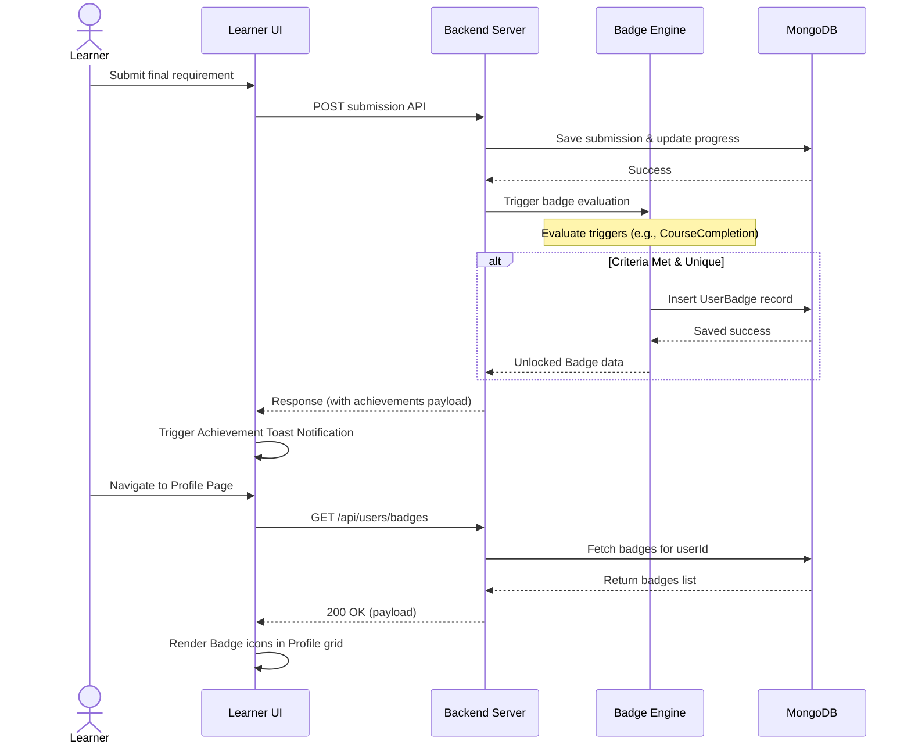

# User Flow 02: Milestone Badge Awards & User Profile Gallery

## 1. Actors
* Primary Actor: **Learner**
* Supporting Systems: **LMS Frontend Client**, **LMS Database (MongoDB)**, **Badge Engine Service**

## 2. Preconditions
1. The learner is logged in.
2. The learner is enrolled in the course.
3. The learner completes a trigger action (e.g. completes all topics, passes the final exam).

## 3. Main Success Flow
1. The learner completes a trigger action (such as submitting the final exam successfully).
2. The server processes the submission, grades it, and updates the learner's course progress.
3. The Badge Engine Service checks if any badge criteria are met.
4. If criteria are met, the service verifies that the user doesn't already own the badge and creates a new `UserBadge` record.
5. The API response includes an `achievements` payload.
6. The frontend displays an instant Toast Notification: "Achievement Unlocked: [Badge Title]!".
7. The learner navigates to their Profile Page.
8. The page fires a query loading all unlocked student badges.
9. The Profile grid displays the unlocked badge icon and details.

## 4. Alternate Flows
* **A1: Profile Inspection**: The user visits another student's public profile and views their badge gallery (if public profile sharing is enabled).

## 5. Exception Flows
* **E1: Duplicate trigger validation**: If a learner retakes an exam or quiz, the Badge Engine runs. The database unique compound index `{ userId: 1, badgeId: 1 }` prevents double inserts, silently resolving without errors.
* **E2: Trigger evaluation timeout**: The badge processing task times out. The main attempt remains saved successfully, and the badge unlock runs asynchronously, populating the database once resolved.

## 6. Business Rules
* Badges are unlocked only once per student-badge mapping.
* The badge engine must run asynchronously to avoid slowing down quiz submissions.

## 7. Screens Involved
* **Assessment Results Screen**
* **User Profile Page**
* **Toast Notification Overlay**

## 8. API Touchpoints
* `GET /api/users/badges`

## 9. Notifications/Events
* **Toast Alert Event**: Displays achievement unlocked notification.

## 10. KPI References
* **KPI-F07**: Badge Unlock Trigger Latency (Target: < 500ms)
* **KPI-B01**: Course Completion Rate Increase
* **KPI-B02**: Platform Active Session Duration
* **SLA Targets**: Standard Read Routes (P95 < 150ms)

## 11. User Flow Diagram

