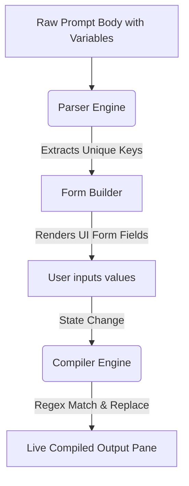

# Feature Specification: Dynamic Form & Preview Editor (Feature-03)
**Status:** Ready for Development  
**Target Release:** v1.0.0  
**Author:** Core Engine Team  

---

## 1. Feature Summary & Value Proposition
When developers discover a template prompt, they need a frictionless way to populate its parameters. Typing values directly into code structure can break prompts and is error-prone.

The **Dynamic Form & Preview Editor** bridges template design and prompt deployment. It parses a prompt, extracts variables, and instantly renders an interactive user interface with input fields. As the user types in these fields, the output pane dynamically compiles and renders the completed prompt in real-time, allowing users to verify prompt structure before taking action.

---

## 2. Feature Scope
*   **Dynamic Forms:** Dynamically generating text inputs and textareas based on extracted template variables.
*   **Live Updates:** Immediate recalculation and compilation of the prompt template text upon any input modification.
*   **Variable Binding:** Dual binding between the editor fields and the preview model variables.
*   **Prompt Compilation:** Subsituting variables with their corresponding inputs in the correct template positions.
*   **Real-time Preview:** Displaying a read-only rendered panel showing exactly how the final prompt looks with all parameters injected.

---

## 3. Functional Requirements

### FR-3.1: Form Generator UI
*   **Dynamic Inputs:** The system must read the list of unique variables (from Feature-02) and render a list of labeled text inputs.
*   **Adaptive Controls:** By default, variables ending in `_Snippet` or `_Block` (e.g. `{{code_snippet}}`) must render as multi-line textareas, while other variables render as single-line text inputs.
*   **Reset Action:** A "Clear Fields" button must reset all inputs to their default empty states.

### FR-3.2: Real-time Compilation & Debounce
*   **Instant Binding:** Input changes must immediately trigger the compilation function.
*   **Highlighting Injected Values:** In the live preview, compiled user inputs should have a subtle background highlight (e.g., light blue background or yellow underline) so the user can easily review what text they injected.

### FR-3.3: Empty/Null Parameter Handling
*   If a user has not yet typed into a field, the preview text must display a faded, readable placeholder showing the variable name (e.g. `[Enter values for language]`) to signify that the prompt is not yet ready.

---

## 4. Technical Design & Flow

### 4.1 UI Layout Spec
*   **Variable Form Pane:** Left column (or top pane on mobile) displaying input labels (capitalized variable name, replacement of underscores with spaces) and the fields.
*   **Live Compilation Preview:** Right column (or bottom pane on mobile) displaying the read-only generated text formatted cleanly.

---

## 5. Test Scenarios

| Test ID | Input Case | Expected Behavior / Output |
|---------|------------|----------------------------|
| **TS-01** | Variable list is empty | Form Builder renders "No variables in this template." |
| **TS-02** | User inputs text in `{{language}}` | Live compiled preview immediately replaces all `{{language}}` tokens with the entered text. |
| **TS-03** | User types code block with newlines | Textarea preserves line breaks and compiles them cleanly inside the preview. |
