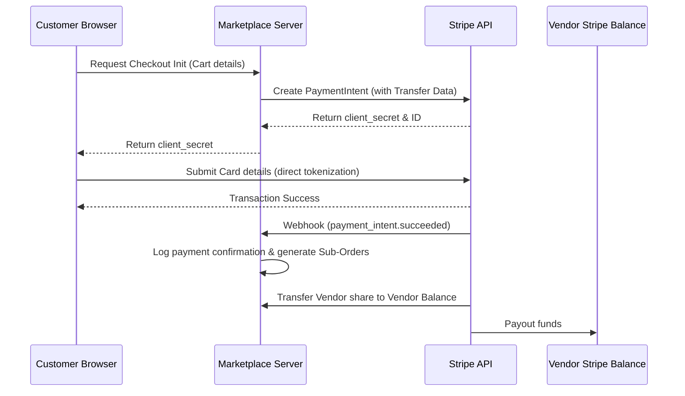

# Feature Specification: Secure Checkout & Split Payments

## 1. Overview & Purpose
This feature integrates payment processor APIs (Stripe Connect) to process transactions securely. It split-routes customer payments to vendors' bank accounts after automatically deducting platform commissions.

---

## 2. Scope & Detailed Requirements

### Stripe Connect Integration
* Use Stripe Connect Express/Custom accounts.
* Manage vendor Stripe connection states and onboarding updates.

### Secure Payments
* Client-side PCI-compliant payment inputs using Stripe Elements SDK.
* Raw card details never touch or get stored on the marketplace servers.

### Split Payouts
* Calculate checkout payouts programmatically.
* Instruct Stripe to route the vendor's share directly to their connected bank account.

### Commission Handling
* Calculate platform fees based on global flat rates (e.g., $0.30) plus percentage variables (e.g., 10%).
* Admin configurations to override rates for specific high-volume vendors.

### Payment Validation
* Handle Stripe webhooks (e.g., `payment_intent.succeeded`, `charge.refunded`) to ensure data syncs even if the user closes their browser during checkout redirection.

---

## 3. Technical Workflow & User Flows

---

## 4. Proposed API Endpoints

### Checkout & Payments Endpoints
* `POST /api/v1/checkout/initialize`
  * Body: `{ shipping_address_id, billing_address_id, coupon_code }`
  * Response: `{ payment_intent_client_secret, stripe_public_key, order_id }`
* `POST /api/v1/payments/stripe-webhook` (Internal Webhook URL)
  * Headers: `Stripe-Signature`
  * Body: Raw JSON payload from Stripe.

---

## 5. Database Schema & Data Model

* **Transactions Entity:**
  * `id`: UUID (Primary key)
  * `order_id`: UUID (Foreign Key to Orders)
  * `stripe_payment_intent_id`: String (Unique)
  * `amount_charged`: Decimal
  * `platform_commission`: Decimal
  * `vendor_net_payout`: Decimal
  * `status`: Enum (`initiated`, `succeeded`, `failed`, `refunded`)
  * `created_at`: Timestamp

---

## 6. Acceptance Criteria
* **AC-6.01:** Customer credit card data undergoes encryption via Stripe Elements directly before hitting the app API. No raw credit card numbers are logged, stored, or sent to backend logs.
* **AC-6.02:** When payment succeeds, Stripe Connect splits the checkout total: the platform commission is transferred to the platform bank account, and the remaining item revenue is routed to the respective vendor balance.
* **AC-6.03:** If a multi-vendor transaction fails (e.g., card declined), all items remain in the user's cart, and no partial sub-orders are created.
