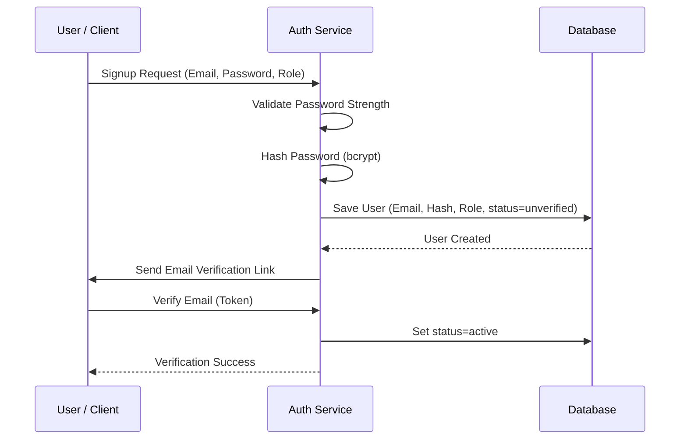

# Feature Specification: User Authentication & Role-Based Access Control (RBAC)

## 1. Overview & Purpose
This feature provides secure registration, authentication, session management, and authorization boundaries for the three target user personas: Customers, Vendors, and Platform Administrators. It guarantees data isolation and endpoint security using modern cryptographic standards and Role-Based Access Control (RBAC).

---

## 2. Scope & Detailed Requirements

### Registration & Login
* Users can sign up via an email and password or using third-party identity providers (OAuth).
* Credentials must be securely hashed on the backend.
* Session tokens should be issued upon successful authentication.

### OAuth Authentication
* Support single sign-on (SSO) with identity providers such as Google and Apple.
* Upon successful OAuth response, auto-provision user profiles in the database if they do not exist.

### Role Management
* Assign roles to users during signup (either `Customer` or `Vendor`).
* Assign `Admin` roles only via database seeding or super-admin invitation workflow.

### Access Permissions (RBAC)
* Implement middleware to protect backend routes based on user roles.
* Prevent unauthorized cross-role resource modification (e.g., vendors updating other vendors' items).

### Dashboard Routing
* Restrict frontend routes (e.g., `/admin/*`, `/vendor/*`) based on authenticated role contexts.

---

## 3. Technical Workflow & User Flows

---

## 4. Proposed API Endpoints

### Public Endpoints
* `POST /api/v1/auth/signup`
  * Body: `{ email, password, role ("customer" | "vendor") }`
* `POST /api/v1/auth/login`
  * Body: `{ email, password }`
  * Response: JWT or HTTP-Only cookie set containing access & refresh token.
* `POST /api/v1/auth/oauth/google`
  * Body: `{ token }`

### Protected Endpoints
* `POST /api/v1/auth/logout` (Requires valid token)
* `GET /api/v1/auth/me` (Returns current user identity and role credentials)

---

## 5. Database Schema & Data Model
* **Users Entity:**
  * `id`: UUID (Primary Key)
  * `email`: String (Unique, Indexed)
  * `password_hash`: String (Nullable for OAuth accounts)
  * `role`: Enum (`customer`, `vendor`, `admin`)
  * `status`: Enum (`unverified`, `active`, `suspended`)
  * `created_at`: Timestamp
  * `updated_at`: Timestamp

---

## 6. Acceptance Criteria
* **AC-1.01:** Users can sign up using email/password. Password must satisfy complexity rules: minimum 8 characters, at least 1 uppercase letter, 1 number, and 1 special character.
* **AC-1.02:** System verifies user emails by generating an encrypted, timed OTP or link. Unverified customers cannot check out; unverified sellers cannot list items.
* **AC-1.03:** Role boundaries are strict: Customers cannot access vendor dashboards (`/vendor/*`) or admin interfaces (`/admin/*`). Attempted access returns an HTTP 403 Forbidden.
