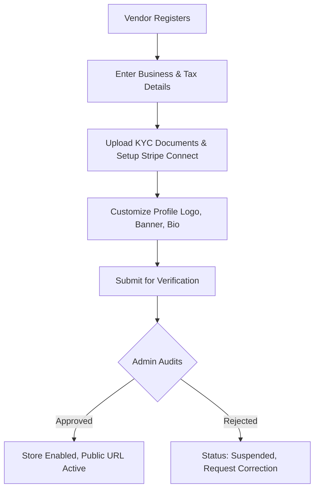

# Feature Specification: Vendor Onboarding & Storefront Customization

## 1. Overview & Purpose
This feature enables prospective merchants to onboard self-sufficiently, verify their identity and tax metrics (KYC), customize their storefront appearance, and configure unique store routes. Admins inspect these onboarded details to approve store activations.

---

## 2. Scope & Detailed Requirements

### KYC Verification
* Vendors must submit onboarding data: legal business entity name, registration number, business address, and tax information.
* Support file uploads for business license and tax certificate in PDF, JPG, or PNG formats (file sizes limited to 5MB).
* Stripe Connect account association for bank payouts.

### Store Profile Setup
* Provide settings to customize store details: Store name, customer service email, support phone number, and physical store location coordinates/address.

### Logo & Banner Upload
* Image crop and resize UI component for vendor logos and background storefront banners.
* Store media assets securely on AWS S3 or Cloudinary storage.

### Store Description
* Markdown/Rich text block to describe the seller profile, store policies, refund specifics, and shipping notes.

### Custom Store URL
* Automated generation of a clean URL slug from the verified store name (e.g., "Alpha Gear" translates to `/store/alpha-gear`).
* Enforce unique constraint checks on the slug in the database.

---

## 3. Technical Workflow & User Flows

---

## 4. Proposed API Endpoints

### Seller Configuration Endpoints
* `POST /api/v1/vendor/profile`
  * Body: `{ store_name, phone, business_address, description }`
* `POST /api/v1/vendor/kyc`
  * Body: Multipart form data containing registration certificates, ID copies, and tax documents.
* `POST /api/v1/vendor/stripe-onboard`
  * Response: Stripe-hosted registration link for vendor payout credentials.

### Public Storefront Endpoints
* `GET /api/v1/stores/:slug`
  * Response: Store public details (logo, banner, bio, overall ratings).

---

## 5. Database Schema & Data Model
* **Vendor Profiles Entity:**
  * `id`: UUID (Primary Key)
  * `user_id`: UUID (Foreign Key linking to Users table, Unique)
  * `store_name`: String (Required)
  * `slug`: String (Unique, Indexed)
  * `logo_url`: String (Nullable)
  * `banner_url`: String (Nullable)
  * `description`: Text (Nullable)
  * `tax_number`: String (Required)
  * `kyc_status`: Enum (`pending_onboarding`, `submitted_for_review`, `approved`, `suspended`)
  * `stripe_connect_id`: String (Nullable)
  * `created_at`: Timestamp
  * `updated_at`: Timestamp

---

## 6. Acceptance Criteria
* **AC-2.01:** The registration form requires business name, phone, address, tax registration number, and bank account setup (via Stripe Connect).
* **AC-2.02:** Sellers must upload at least one valid identity document. The admin interface lists these documents as downloadable files for approval workflows.
* **AC-2.03:** Dynamic URL mapping: Creating store name "Alpha Gear" generates `/store/alpha-gear` route, containing only products belonging to Vendor ID mapped to Alpha Gear.
