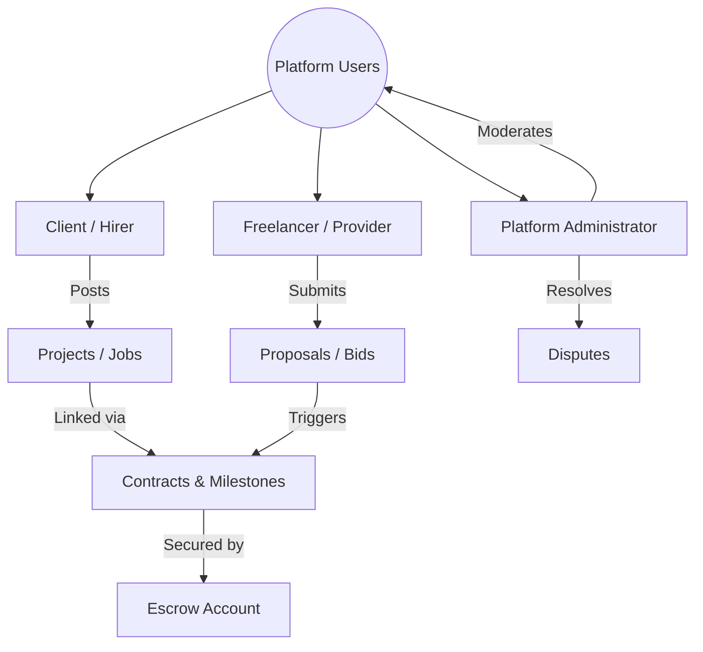

# Business Requirements Document (BRD)
## Project: Freelance & Client Marketplace (Escrow-Enabled Platform)

---

### 1. Document Control & Approvals

| Version | Date | Description | Author |
| :--- | :--- | :--- | :--- |
| v1.0.0 | 2026-06-03 | Initial Release - Baseline Business Requirements | Antigravity AI |

---

### 2. Executive Summary
The goal of this project is to build a modern, secure, and highly efficient Freelance Marketplace. The platform acts as a bridge connecting **Clients** (individuals or organizations seeking talent) and **Freelancers** (independent professionals offering services). 

Unlike generic matching services, this platform emphasizes end-to-end security, seamless collaboration, milestone-driven contract management, and a robust Escrow Payment System. By holding client funds in escrow until predetermined contract milestones are met, we mitigate risks for both parties, establishing trust and driving high-quality engagement.

---

### 3. Business Goals & Objectives
- **Build Trust**: Establish a secure transaction mechanism utilizing digital contracts and escrow holdings to protect clients from unfinished work and freelancers from non-payment.
- **Minimize Time-to-Hire**: Provide intuitive filtering, semantic search, and structured proposals to reduce the time from project posting to contract execution to less than 48 hours.
- **Diversify Monetization**: Implement multiple revenue streams, including a commission fee (take-rate) on completed contracts, premium user tiers, featured listings, and transaction processing surcharges.
- **Operational Scalability**: Streamline dispute resolution and project moderation to require minimal administrative intervention.

---

### 4. Stakeholder Roles & User Personas

The platform serves three main user roles:

1. **Clients (Hirers)**
   - Individuals or businesses posting freelance projects.
   - Core Needs: Transparent candidate credentials, secure funds protection, quality assurance before payout, clean communication tools.
2. **Freelancers (Service Providers)**
   - Individual contractors or small agencies bidding on work.
   - Core Needs: Guranteed payment upon meeting milestone criteria, visible work pipeline, showcase portfolio, low platform fees.
3. **Platform Administrators (Auditors/Support)**
   - Operators managing platform compliance, processing manual disputes, handling payouts, and auditing user activity.

---

### 5. Project Scope

#### In-Scope (Phase 1)
- **User Authentication & Profiles**: Secure sign-up, KYC/identity verification, customizable profiles (portfolios, skill tags, client ratings).
- **Project Engine**: Client ability to post public/private projects (fixed-price and hourly). Freelancer directory with search and filter.
- **Proposal & Bidding System**: Freelancers submit cover letters, portfolios, dynamic price bids, and suggested milestone timelines.
- **Milestone & Contract Management**: Automated digital contracts based on agreed proposal terms. Multi-milestone definition per contract.
- **Escrow Payment Infrastructure**: Integrated payment gateway (e.g., Stripe, PayPal) supporting credit card/bank payments. Client deposits milestone funds into platform escrow; platform releases funds to freelancer upon milestone completion and client approval.
- **Real-Time Communication**: Workroom messaging, file exchange, and notification system.
- **Feedback & Rating System**: Dual-sided ratings (out of 5 stars) and text reviews after contract completion.
- **Dispute Resolution Flow**: Standardized claim filing system with administrative arbitration.

#### Out-of-Scope (Phase 2 & Future Releases)
- **Automated AI Matching Engine**: Recommendations based on skill matrices.
- **Hourly Desktop Time-Tracker**: Automatic desktop screenshot taking and activity logging app.
- **Multi-Currency Hedging**: Internal multi-currency protection tools.
- **Payroll Integration**: Issuing direct W2/1099 tax forms automatically.

---

### 6. High-Level Functional Requirements

#### FR-1: Account Creation & Profile Customization
- The system must support two primary user roles: Client and Freelancer. Users can switch context or register a single unified account.
- Profiles must support portfolios, work histories, hourly rates, skills verification badges, and rating metrics.

#### FR-2: Project Lifecycle Management
- Clients can create, save, edit, publish, or archive project posts.
- Project details must require title, description, skills required, budget type (fixed or hourly), budget range/limit, and duration.
- Freelancers can search, filter (by category, budget, rating, date), and bookmark projects.

#### FR-3: Bidding & Negotiation
- Freelancers can submit structured proposals including cover letters, estimated delivery dates, and proposed milestones.
- The platform must restrict freelancers' bids using a token/credit system (e.g., "connects") to prevent spam.
- Clients can message bidders, negotiate terms, decline proposals, or initiate contracts.

#### FR-4: Secure Escrow Contracts
- Once a proposal is accepted, a legal contract is dynamically generated detailing the scope of work, budget, and milestones.
- Before work begins, the Client must fund the first milestone. The platform holds these funds securely in escrow.
- Freelancers submit work deliverables against a milestone. Clients have a set verification window (e.g., 7 days) to approve work and release escrow, request revisions, or file a dispute.

#### FR-5: Secure Payment Handling & Multi-Gateways
- The system must process credit card, debit card, and ACH transfers.
- The platform must deduct a system fee (e.g., 5-10% depending on volume) upon releasing escrow to the freelancer.
- Freelancers can configure payout methods (Local Bank, Wire, PayPal) with customizable payout schedules.

#### FR-6: Dispute Arbitration
- Either party can open a dispute if work is rejected or communication breaks down.
- Funds are locked in escrow during an active dispute.
- Admins act as mediators, reviewing submitted artifacts (chat logs, code, designs) to distribute escrow split percentages fairly between the client and freelancer.

---

### 7. Non-Functional Requirements

#### NFR-1: Security & Compliance
- All financial transactions must comply with PCI-DSS guidelines.
- User data must be stored and processed in compliance with GDPR and local privacy laws.
- High-value operations (profile changes, bank details update, payouts) must require Multi-Factor Authentication (MFA).

#### NFR-2: Performance & Scalability
- The platform must support up to 50,000 concurrent active users.
- Project search query results must load in less than 1.5 seconds.
- Payment status webhooks must process within 5 seconds of gateway verification.

#### NFR-3: Availability & Reliability
- Core services (Auth, Escrow Payment processing, Workroom) must maintain 99.9% uptime.
- High-availability database replication must prevent data loss, ensuring a Recovery Point Objective (RPO) of < 1 minute.

---

### 8. Key Business Risks & Mitigations

| Risk | Impact | Likelihood | Mitigation Strategy |
| :--- | :--- | :--- | :--- |
| **Payment Fraud & Chargebacks** | High | Medium | Implement Stripe Radar/fraud monitoring. Retain escrow funds during disputes and restrict instant bank transfers for unverified accounts. |
| **Off-Platform Transactions (Disintermediation)** | Medium | High | Restrict sharing of external contact details (emails, phone numbers) in public chat channels using automated filters. Provide lower platform fees for long-term relationships to incentivize staying on-platform. |
| **Project Quality/Non-Delivery** | High | Medium | Maintain an escrow system where no money is paid out until the client accepts the milestone work. Provide a clear dispute arbitration system. |
| **Regulatory Compliance (KYC/AML)** | High | Low | Partner with third-party KYC providers (e.g., Persona, Stripe Identity) for identity verification during freelancer onboarding and withdrawal setup. |
