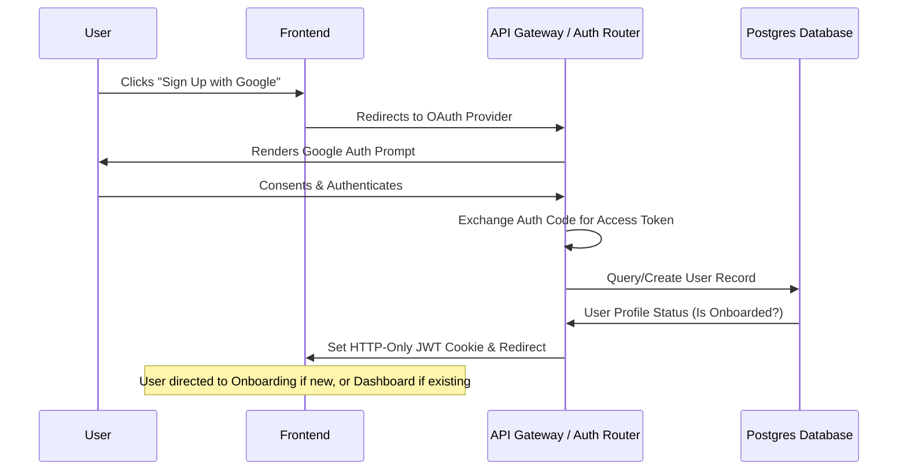

# Feature Specification: User Authentication & Role-Based Onboarding
## Feature ID: F-01

---

### 1. Feature Description
Build a secure, enterprise-grade authentication system utilizing email/password and OAuth (Google & GitHub) credentials. The platform will support dual roles (**Client** and **Freelancer**) under a single unified user account, allowing users to toggle their context seamlessly without creating separate logins.

---

### 2. Scope & Boundaries

#### In-Scope:
- **Registration & Login**: Secure email and password signup/login, password hashing (bcrypt), password complexity validation.
- **OAuth Authentication**: Google & GitHub OAuth 2.0 integrations with profile information mapping.
- **JWT Sessions**: Secure session tokens stored in HttpOnly, SameSite, Secure cookies. Auto-refresh token mechanism.
- **Role Switching**: Central database flags linking a single user profile to either Client or Freelancer workspaces, with active workspace state preserved in session cookies.
- **Profile Onboarding**: A step-by-step onboarding flow after registration to complete profile details based on the selected initial role.

#### Out-of-Scope:
- Multi-organization team management (e.g., inviting multiple managers to a single Client account—planned for Phase 2).
- Biometric authentication (WebAuthn/FaceID).

---

### 3. Detailed Technical Requirements

#### 3.1. Frontend Views & UI Elements
- **Authentication Modal/Page**: Modern glassmorphic login panel with input fields (email, password), Google/GitHub SVG icons, and validation notifications.
- **Role Selection Screen**: Minimalist onboarding screen asking: *"Are you looking to hire top talent (Client) or find freelance opportunities (Freelancer)?"*
- **Onboarding Form Wizard**:
  - *For Clients*: Company Name, Website, Industry, Description.
  - *For Freelancers*: Professional Title, Hourly Rate, Top 5 Skills, Bio.

#### 3.2. Backend APIs & Endpoints
- `POST /api/v1/auth/register`: Creates local user, validates password strength.
- `POST /api/v1/auth/login`: Authenticates user, issues JWTs.
- `POST /api/v1/auth/logout`: Clears cookie storage.
- `GET /api/v1/auth/oauth/google`: Redirects to Google authentication URL.
- `GET /api/v1/auth/oauth/github`: Redirects to GitHub authentication URL.
- `POST /api/v1/user/role/switch`: Updates active role session cookie.
- `POST /api/v1/user/onboarding`: Submits the initial role details.

#### 3.3. Database Schema Impact
- **Users Table**: Add `active_role` (ENUM: 'client', 'freelancer'), `google_id` (VARCHAR), `github_id` (VARCHAR), `is_onboarded` (BOOLEAN).

---

### 4. Acceptance Criteria & Edge Cases

| Scenario | Given | When | Then |
| :--- | :--- | :--- | :--- |
| **Local Sign-Up Validation** | User provides invalid email or short password (< 8 characters) | They click "Register" | The API returns `400 Bad Request` and highlights validation errors in the UI. |
| **First-time OAuth Login** | A new user signs in via Google | Google profile details are verified | A new user record is created with `is_onboarded = false` and they are redirected to the onboarding wizard. |
| **Existing OAuth Login** | An onboarded user signs in via Google | Google profile details are verified | User is logged in and redirected directly to their dashboard. |
| **Workspace Role Toggle** | An authenticated user toggles their view from Freelancer to Client | The workspace mode switch is clicked | The active role updates in the database and session token, updating the navigation header and views instantly. |
| **Unauthorized Endpoint Access** | A guest attempts to access `/api/v1/user/onboarding` | They trigger the GET/POST request | The server returns `401 Unauthorized` and deletes invalid cookies. |
