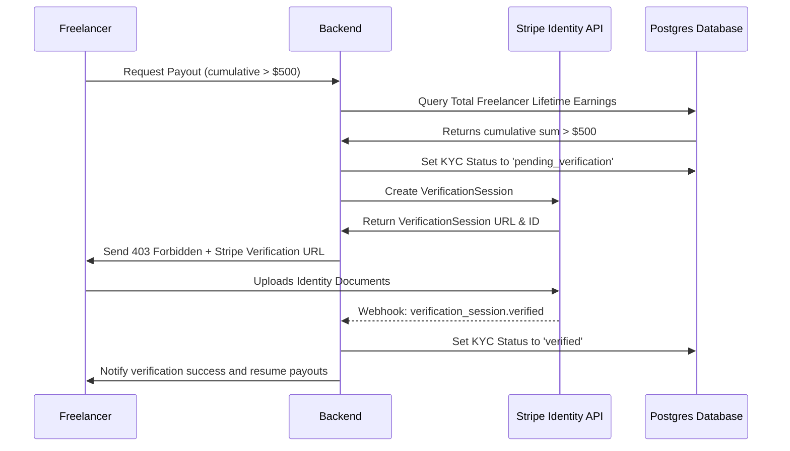

# Feature Specification: KYC Verification Integration
## Feature ID: F-02

---

### 1. Feature Description
Integrate identity verification (Know Your Customer) for freelancers. When a freelancer's cumulative earnings or payout attempts exceed a lifetime value of $500, the system must freeze their payout abilities and mandate KYC verification via Stripe Identity before releasing future payouts.

---

### 2. Scope & Boundaries

#### In-Scope:
- **Threshold Monitoring**: Backend jobs that monitor freelancer lifetime earnings and pending withdrawals.
- **Verification Status**: Dynamic user status flags in the database (`unverified`, `pending_verification`, `verified`, `failed_verification`).
- **Stripe Identity Integration**: Generating Stripe verification sessions, redirecting users to the Stripe identity verification UI, and listening for Stripe webhook updates.
- **Compliance Tracking**: Secure logs detailing verification metadata (date, session ID, status) for audit trails, ensuring no raw government IDs are stored directly in the application's database.

#### Out-of-Scope:
- In-house image analysis of government IDs (entirely delegated to Stripe).
- Global KYC compliance logic for enterprise clients (focused strictly on freelancers in Phase 1).

---

### 3. Detailed Technical Requirements

#### 3.1. Frontend Views & UI Elements
- **KYC Banner Alert**: A global dashboard alert banner for unverified freelancers: *"Action Required: To continue withdrawing your funds, please verify your identity."*
- **Verification Verification Portal Page**: Form explaining why verification is required, containing a button *"Start Verification with Stripe"*.
- **Pending verification screen**: Informative landing page showing: *"We are reviewing your details. This usually takes under 10 minutes."*

#### 3.2. Backend APIs & Endpoints
- `GET /api/v1/kyc/status`: Retrieves current KYC status and current cumulative earnings total.
- `POST /api/v1/kyc/session`: Initiates a Stripe VerificationSession and returns the secure URL.
- `POST /api/v1/kyc/webhook/stripe`: Endpoint to receive Stripe webhooks (`verification_session.processing`, `verification_session.verified`, `verification_session.canceled`).

#### 3.3. Database Schema Impact
- **FreelancerProfiles Table**: Add `kyc_status` (ENUM: 'unverified', 'pending_verification', 'verified', 'failed_verification'), `stripe_verification_id` (VARCHAR), `last_verification_attempt` (TIMESTAMP).

---

### 4. Acceptance Criteria & Edge Cases

| Scenario | Given | When | Then |
| :--- | :--- | :--- | :--- |
| **Below Threshold Payout** | Freelancer has $300 in lifetime earnings and requests a payout | They initiate the payout request | The transaction is processed successfully, skipping KYC logic. |
| **Above Threshold Trigger** | Freelancer has $520 in lifetime earnings and requests a payout | They initiate the payout request | The request is blocked, and they are redirected to the Stripe KYC portal. |
| **Successful Webhook Processing** | Freelancer completes verification on Stripe | Stripe issues `verification_session.verified` webhook | The backend updates `kyc_status` to 'verified' and unlocks payout capabilities instantly. |
| **Failed Document Submission** | Freelancer submits blurry ID images | Stripe issues `verification_session.requires_input` | The backend updates status to 'failed_verification' and shows user an alert to retry. |
| **Escrow Holds Locked** | An unverified freelancer has active disputes | Payout limits are checked | The limits apply only to withdrawable bank balances, not to funds locked in escrow. |
