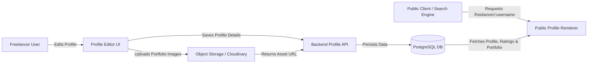

# Feature Specification: Freelancer Profile & Portfolio Portal
## Feature ID: F-03

---

### 1. Feature Description
Build customizable Freelancer Profiles allowing professionals to market their skills, display custom hourly rates, list experience tags, and showcase a gallery of past works (portfolio). This information must be rendered as a public-facing SEO-optimized page.

---

### 2. Scope & Boundaries

#### In-Scope:
- **Professional Profile Details**: Display photo, banner, professional title, bios, location, and verified badges.
- **Hourly Rate Management**: Input field to manage hourly rates with automatic conversion checks.
- **Skill Tags Engine**: Auto-suggest input containing predefined tags (e.g., "React", "Python", "UX Design") restricted to a maximum of 15 skill tags.
- **Portfolio Gallery**: Upload utility for multiple media files (PNG/JPG mockups, PDFs, URLs) detailing project title, description, and freelancer's role.
- **Public Profile View**: SEO-friendly public routes displaying profiles, calculated average ratings, work history, and client reviews.

#### Out-of-Scope:
- Portfolio video uploads (restricted to images and external links to reduce storage costs in Phase 1).
- Custom domains for freelancer profiles.

---

### 3. Detailed Technical Requirements

#### 3.1. Frontend Views & UI Elements
- **Profile Customization Dashboard**: Tabbed interface with fields for basic details, skills editor, and portfolio upload.
- **Portfolio Card Component**: Grid component detailing project previews with modal lightbox viewers for image assets.
- **SEO Public Page Layout**: Clean, semantic HTML layout with structured metadata (JSON-LD) for Search Engine indexing.

#### 3.2. Backend APIs & Endpoints
- `GET /api/v1/freelancer/profile/:username`: Public endpoint returning profile details, skills, reviews, and portfolio items.
- `PUT /api/v1/freelancer/profile`: Updates title, bio, hourly rate, and location.
- `POST /api/v1/freelancer/portfolio`: Creates a new portfolio item, handles file uploads (via multipart form).
- `DELETE /api/v1/freelancer/portfolio/:id`: Deletes a portfolio item and removes associated file assets.

#### 3.3. Database Schema Impact
- **FreelancerProfiles Table**: Add fields `username` (VARCHAR, UNIQUE), `title` (VARCHAR), `bio` (TEXT), `hourly_rate` (DECIMAL), `skills` (ARRAY).
- **PortfolioItems Table**: Create table with columns `id` (UUID, PK), `profile_id` (UUID, FK), `title` (VARCHAR), `description` (TEXT), `media_url` (VARCHAR), `project_url` (VARCHAR), `created_at` (TIMESTAMP).

---

### 4. Acceptance Criteria & Edge Cases

| Scenario | Given | When | Then |
| :--- | :--- | :--- | :--- |
| **Max Skills Limit** | Freelancer attempts to save 16 skills | They submit the profile details | System returns a validation error restricting them to 15 skills. |
| **Portfolio Image Dimensions** | User uploads a file > 10MB or not in image format | They submit the portfolio upload | API rejects request with message: "File must be a JPEG/PNG and under 10MB." |
| **Hourly Rate Format** | Freelancer inputs a negative or non-numerical rate | They click save | UI prevents submission and shows validation message: "Rate must be a positive number." |
| **Public vs Private View** | Client views a freelancer profile | They navigate to `/freelancer/:username` | The page displays all public details, average ratings, and portfolios, hiding personal emails and payout accounts. |
| **Empty Portfolio State** | User has no portfolio uploads | Client views public profile page | Profile displays a placeholder card: "No portfolio items added yet." |
