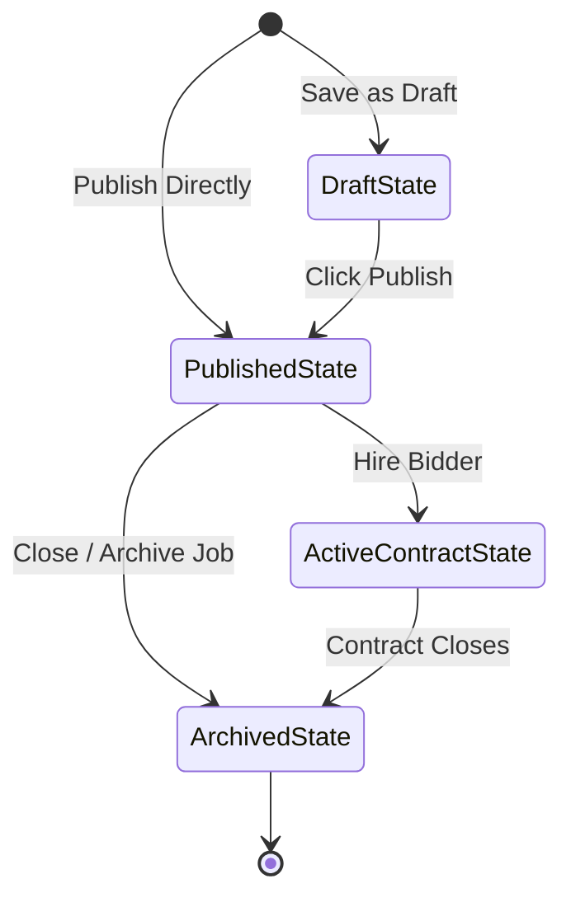

# Feature Specification: Project Creation & Lifecycle Manager
## Feature ID: F-04

---

### 1. Feature Description
Allow Clients to draft, preview, publish, edit, and archive projects. This feature includes a step-by-step wizard to guide clients through describing requirements, listing skills, and attaching project files securely.

---

### 2. Scope & Boundaries

#### In-Scope:
- **Project Wizard**: Multi-step client form detailing: (1) Basic Title & Category, (2) Detailed Requirements, (3) Budget Setup (Fixed vs Hourly), (4) Review & Post.
- **File Attachments**: Drag-and-drop secure file attachment uploader (PDFs, text files, images) linked directly to the project spec.
- **Project States**:
  - `Draft`: Project saved locally/on server, visible only to the client.
  - `Published`: Active listing accepting bids from freelancers.
  - `Archived`: Listing removed from search, no new proposals allowed, but history is preserved.
- **Revision Control**: Clients can edit active listings, with changes highlighted in the proposal logs for bidders.

#### Out-of-Scope:
- Private project invites (Phase 2 feature; all published projects are public in Phase 1).
- Recurring project templates.

---

### 3. Detailed Technical Requirements

#### 3.1. Frontend Views & UI Elements
- **Project Creation Wizard**: Progress-bar driven wizard with step validations. Rich-text markdown editor for descriptions.
- **Client Jobs Dashboard**: List of posted jobs filtered by status (`Draft`, `Active`, `Archived`). Displays number of incoming proposals on each card.
- **Job Details View**: Client-facing workspace view showing job details, attachments list, and a table of submitted freelancer proposals.

#### 3.2. Backend APIs & Endpoints
- `POST /api/v1/projects`: Creates a draft or directly publishes a project.
- `GET /api/v1/projects/my-jobs`: Returns all jobs created by the authenticated Client.
- `PUT /api/v1/projects/:id`: Updates project details (only allowed if status is `Draft` or has 0 proposals).
- `PATCH /api/v1/projects/:id/status`: Updates project state (`published`, `archived`).
- `POST /api/v1/projects/:id/attachments`: Uploads files related to the project.

#### 3.3. Database Schema Impact
- **Projects Table**: Add columns `status` (ENUM: 'draft', 'published', 'archived', 'contract_active'), `attachments` (ARRAY of VARCHAR URLs), `category_id` (UUID), `duration_estimate` (VARCHAR).

---

### 4. Acceptance Criteria & Edge Cases

| Scenario | Given | When | Then |
| :--- | :--- | :--- | :--- |
| **Draft Preservation** | Client exits the creation wizard at Step 2 | They click "Close" | The system automatically saves current inputs as a `Draft` project, appearing in their dashboard. |
| **Editing Active Job** | Client attempts to change budget of a published job with active bids | They click "Save Changes" | System allows edit, but flags the job as "Updated" and alerts existing bidders to review terms. |
| **Archiving Published Job** | Client archives a job containing 5 pending proposals | They click "Archive Job" | System updates state to `Archived`, hides project from search, and auto-declines pending proposals with a notification. |
| **Zero Budget Validation** | Client sets budget type to Fixed-price and inputs $0 | They try to progress | Wizard blocks step progression and displays: "Fixed-price budget must be greater than $5." |
| **Invalid File Type Upload** | Client attempts to upload `.exe` or `.sh` files | They drop files in upload box | System rejects uploads immediately based on extension whitelist (PDF, DOCX, ZIP, PNG, JPG). |
