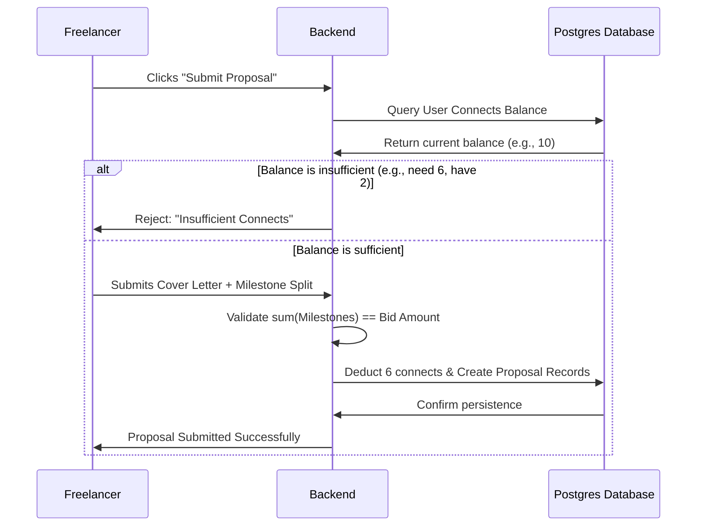

# Feature Specification: Token-Gated Proposal Submission Engine
## Feature ID: F-06

---

### 1. Feature Description
Develop the proposal engine where freelancers submit bids on published projects. To prevent spam and maintain proposal quality, proposal submission will be gated using a token-based system ("Connects"). Freelancers must allocate virtual connects to submit proposals, and outline a proposed milestone plan.

---

### 2. Scope & Boundaries

#### In-Scope:
- **Proposal Submission**: Freelancer UI for entering bid details, price, duration, and attachments.
- **Connect Token System**: Database table tracking freelancer token balances. Automatic deductions based on project budget sizing (e.g., $100 job = 2 connects, $1000+ job = 6 connects).
- **Cover Letters**: Minimum 150-character cover letter validation to discourage copy-paste replies.
- **Milestone Plans**: Freelancer breaks down their bid amount into detailed, actionable milestones (each with a title, budget, and estimated delivery date).
- **Spam Prevention**: Dynamic throttle limits (e.g., max 5 proposals per hour per user).

#### Out-of-Scope:
- Buying connects via payment gateways (Connect purchase bundles will be designed in Phase 2; Phase 1 will provide 50 free monthly connects).
- Automated proposal screening tools.

---

### 3. Detailed Technical Requirements

#### 3.1. Frontend Views & UI Elements
- **Proposal Submission Workspace**: Interface displaying job details on the left, bid details/milestone planner on the right.
- **Milestone Creator Widget**: Dynamic row-based component. Allows adding, editing, and deleting milestones with instant sum checking.
- **Connects Cost Banner**: Summary panel highlighting: *"This proposal requires 4 Connects. Your current balance: 24 Connects."*

#### 3.2. Backend APIs & Endpoints
- `POST /api/v1/proposals`: Submits proposal. Validates cover letter length, connects balance, and milestone totals.
- `GET /api/v1/proposals/:id`: Retrieves individual proposal and its milestone schedule.
- `GET /api/v1/user/connects`: Returns current connects balance and transactions log.

#### 3.3. Database Schema Impact
- **Users Table**: Add column `connects_balance` (INTEGER, DEFAULT 50).
- **ConnectTransactions Table**: Create table storing `id` (UUID, PK), `user_id` (UUID, FK), `amount` (INTEGER), `description` (VARCHAR), `created_at` (TIMESTAMP).
- **Milestones Table**: Add columns `proposal_id` (UUID, FK), `status` (ENUM: 'proposed', 'approved').

---

### 4. Acceptance Criteria & Edge Cases

| Scenario | Given | When | Then |
| :--- | :--- | :--- | :--- |
| **Insufficient Connects** | Freelancer has 2 connects remaining and a project requires 6 | They click "Submit Proposal" | The button is disabled, and an alert requests them to acquire more connects. |
| **Milestone Sum Mismatch** | Total bid is $1,000, but freelancer's milestone plan sums to $950 | They click submit | System returns validation error: "The sum of milestone budgets must equal the total bid amount." |
| **Cover Letter Minimum Validation** | Freelancer writes "Hire me, I do React" | They click submit | Validation blocks submission: "Cover letter must be at least 150 characters." |
| **Connect Refund on Job Cancel** | A Client cancels a project without hiring | The job is archived | System automatically refunds the connects spent by all active bidders. |
| **Double Submission Attempt** | Freelancer double-clicks submit button rapidly | Network request is sent | Backend uses unique composite index constraint (`freelancer_id`, `project_id`) to block duplicate submissions. |
