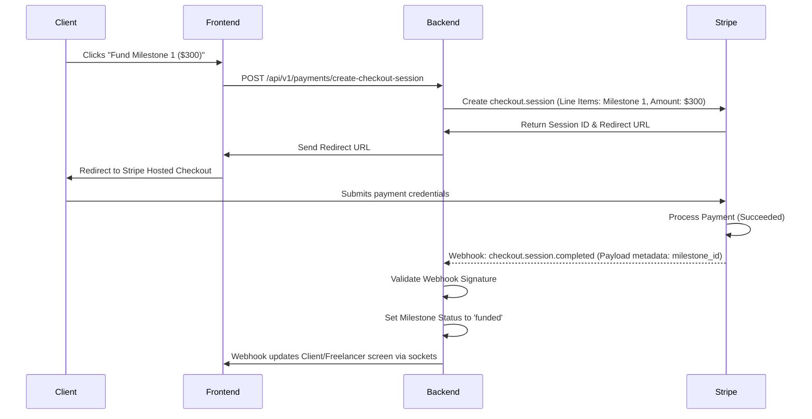

# Feature Specification: Stripe Escrow Payment Gateway
## Feature ID: F-08

---

### 1. Feature Description
Implement an escrow payment processing backend utilizing Stripe. The gateway must collect funds from clients during contract creation, allocate funds securely in a platform-managed transit account (escrow), and lock milestone budgets until approval criteria are verified.

---

### 2. Scope & Boundaries

#### In-Scope:
- **Payment Collection**: Integration with Stripe Checkout to securely capture credit card and ACH inputs.
- **Escrow Funding**: Process payments to store funds in platform Stripe Account (holding balances).
- **Milestone Allocation**: Bind specific transaction records to active milestone IDs.
- **Stripe Integration**: Configure webhooks (`payment_intent.succeeded`, `checkout.session.completed`) to update escrow statuses automatically.
- **Payment Security**: Strict server-side validation of amount limits, currency types (USD only for Phase 1), and verification signature hashes on stripe webhook payloads.

#### Out-of-Scope:
- Supporting cryptocurrency escrows.
- Multi-currency conversion (USD is base transaction currency).

---

### 3. Detailed Technical Requirements

#### 3.1. Frontend Views & UI Elements
- **Payment Confirmation Screen**: Summarizes the checkout transaction (Milestone details, Escrow processing warnings, Payment Methods, Processing Fee).
- **Stripe Element Integration**: Responsive input form styled to match the dark-theme UI.
- **Escrow Dashboard status badges**: Displays color-coded payment labels (`Unfunded` = Gray, `Escrow Funded` = Yellow, `Released` = Green).

#### 3.2. Backend APIs & Endpoints
- `POST /api/v1/payments/create-checkout-session`: Prepares payment intent metadata, registers product as milestone deliverables, returns Redirect token.
- `POST /api/v1/payments/webhooks/stripe`: Public webhook handling raw Stripe payload stream. Verifies HMAC header signature.
- `GET /api/v1/payments/milestone/:id/status`: Retrieves payment verification states.

#### 3.3. Database Schema Impact
- **EscrowTransactions Table**: Create table storing `id` (UUID, PK), `milestone_id` (UUID, FK), `stripe_charge_id` (VARCHAR), `amount` (DECIMAL), `currency` (VARCHAR), `status` (ENUM: 'initiated', 'captured', 'refunded'), `created_at` (TIMESTAMP).

---

### 4. Acceptance Criteria & Edge Cases

| Scenario | Given | When | Then |
| :--- | :--- | :--- | :--- |
| **Fake Webhook Attack** | Hacker constructs a mock HTTP post resembling stripe webhook payload | They post it to `/api/v1/payments/webhooks/stripe` | The endpoint signature check fails, returning `400 Bad Request` and ignoring updates. |
| **Card Decline Handle** | Client's credit card has insufficient balance | They submit details on Stripe Checkout | Stripe declines transaction, returns user to "Payment Failed" redirect page, leaving milestone state `pending_funding`. |
| **Out-of-Order Webhook** | Webhook confirms payment before database records checkout session | Webhook is received | System upserts payment transaction status safely using locks, preventing double entry. |
| **Refund Request on Unfunded Job** | Client requests refund for active draft | They click refund | System permits cancellation instantly as no stripe transactions exist. |
| **Escrow Hold Duration** | Escrow holds funds indefinitely | Milestone is funded | Funds remain locked on Stripe balance sheet, releasing only when authorized. |
