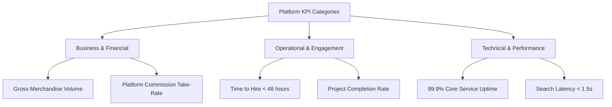

# KPIs & Acceptance Criteria Document (KPI)
## Project: Freelance & Client Marketplace (Escrow-Enabled Platform)

---

### 1. Key Performance Indicators (KPIs)

To evaluate the success of the platform post-launch, the following business, operational, and system performance metrics will be measured:

#### 1.1. Business & Financial KPIs
- **Gross Merchandise Volume (GMV)**: Total volume of payments processed through escrow milestones monthly. Target: $100K GMV within 6 months.
- **Platform Take-Rate (Revenue)**: Total fee revenue collected (10% of freelancer earnings + 3% client transaction charges). Target: 11.5% blended take-rate.
- **Customer Acquisition Cost (CAC) vs. Customer Lifetime Value (LTV)**: Ratio of marketing cost to obtain a user vs. cumulative fee revenue. Target: LTV to CAC ratio > 3:1.

#### 1.2. Engagement & Operational KPIs
- **Average Time-to-Hire (TTH)**: The time elapsed from publishing a project to funding the first milestone. Target: < 48 hours.
- **Project Completion Rate (PCR)**: Percentage of funded contracts that transition to `Completed` status rather than `Cancelled` or `Refunded`. Target: > 92%.
- **Dispute Rate**: Percentage of funded contracts that enter `Disputed` status. Target: < 2.5%.
- **Dispute Resolution Velocity**: Average time taken by an Administrator to resolve an active dispute. Target: < 72 hours.

#### 1.3. Technical Performance KPIs
- **Search Response Latency**: The average response time of project search queries. Target: < 1.5 seconds.
- **Core API Availability**: Total uptime of essential services (Auth, Escrow Operations). Target: 99.9% uptime.
- **Payment Processing Success Rate**: Percentage of Stripe checkout processes completed successfully without error. Target: > 99%.

---

### 2. Global Acceptance Criteria (Given-When-Then Scenarios)

The project will be considered accepted only when all scenarios across the following core functional modules pass verification.

---

### Module 1: User Onboarding & Identity Authentication

#### Scenario 1.1: Registration and Role Selection
- **Given** a new visitor lands on the registration page,
- **When** they fill in valid credentials, select the role of "Freelancer", and click "Submit",
- **Then** the system must create a new user account, initialize a freelancer profile, send a confirmation email, and log them into the freelancer dashboard.

#### Scenario 1.2: KYC (Know Your Customer) Check Threshold
- **Given** a registered freelancer attempts to initiate a payout of $600,
- **When** their KYC verification status is "Unverified",
- **Then** the payout request must be blocked, and the system must present a modal redirection to the Stripe Identity verification portal.

---

### Module 2: Project Management & Posting

#### Scenario 2.1: Client Job Posting with Fixed-Price Budget
- **Given** an authenticated Client in the workspace,
- **When** they fill in the project details (Title: "React/Node Web App", Category: "Development", Budget Type: "Fixed-Price", Budget: $1,000, Skills: "React, Node.js") and click "Publish",
- **Then** the project status must become `Published` and be visible in the public search index.

#### Scenario 2.2: Freelancer Project Search and Filtering
- **Given** a freelancer browsing the jobs portal,
- **When** they filter by skill "React" and budget range "$500 to $2,000",
- **Then** the system must display only active project posts matching both criteria, ordered by newest first.

---

### Module 3: Proposals & Negotiation

#### Scenario 3.1: Submitting a Proposal with Milestones
- **Given** a freelancer with a balance of 20 connects,
- **When** they submit a proposal on a $1,000 project requiring 4 connects, providing a cover letter and splitting the $1,000 into 2 milestones ($400 and $600),
- **Then** their profile connects balance must decrease to 16, and the client must see the proposal on their project dashboard with the proposed milestones.

#### Scenario 3.2: Milestone Negotiation
- **Given** a Client reviewing a freelancer's proposal milestones,
- **When** the Client requests a change to Milestone 1 (from $400 to $300) and Milestone 2 (from $600 to $700),
- **Then** the freelancer must receive a notification, and the proposal status must set to "Under Negotiation" until the freelancer accepts or declines the revisions.

---

### Module 4: Secure Escrow Payment Contracts

#### Scenario 4.1: Escrow Funding before Starting Work
- **Given** a Client decides to hire a Freelancer based on a negotiated proposal,
- **When** they click "Accept & Fund Milestone 1 ($300)",
- **Then** the application must direct them to Stripe Checkout, process the payment, update the contract state to `Active`, set Milestone 1 state to `Funded`, and notify the freelancer to begin work.

#### Scenario 4.2: Work Submission for Milestone Review
- **Given** an active contract where Milestone 1 is in state `Funded`,
- **When** the freelancer uploads the project file zip, provides a live demo URL, and clicks "Submit Milestone Deliverables",
- **Then** the contract status changes to `Review / Pending Approval`, and the client receives a high-priority approval alert.

#### Scenario 4.3: Safe Escrow Release & Platform Take-Rate Deduction
- **Given** a milestone has been submitted by the freelancer,
- **When** the client clicks "Approve & Release Funds",
- **Then** the system must deduct a 10% platform fee ($30), transfer $270 to the freelancer's wallet balance, update the milestone status to `Released`, and prompt the client to fund the next milestone.

---

### Module 5: Dispute Arbitration

#### Scenario 5.1: Dispute Triggering
- **Given** a client rejects a milestone deliverable and requests revisions 3 times,
- **When** the freelancer clicks "File Dispute" from the contract workspace,
- **Then** the milestone status must change to `Disputed`, the contract must lock to prevent further modification, and a support ticket must be raised for admin arbitration containing all communications and submissions.

#### Scenario 5.2: Admin Split Resolution
- **Given** an active dispute over a $500 milestone,
- **When** the Administrator reviews the dispute logs and issues a resolution split of 60% ($300) to the Freelancer and 40% ($200) refund to the Client,
- **Then** the escrow engine must execute payouts (minus platform fee on the freelancer's portion), update contract status to `Closed via Dispute Resolution`, and notify both parties.

---

### Module 6: Review & Feedback Engine

#### Scenario 6.1: Double-Blind Feedback Visibility
- **Given** a completed contract,
- **When** the client submits a review for the freelancer,
- **Then** the review must remain hidden from the freelancer until either the freelancer submits their feedback for the client or 14 days elapse, preventing retaliatory ratings.

---

### Module 3: Summary of Verification Metrics

To ensure successful delivery, the testing suite must validate all scenarios:

| Module | Test Type | Target Pass Rate | Minimum Coverage |
| :--- | :--- | :--- | :--- |
| **Auth & KYC** | Integration | 100% | 90% |
| **Project Posting** | End-to-End | 100% | 85% |
| **Bidding Engine** | Unit & Integration | 100% | 95% |
| **Escrow & Payments** | Transactional Integration | 100% | 100% |
| **Disputes** | Workflows / System Tests | 100% | 80% |
| **Reviews** | Unit Tests | 100% | 90% |
