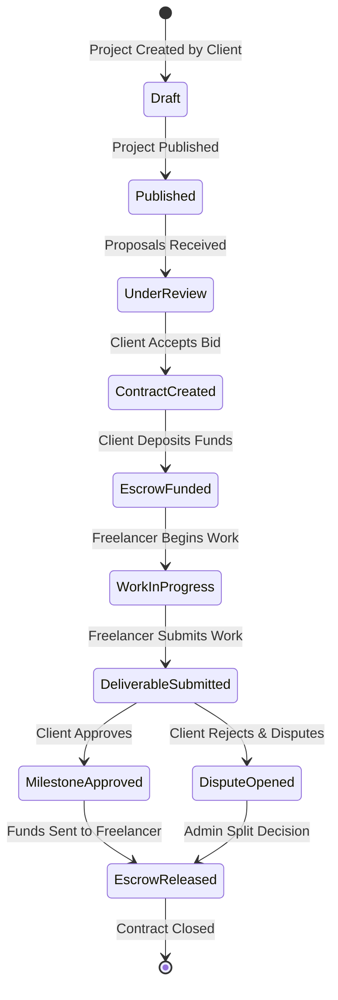

# Product Requirements Document (PRD)
## Project: Freelance & Client Marketplace (Escrow-Enabled Platform)

---

### 1. Introduction & Objectives
This Product Requirements Document (PRD) details the feature specifications, user experience guidelines, and technical architectures required to build the Freelance Marketplace. The target is a highly responsive web application built with a premium interface, leveraging secure stripe-based payment escrows, and a reliable contract/proposal state machine.

---

### 2. User Roles & Personas
- **Freelancer (Alex - Full Stack Developer)**: Wants to find web development projects, submit professional bids, write milestone proposals, communicate with clients via an organized workspace, submit deliverables, and get paid securely.
- **Client (Sarah - Startup Founder)**: Wants to post project details, browse experienced candidates, filter bids, lock project funds in escrow to protect her investment, approve deliverables stage-by-stage, and easily manage payments.
- **System Admin (Emily - Support Manager)**: Oversees site compliance, review flagged listings, mediates payment disputes between Alex and Sarah, and reviews automated platform transaction records.

---

### 3. Comprehensive Feature Specifications



#### 3.1. Authentication & Onboarding
- **Sign-Up/Login**: Email/password authentication, Google OAuth, and Github OAuth.
- **Role Selection**: During onboarding, users select whether they want to use the platform as a **Client** (to hire) or a **Freelancer** (to work). A toggle in the dashboard allows switching mode.
- **KYC Integration**: Stripe Identity integration for freelancers. If withdrawals exceed $500, identity verification is flagged as mandatory.

#### 3.2. Project Engine (Listing & Discovery)
- **Project Creation Form**:
  - Fields: Title (min 15 chars), Description (rich text, markdown supported, file uploads), Categories (tags), Skills required (max 10), Budget Type (Fixed-Price or Hourly), Budget Range ($ value), Project Duration, Attachments.
- **Project Search & Directory**:
  - Live filtering by search query, skills, budget range, project duration, client rating, and job category.
  - Sorting options: Newest, budget (low-to-high, high-to-low), number of proposals.

#### 3.3. Proposal & Negotiation Engine
- **Proposal Submission Form**:
  - Dynamic Bidding Amount (must be within or equal to project budget limits).
  - Connect Cost: Deducts a specific number of profile tokens (e.g., 2 to 6 connects depending on project size).
  - Custom Cover Letter.
  - Deliverables & Milestones Setup: Freelancers define a schedule of milestones, allocating a description, due date, and budget amount for each. The sum must match the total proposal bid.
- **Negotiation Interface**:
  - Private instant messaging thread bound specifically to the proposal.
  - Ability for the client to request modification of milestones.
  - Ability for the freelancer to submit updated milestones.

#### 3.4. Escrow & Contract Management
- **Contract States**: `Draft`, `Escrow Funded`, `Active / Work in Progress`, `Review / Pending Approval`, `Disputed`, `Completed`, `Cancelled`.
- **Escrow Funding Flow**:
  - When the client clicks "Accept Proposal", they are redirected to a Checkout flow to fund the *first* milestone.
  - Upon successful payment, the contract state changes to `Escrow Funded`, and a webhook updates the status.
  - The freelancer receives a notification: "Milestone funded. You may safely begin work."
- **Deliverable Submission Flow**:
  - Freelancers can upload files, submit text/code links, and write a submission message.
  - Client receives an approval request.
- **Escrow Release Flow**:
  - Client clicks "Approve & Release".
  - The payment processor releases the locked milestone funds from the platform escrow to the freelancer's wallet balance, minus a platform fee.
  - If there are remaining milestones, the client must fund the next milestone to resume work.

#### 3.5. Real-Time Chat Room & Communication
- Dedicated chat rooms for active contracts.
- File attachment viewer support (image previews, PDFs, ZIP files).
- Text messages should use WebSockets to sync instantly without browser refresh.
- Automated system messages posted in chat when contract states change (e.g., "Sarah funded Milestone 1 for $500", "Alex submitted work for Milestone 1").

#### 3.6. Rating & Review System
- Triggered automatically once a contract is closed (`Completed` or `Cancelled`).
- Clients rate freelancers on: Quality of Work, Communication, Expertise, Adherence to Schedule.
- Freelancers rate clients on: Communication, Clear Requirements, Professionalism.
- Reviews must be submitted blindly; reviews are only visible after both parties have completed their review or after 14 days.

---

### 4. Database Schema Proposal (Conceptual)

```
Users Table
  - id (UUID, PK)
  - email (VARCHAR)
  - password_hash (VARCHAR)
  - full_name (VARCHAR)
  - role (ENUM: 'client', 'freelancer', 'admin')
  - verified (BOOLEAN)
  - created_at (TIMESTAMP)

FreelancerProfiles Table
  - id (UUID, PK)
  - user_id (UUID, FK -> Users.id)
  - title (VARCHAR)
  - bio (TEXT)
  - hourly_rate (DECIMAL)
  - skills (ARRAY of VARCHAR)
  - balance (DECIMAL)

Projects Table
  - id (UUID, PK)
  - client_id (UUID, FK -> Users.id)
  - title (VARCHAR)
  - description (TEXT)
  - budget_type (ENUM: 'fixed', 'hourly')
  - budget (DECIMAL)
  - status (ENUM: 'draft', 'published', 'closed')
  - created_at (TIMESTAMP)

Proposals Table
  - id (UUID, PK)
  - project_id (UUID, FK -> Projects.id)
  - freelancer_id (UUID, FK -> Users.id)
  - bid_amount (DECIMAL)
  - cover_letter (TEXT)
  - status (ENUM: 'pending', 'accepted', 'declined')
  - created_at (TIMESTAMP)

Contracts Table
  - id (UUID, PK)
  - project_id (UUID, FK -> Projects.id)
  - client_id (UUID, FK -> Users.id)
  - freelancer_id (UUID, FK -> Users.id)
  - total_budget (DECIMAL)
  - status (ENUM: 'funded', 'active', 'completed', 'disputed')
  - created_at (TIMESTAMP)

Milestones Table
  - id (UUID, PK)
  - contract_id (UUID, FK -> Contracts.id)
  - title (VARCHAR)
  - amount (DECIMAL)
  - status (ENUM: 'pending_funding', 'funded', 'submitted', 'released', 'disputed')
  - due_date (DATE)
  - submission_details (TEXT)
```

---

### 5. Detailed User Flows

#### User Flow 1: Client Hires a Freelancer
1. Client logs in -> Browses proposals on their active project.
2. Clicks on Alex's proposal -> Reviews suggested milestones:
   - Milestone 1: "Wireframes & Mockups" - $200 (Due: June 15)
   - Milestone 2: "Frontend Implementation" - $400 (Due: July 01)
   - Milestone 3: "Backend Integration" - $400 (Due: July 15)
3. Client clicks "Accept Proposal & Fund Milestone 1".
4. System redirects to Stripe Checkout session. Client pays $200.
5. Stripe sends payment confirmation webhook.
6. System changes Contract status to `Active`, and Milestone 1 status to `Funded`.
7. Alex is notified via email and platform notification to start work.

#### User Flow 2: Escrow Release
1. Alex completes the wireframes -> Clicks "Submit Milestone Work".
2. Alex uploads a link to the prototype and writes a short explanation.
3. System changes Milestone 1 status to `Submitted`.
4. Client is notified -> Reviews the deliverable in their dashboard.
5. Client clicks "Approve Work".
6. System deducts platform fee (e.g., 10% = $20) and adds $180 to Alex's withdrawable balance.
7. System updates Milestone 1 status to `Released`.
8. Client prompted to fund Milestone 2.

---

### 6. System Arbitration & Dispute Workflows
- **Trigger**: When a freelancer submits work but the client repeatedly requests revisions without constructive comments, or if a freelancer stops responding while funds are locked in escrow, either party can click "Request Arbitration".
- **Action**:
  - The milestone and contract state transition to `Disputed`.
  - An email is dispatched to Support.
  - The chat log, deliverables, files, and project scope are compiled into a dispute bundle.
- **Resolution**:
  - An Admin reviews the dispute bundle.
  - The Admin uses the panel to define the payout split: `x%` to Freelancer, `y%` back to Client (where $x + y = 100\%$).
  - Once submitted, the escrow engine triggers payouts, and the contract is marked `Closed`.

---

### 7. Core Non-Functional & Security Requirements
- **PCI-DSS Compliance**: The application must never store raw credit card credentials. All payments must be handled via tokens using Stripe Elements or Hosted Checkout.
- **CSRF & XSS Protection**: All user input text must be sanitized before rendering. Auth tokens must be stored in secure HttpOnly cookies.
- **Optimized Latency**: Dynamic interfaces must render database results instantly. Use optimistic UI updates for chat channels to ensure chat feels fast and premium.
- **Responsive Layout**: Design must be fully optimized for Mobile, Tablet, and Desktop, using clean CSS Grid and Flexbox layouts. All pages must use a sleek dark-themed workspace.

---

### 8. Key Performance Indicators (KPIs) Linkage
Product features are directly aligned with success metrics defined in [kpi.md](file:///d:/vibeCoding2026/Projects/freelance-marketplace/kpi.md). The application metrics collector must track registration rates, project-to-bid times, milestone completion velocities, and payment gateway failure metrics.
