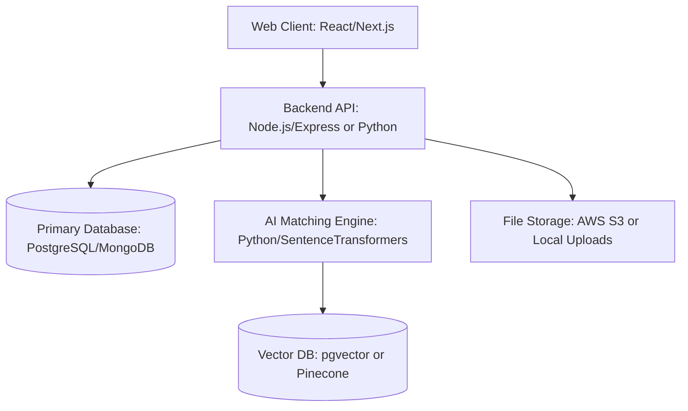

# Product Requirements Document (PRD)
## Project: Global AI-Powered Job Portal

---

### 1. Product Overview & Goals
The objective of the Product is to deliver a seamless, responsive, and highly interactive job portal. The product combines standard Applicant Tracking System (ATS) features with vector-based semantic matching algorithms to deliver real-time recommendations and transparent pipeline management.

---

### 2. User Personas
#### 2.1 Sarah (The Recruiter / Hiring Manager)
* **Goal:** Source high-quality software engineering candidates quickly without reading hundreds of unqualified resumes.
* **Pain Point:** Sifting through 300+ applicants per job posting; lack of simple, drag-and-drop tool to update applicants; missing automated filters.
* **Needs:** A dashboard that scores applicants based on skill alignment and provides a Kanban-style board for status tracking.

#### 2.2 Alex (The Job Seeker / Candidate)
* **Goal:** Find relevant senior engineer positions and receive updates on submitted applications.
* **Pain Point:** The "black hole" of job boards (no feedback after applying); tedious profile entry processes.
* **Needs:** Real-time application tracker dashboard and automated suggestions matching Alex's specific stack (React, Node, AWS) rather than generic keyword matching.

---

### 3. Detailed Functional Specifications

#### 3.1 Authentication & Profile Management
* **Auth-1 (Roles):** User onboarding must prompt for a role: **Candidate** or **Employer**.
* **Auth-2 (Profile - Candidate):** Candidates complete a profile with:
  - Name, Contact Info, Bio, Location (Remote/Onsite preferences).
  - Resume Upload (PDF only, max 5MB).
  - Experience list (Company, Title, Duration, Description).
  - Skills list (Tags format).
* **Auth-3 (Profile - Employer):** Employers complete a profile with:
  - Company Name, Website, Logo, Industry, Company Size, Description.

#### 3.2 Job Posting & Management (Employer Flow)
* **Job-1 (CRUD):** Employers can create, read, update, and delete jobs.
* **Job-2 (Attributes):** Job postings require:
  - Title, Description, Requirements (Text area).
  - Location (City, Country + Remote/Hybrid/Onsite option).
  - Job Type (Full-time, Part-time, Contract, Internship).
  - Salary Range (Min, Max, Currency).
  - Experience Level required (Junior, Mid, Senior, Lead).
  - List of target skill tags.
* **Job-3 (Status):** Jobs can be set to **Draft**, **Published**, or **Archived**.

#### 3.3 Job Search, Applying & Tracking (Candidate Flow)
* **Search-1 (Search & Filter):** Search jobs by keyword (title/description) and filter by Location, Salary range, Job Type, and Experience level.
* **Apply-1 (Application submission):** Candidates apply to a job with one click if profile is complete. System links the Candidate Profile and Resume PDF to the application.
* **Track-1 (Application Status Tracker):** Candidates have an "Applications" page showing a list of jobs applied to, date applied, and current status:
  - `Applied` -> `Under Review` -> `Interviewing` -> `Offered` / `Rejected` / `Withdrawn`.

#### 3.4 Recruiter Pipeline Management (Employer Flow)
* **Pipe-1 (Visual Board):** Employers see a board (similar to Trello/Kanban) displaying all applicants for a specific job grouped by stage:
  - Column 1: `Applied`
  - Column 2: `Under Review`
  - Column 3: `Interviewing`
  - Column 4: `Offered` / `Rejected`
* **Pipe-2 (Drag-and-Drop / Action):** Recruiter can drag a candidate card to change their stage.
* **Pipe-3 (Automatic Alert):** Moving a card must trigger an immediate in-app status update and email alert to the candidate.

#### 3.5 AI Job Recommendations & Matching Engine
* **AI-1 (Matching Score):** The system calculates a Match Score (0% to 100%) for every application using a semantic comparison (e.g., text embedding similarity) between the Candidate Resume/Skills and the Job Description/Requirements.
* **AI-2 (Candidate Recommendations):** The Candidate home page displays "AI-Recommended Jobs" sorted by matching score descending.
* **AI-3 (Employer Candidate Suggestions):** The Employer Job Detail page lists "AI-Suggested Candidates" from the public pool who match the job criteria, even if they haven't applied yet.

---

### 4. Technical Architecture Overview

* **Frontend:** React.js / Next.js with TailwindCSS (or Vanilla CSS custom-styled).
* **Backend:** Node.js (Express) or Python (FastAPI).
* **Databases:**
  - PostgreSQL (relational tables for Users, Jobs, Applications).
  - pgvector (PostgreSQL extension) to store and query candidate resume embeddings and job description embeddings.
* **AI & Embeddings Model:** `all-MiniLM-L6-v2` or similar HuggingFace sentence embedding model to generate dense vectors from text, calculating cosine similarity for matching scores.

---

### 5. Data Model Design (Conceptual)

#### 5.1 User Table
| Field | Type | Description |
|---|---|---|
| id | UUID | Primary Key |
| email | String | Unique identifier |
| password_hash | String | Secure password hash |
| role | Enum | `CANDIDATE` or `EMPLOYER` |
| created_at | Timestamp | Record creation date |

#### 5.2 Candidate Profile Table
| Field | Type | Description |
|---|---|---|
| user_id | UUID | Foreign Key -> User |
| full_name | String | Candidate's name |
| skills | Array[String] | Parsed skill tags |
| resume_url | String | Path to uploaded resume file |
| raw_resume_text | Text | Parsed text from PDF |
| resume_embedding | Vector(384) | Semantic vector embedding of resume |

#### 5.3 Job Postings Table
| Field | Type | Description |
|---|---|---|
| id | UUID | Primary Key |
| employer_id | UUID | Foreign Key -> User |
| title | String | Job Title |
| description | Text | Job description |
| requirements | Text | Job requirements |
| description_embedding | Vector(384)| Semantic vector embedding of description |
| salary_min | Decimal | Minimum salary |
| salary_max | Decimal | Maximum salary |
| status | Enum | `DRAFT`, `PUBLISHED`, `ARCHIVED` |

#### 5.4 Applications Table
| Field | Type | Description |
|---|---|---|
| id | UUID | Primary Key |
| job_id | UUID | Foreign Key -> Job |
| candidate_id | UUID | Foreign Key -> User |
| status | Enum | `APPLIED`, `UNDER_REVIEW`, `INTERVIEWING`, `OFFERED`, `REJECTED` |
| match_score | Float | Calculated AI match percentage |
| applied_at | Timestamp | Application submit timestamp |

---

### 6. Non-Functional Requirements (NFR)
* **Performance:** AI matching score calculation must take less than 1.5 seconds.
* **Security:** Resumes containing PII must only be accessible by the recruiter who posted the job. Access control must prevent cross-tenant exposure.
* **Scalability:** System architecture must support serverless vector search queries so latency does not increase linearly with the number of candidate records.
