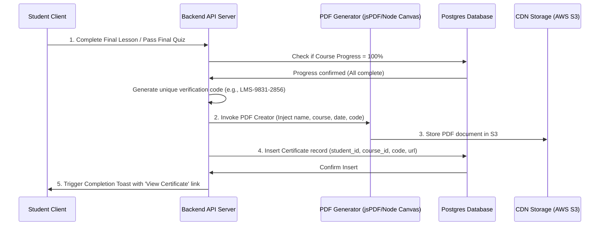

# Feature Specification: Digital Certificate Generator & Public Verifier

## 1. Feature Description
Create an automated certificate generator that creates personalized PDF completion documents when students reach 100% course completion. It includes a public verification portal (`/verify/:verification_code`) for employers or schools to validate the authenticity of the certificate.

---

## 2. Scope & Boundaries
* **In Scope:**
  * Completion listener checking if all course lectures are completed and all quizzes passed.
  * PDF generation engine dynamically creating high-quality certificates.
  * Unique verification hash generation (e.g. SHA-256 or base62 UUID strings).
  * Standalone public route `/verify/:verification_code` displaying verification status, student credentials, and course metrics.
  * "Download PDF" button inside student certificate dashboards.
* **Out of Scope:**
  * Physical certificate mailing services.
  * Integration with public blockchain networks for immutable ledger storage.

---

## 3. User Stories
* **US-10.1:** As a student, I want my certificate to generate automatically upon completing the final lesson so that I don't have to wait for manual approval.
* **US-10.2:** As a student, I want to download my certificate as a high-quality PDF so that I can print or share it.
* **US-10.3:** As an employer, I want to visit a verification link printed on a certificate to verify that it is genuine and was indeed issued by the platform to that student.

---

## 4. UI/UX Specifications
* **Certificate Layout:**
  * Premium design template featuring a dark blue/gold border, elegant serif typography (Outfit/Playfair Display), digital signature, platform logo, and seal.
* **Verification Portal Page:**
  * Clean, minimal lookup layout showing verification outcome (e.g. "Certificate Verified" in a green badge with a check icon).
  * Displays Student Name, Course Title, Issue Date, Grade achieved, and Instructor Name.
  * Secure download option to fetch the original PDF.

---

## 5. Technical Implementation & Flow

---

## 6. Acceptance Criteria
* **AC-10.1:** Certificates must be generated with a unique verification code that cannot be easily guessed (e.g. using cryptographically secure random strings or UUID hashes).
* **AC-10.2:** The public `/verify/:code` page must load successfully for unauthenticated guest visitors to facilitate external checking.
* **AC-10.3:** Students must not be able to access or download the certificate if their course completion status is less than 100%.
