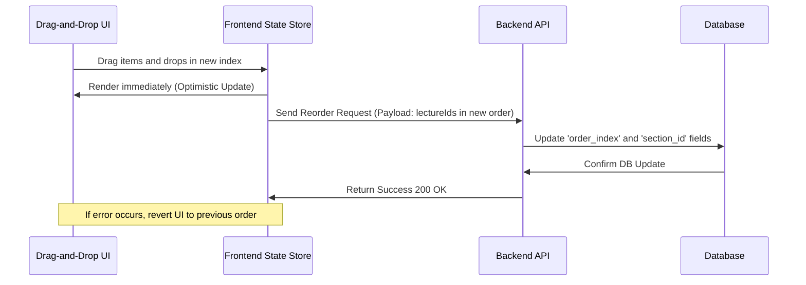

# Feature Specification: Drag-and-Drop Curriculum Builder

## 1. Feature Description
Develop an intuitive, visual drag-and-drop hierarchy builder that allows instructors to create and organize modules/sections and move lessons or quizzes between different sections, automatically persisting the sequence order of the syllabus.

---

## 2. Scope & Boundaries
* **In Scope:**
  * Component layout depicting sections containing individual lectures/quizzes.
  * Drag-and-drop reordering of lectures within a section.
  * Drag-and-drop movement of lectures between different sections.
  * Creating, renaming, and deleting sections and lectures.
  * Interactive UI indicators showing active drag states and insertion indicators.
* **Out of Scope:**
  * Nested sub-sections (limited to a flat 2-level structure: Section -> Lecture/Quiz).
  * Offline-mode curriculum building.

---

## 3. User Stories
* **US-3.1:** As an instructor, I want to organize my course into sections so that I can group related topics logically.
* **US-3.2:** As an instructor, I want to drag a lesson from Module 1 and drop it into Module 2 to reorganize my curriculum structure without reloading the page.
* **US-3.3:** As an educator, I want the system to automatically recalculate and save the layout index order in the database so that students see the updated syllabus flow.

---

## 4. UI/UX Specifications
* **Curriculum Interface:**
  * Accordion structure for sections. Clicking a header expands/collapses the content drawer.
  * Drag handle icon (six dots pattern) indicating draggable elements.
  * Smooth animations using CSS transition parameters when sorting list items.
  * Dynamic visual indicator lines representing target drop locations.
* **State Indications:**
  * "Saving..." indicator in the upper-right corner that updates to "All changes saved" upon database request completion.

---

## 5. Technical Implementation & Flow
* **APIs Required:**
  * `POST /api/v1/courses/:courseId/sections`: Creates a new section.
  * `PUT /api/v1/courses/:courseId/sections/reorder`: Updates sequence order of sections.
  * `PUT /api/v1/sections/:sectionId/lectures/reorder`: Reorders lectures inside or across sections.

---

## 6. Acceptance Criteria
* **AC-3.1:** Reordering items must use optimistic UI updates so that instructors experience zero-latency drag-and-drop movements.
* **AC-3.2:** If the backend API request fails, the UI list must smoothly snap back to its original layout and show a retry toast warning.
* **AC-3.3:** The database schema must store a sequential integer `order_index` beginning at 1 for items in a section.
