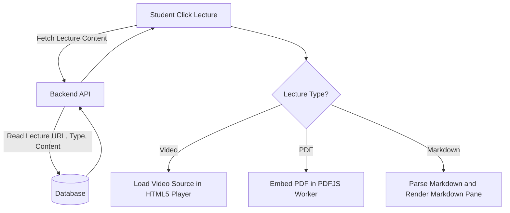

# Feature Specification: Immersive Course Playback Workspace

## 1. Feature Description
Develop an immersive, distraction-free study environment (the course player) that brings together video playback, text-based document views, and interactive lesson checklist sidebars into a single interface.

---

## 2. Scope & Boundaries
* **In Scope:**
  * Clean, dual-pane player layout:
    * Left area: Content player screen (supports HTML5 video player, Markdown views, PDF readers).
    * Right area: Sidebar showing course modules, lecture items with checkmarks indicating progress.
  * Lecture navigation controls ("Previous Lesson" and "Next Lesson").
  * Responsive sidebar drawer that collapses to maximize content focus.
  * Custom HTML5 video controls (play, pause, speed selection, volume, timeline, full-screen).
* **Out of Scope:**
  * Video annotations or drawing directly over playback streams.
  * Picture-in-Picture mode floating outside the system application browser.

---

## 3. User Stories
* **US-7.1:** As a student, I want to watch a lecture video and see the curriculum sidebar on the right side so that I can track my overall course progress.
* **US-7.2:** As a student, I want to click a toggle button to collapse the sidebar so that I can expand the video size on small screens.
* **US-7.3:** As a student, I want to click "Next Lesson" to immediately load the next lecture without manual catalog navigation.

---

## 4. UI/UX Specifications
* **Immersive Player Layout:**
  * Deep charcoal background (`#121214`) to prevent eye fatigue during long sessions.
  * Custom styled custom video controls replacing default browser players.
  * Sidebar: Interactive accordion items. Completed lessons show a filled green circle icon with checkmark; in-progress elements show half-filled rings; locked items show lock icons.
  * Dynamic header displaying course title, total modules, and active lesson breadcrumbs.

---

## 5. Technical Implementation & Flow

---

## 6. Acceptance Criteria
* **AC-7.1:** The content player layout must adapt responsively. On screens narrower than 768px, the syllabus sidebar must automatically slide out of view and toggle via a menu button.
* **AC-7.2:** Clicking "Next Lesson" must automatically save the current lesson state as complete and trigger state updates in the sidebar roster list.
* **AC-7.3:** Video player must intercept standard keyboard shortcuts (Space for Play/Pause, Left/Right Arrows for seek, Up/Down for Volume adjustment).
