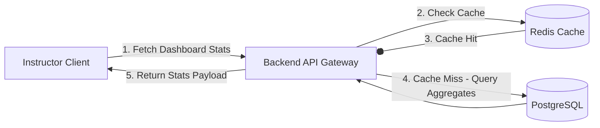

# Feature Specification: Instructor Dashboard & Course Setup

## 1. Feature Description
Create a centralized dashboard workspace for instructors to create courses, configure metadata, manage curriculum lists, publish course drafts, and monitor overall enrollment and performance metrics.

---

## 2. Scope & Boundaries
* **In Scope:**
  * Course dashboard showing dynamic KPI tiles (Total Students, Active Courses, Reviews Average, Earnings).
  * Creation flow for new courses (title, category selection, thumbnail, description, difficulty).
  * "Draft" and "Published" status toggle system.
  * Graphical data charts displaying weekly enrollment velocity using visual elements (e.g., bar/line charts).
* **Out of Scope:**
  * Bulk course importing from standard SCORM packages.
  * Live integration with external instructor accounting tools.

---

## 3. User Stories
* **US-2.1:** As an instructor, I want to view my dashboard metrics so that I can immediately track how many new students enrolled this week.
* **US-2.2:** As an educator, I want to save my new course setup as a draft so that I can finish writing the curriculum details later before students can see it.
* **US-2.3:** As an instructor, I want to easily toggle a published course back to draft if I need to perform a major overhaul of the lecture structure.

---

## 4. UI/UX Specifications
* **Dashboard Layout:**
  * Top metrics strip with glassmorphic cards and subtle gradient borders.
  * Sidebar navigation detailing: Dashboard, Course Builder, Analytics, Earnings.
  * Main area featuring a clean "Create Course" CTA button.
  * Recent activity feed showing student completions and quiz performance logs.
* **Forms & States:**
  * Course creation modal with floating label transitions and real-time character counting for fields.
  * Hover effects on dashboard metric cards with subtle shadow scaling.

---

## 5. Technical Implementation & Flow
* **APIs Required:**
  * `GET /api/v1/instructor/dashboard/stats`: Returns count of total students, courses, average ratings, and monthly history data.
  * `POST /api/v1/courses`: Creates a course draft record.
  * `PATCH /api/v1/courses/:id`: Updates course status or metadata details.

---

## 6. Acceptance Criteria
* **AC-2.1:** The instructor dashboard must load in under 1 second when requested.
* **AC-2.2:** Toggling a course to "Draft" must immediately remove it from the public course catalog, and return an HTTP 404 error if an un-enrolled student attempts to access it directly.
* **AC-2.3:** The "Create Course" form must fail verification and display error borders if the title is empty or the description is shorter than 20 characters.
