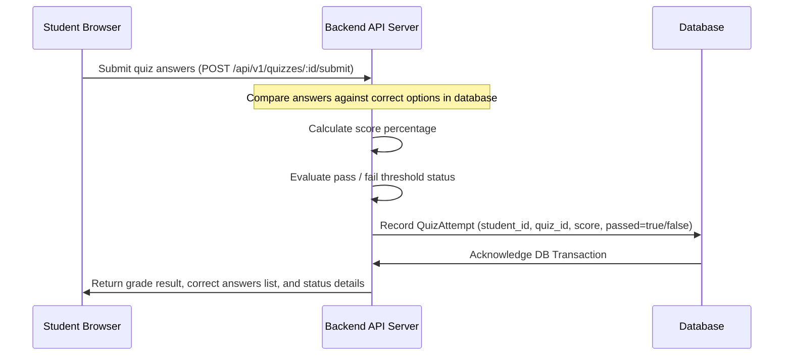

# Feature Specification: Interactive Assessment & Quiz Engine

## 1. Feature Description
Build an assessment module allowing instructors to write multiple-choice questions within sections or at the end of courses. The system automatically grades submissions and displays instant score reviews and option breakdowns.

---

## 2. Scope & Boundaries
* **In Scope:**
  * Quiz creation interface for instructors allowing additions of questions, configuring choices (text or code blocks), and marking the correct answer.
  * Student quiz-taking view (rendering quiz layouts, displaying questions sequentially or on a single page).
  * Auto-grading logic comparing answers to correct option configurations.
  * Scorecard overview displaying pass/fail indicators based on defined criteria (e.g. 80% passing grade).
  * Re-take mechanism for failed quiz attempts.
* **Out of Scope:**
  * Support for free-text answers or essay questions requiring manual instructor grading.
  * Anti-cheat safeguards (browser tab lock detection or camera streams).

---

## 3. User Stories
* **US-9.1:** As an instructor, I want to add a 5-question quiz to Module 1 so that I can evaluate student comprehension of key syntax details.
* **US-9.2:** As a student, I want my quiz to grade instantly upon clicking submit so that I don't have to wait for results.
* **US-9.3:** As a student, I want to see which questions I answered wrong and get visual confirmation of the correct options so that I can learn from my errors.

---

## 4. UI/UX Specifications
* **Quiz Playback Interface:**
  * Clean question headers showing progress counters (e.g., "Question 3 of 10").
  * Multi-choice cards with hover-highlight boundaries and click-selection animations.
  * Glowing CTA buttons ("Submit Answers").
* **Post-Submit Feedback Overlay:**
  * Top status card: Large color indicators (glowing green for "Passed", bold amber/red for "Failed - Try Again").
  * Question review list: Select option answers are visually colored (correct choice in green, selected incorrect choice in red, explanation details below).

---

## 5. Technical Implementation & Flow
* **APIs Required:**
  * `POST /api/v1/quizzes/:quizId/submit`: Evaluates user responses against key indices, stores the attempt metrics, and returns grading results.

---

## 6. Acceptance Criteria
* **AC-9.1:** The database must never return the correct answer field to the client front-end during quiz playback to prevent browser-console cheat lookups. Correct option indices must remain server-side.
* **AC-9.2:** If a course quiz is failed, the course progress must remain locked at its current level, preventing certificate issuance.
* **AC-9.3:** Instructors must be restricted from publishing a quiz that has zero questions or lacks a designated correct answer on any question.
