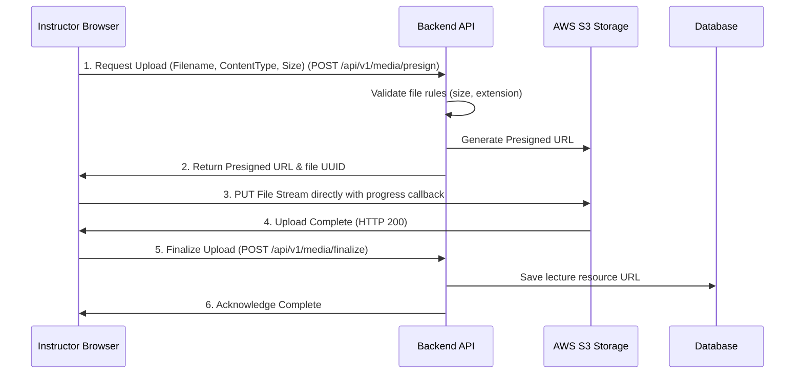

# Feature Specification: Multimedia Lecture Uploader & Cloud Storage

## 1. Feature Description
Enable instructors to upload video lectures, upload PDF documentation reference materials, and write rich text/markdown lectures. Files are securely transferred directly to cloud storage (AWS S3 or Cloudflare Stream) with real-time client-side upload speed/progress tracking.

---

## 2. Scope & Boundaries
* **In Scope:**
  * File picker supporting video (`.mp4`, `.webm`, max 500MB) and PDF (`.pdf`, max 50MB) types.
  * Presigned URL generation API for secure, direct-to-cloud uploads.
  * Real-time progress bar displaying percentage uploaded, file size, and upload speed metrics.
  * Video transcode hook request (initiating compression and adaptive bitrate configs).
  * Rich-text/Markdown editing component for text-based lectures.
* **Out of Scope:**
  * Client-side video encoding or trimming tools.
  * Word document (`.docx`) or slideshow (`.pptx`) automatic conversion (must be uploaded as PDF).

---

## 3. User Stories
* **US-4.1:** As an instructor, I want to drag a 300MB video file into the browser so that it begins uploading without locking the dashboard browser tab.
* **US-4.2:** As an instructor, I want to see an upload progress bar with remaining time estimation so that I know how long the upload will take.
* **US-4.3:** As an instructor, I want to write a supplementary markdown summary for a lecture so that students have a text-based cheat sheet next to the video.

---

## 4. UI/UX Specifications
* **Uploader UI Panel:**
  * Dotted-border drag & drop area with upload icon.
  * File list queue display showing status (Queued, Uploading, Processing, Complete, Failed).
  * Linear progress bar with gradient filling effects.
  * Cancel upload button to abort active file transfers.
* **Markdown Component:**
  * Tabbed layout split between "Write" (textarea) and "Preview" (rendered HTML with high-contrast code snippets).

---

## 5. Technical Implementation & Flow

---

## 6. Acceptance Criteria
* **AC-4.1:** Video files exceeding 500MB or PDFs exceeding 50MB must be rejected instantly by the front-end validation, triggering an validation alert warning.
* **AC-4.2:** Video streaming endpoints must use Cloudfront/CDN caching with signed cookies or tokens to prevent hotlinking.
* **AC-4.3:** Aborting an upload mid-stream must immediately cancel the S3 request to prevent storage charges for partial uploads.
