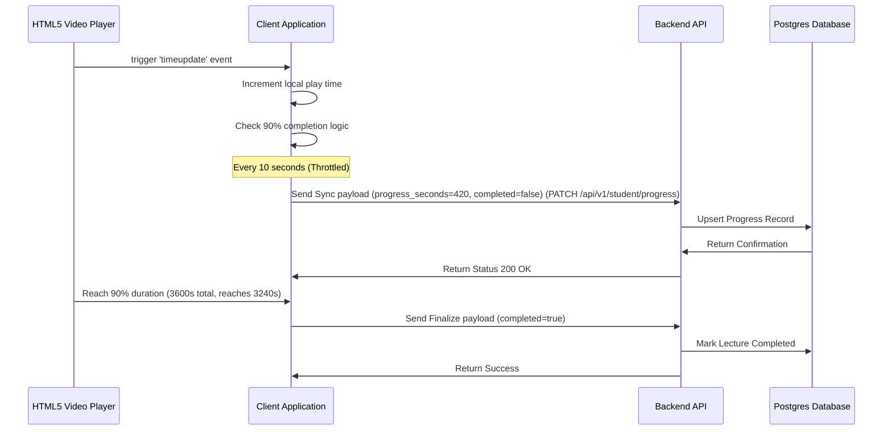

# Feature Specification: Real-Time Student Progress Auto-Saver

## 1. Feature Description
Implement a background progress tracking and saving framework. It saves video playback markers, tracks lesson checklist progression automatically (e.g. marking videos done at 90% watched), and syncs state to the database every 10 seconds to allow smooth course resumption.

---

## 2. Scope & Boundaries
* **In Scope:**
  * Client-side listener monitoring HTML5 video `timeupdate` events.
  * Auto-save handler syncing playback offset (in seconds) to backend database using a throttled/debounced API.
  * 90% threshold checker: Automatically marks a lecture video as "completed" once the playhead reaches 90% of total duration.
  * Resume-playback module: Loads the last played video at the saved timestamp on fresh login or page load.
* **Out of Scope:**
  * Offline progress synchronization (progress tracking requires active connectivity).
  * Keystroke/mouse-movement idle detection (assumes user is active if video is playing).

---

## 3. User Stories
* **US-8.1:** As a student, I want my video position to save automatically so that if my laptop battery dies, I can resume learning exactly where I was.
* **US-8.2:** As a student, I want the system to mark a lecture completed once I have watched most of it (90%), without requiring me to manually click a checkbox.
* **US-8.3:** As an instructor, I want to access student progress analytics so that I can see where students drop out or lose interest.

---

## 4. UI/UX Specifications
* **Progress Interface Details:**
  * Subtle sync status message ("Saved") in the course header, blinking briefly green during database update.
  * Progress percentage on dashboard updates immediately upon completing a lecture.
  * "Resume Playback" banner on course landing pages, showing "Resume at Module 2: Lecture 3 (12:45)".

---

## 5. Technical Implementation & Flow
* **APIs Required:**
  * `PATCH /api/v1/student/progress`: Updates completion state and active video playback offset coordinates.
* **Throttling Strategy:**
  * To avoid database overload, client-side progress telemetry must be throttled to execute once every 10 seconds.

---

## 6. Acceptance Criteria
* **AC-8.1:** The database must record both `completed` (boolean) and `last_watched_timestamp` (integer seconds) fields for each lecture-user pair.
* **AC-8.2:** Progress updates must be throttled at 10-second intervals to prevent overloading API gateways.
* **AC-8.3:** If a student navigates back to a previously completed video, the player must load it from the start rather than locking it at the 90% endpoint.
