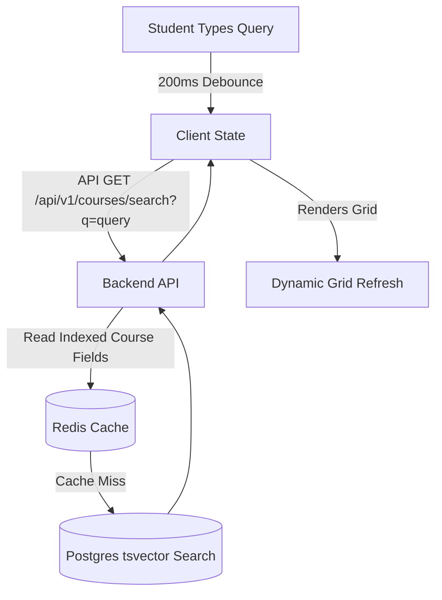

# Feature Specification: Smart Course Catalog Search & Discovery

## 1. Feature Description
Create a responsive, high-performance course search and discovery marketplace catalog page. It features an autocomplete-enabled search bar, category taxonomy tagging, and advanced filter sliders to locate courses by difficulty, user rating, and content length.

---

## 2. Scope & Boundaries
* **In Scope:**
  * Search bar with fuzzy match search queries.
  * Real-time query autocomplete suggestion list popup.
  * Category landing page grids and tag buttons.
  * Filter panel supporting parameters:
    * Category (Multi-select checkboxes)
    * Difficulty Level (Beginner, Intermediate, Advanced)
    * Course Rating (Minimum stars filter)
    * Duration (e.g., Short <3 hrs, Medium 3-10 hrs, Long >10 hrs)
  * Sorting options (Most Popular, Newest, Highest Rated, Price Low-High).
* **Out of Scope:**
  * AI-powered personalization recommendations engine (planned for future phases).
  * Geolocation-based price adjustment filters.

---

## 3. User Stories
* **US-5.1:** As a student, I want to type "re" in the search input and see suggestions like "React Native" or "Redis" immediately.
* **US-5.2:** As a student, I want to filter for 4.5+ star React courses that are less than 3 hours long so that I can learn quickly.
* **US-5.3:** As a student, I want search results to load in under 300ms without flickering the interface layout.

---

## 4. UI/UX Specifications
* **Marketplace Layout:**
  * Header showcasing a prominent search input with embedded magnifying glass icon.
  * Two-column grid: Left sidebar for filters (sticky layout on desktop, sliding drawer on mobile); Right main panel for course grids.
  * Clean, empty states showing "No results found - try clearing filters" with an illustrative card.
* **Components:**
  * Course Card: Thumbnail with gradient cover, category badge, course title, instructor profile thumbnail, star rating visual, price tag, and active student counter.

---

## 5. Technical Implementation & Flow
* **Search Optimization:**
  * Debounce query input text by 200ms on the client.
  * Use Full-Text Search (FTS) queries on the database (e.g., PostgreSQL `tsvector` or index searches).

---

## 6. Acceptance Criteria
* **AC-5.1:** Search input must not trigger API calls on every keystroke; client must debounce search inputs by 200ms.
* **AC-5.2:** Filtering results must update the browser URL search query parameters (e.g., `?category=programming&level=beginner`) so that students can copy, bookmark, or share search states.
* **AC-5.3:** Autocomplete popover must close immediately when clicking anywhere outside the search container.
