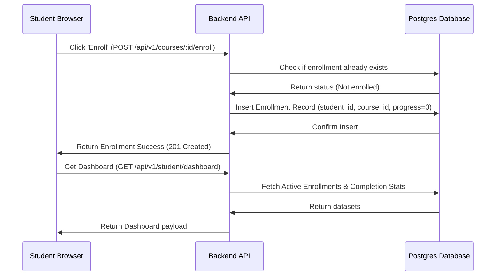

# Feature Specification: Student Dashboard & Enrollment Manager

## 1. Feature Description
Design and develop the Student Dashboard workspace. This page aggregates user progress, details course enrollments, lets students enroll or un-enroll from courses, and lists all verifiable certificates earned.

---

## 2. Scope & Boundaries
* **In Scope:**
  * Enrollment database link joining `User` to `Course`.
  * Dashboard panels showing:
    * "In-Progress" list showing progress bars and a "Resume" button.
    * "Completed" course historical log lists.
    * "Certificates" collection displaying download and share widgets.
  * Simple course enrollment action button (triggering DB insertion).
  * Overall stats display (Courses Started, Hours Spent, Certificates Earned).
* **Out of Scope:**
  * Shopping cart checkout flows (free courses only for Phase 1).
  * Wishlist features.

---

## 3. User Stories
* **US-6.1:** As a student, I want to click "Enroll Now" on a course details page so that it appears in my personal learning dashboard.
* **US-6.2:** As a student, I want to see my current completion progress bar for each course so that I can decide which topic to study next.
* **US-6.3:** As a student, I want to click a "Resume" button to open the course player at the exact lesson where I last left off.

---

## 4. UI/UX Specifications
* **Dashboard Design:**
  * User profile banner featuring name, avatar, role badge, and study streak counters.
  * Tabbed selector navigation structure:
    * `Active Courses` (Grid of progress cards).
    * `Certificates` (Certificates with PDF badges and verification links).
    * `Purchase History` (Read-only enrollment transaction audits).
* **Components:**
  * Progress Card: Course thumbnail, category tag, title, progress bar (percentage color changes: red if <10%, yellow if 10-90%, green if 100%), and CTA button.

---

## 5. Technical Implementation & Flow
* **APIs Required:**
  * `POST /api/v1/courses/:courseId/enroll`: Adds a student-course enrollment record in the database.
  * `GET /api/v1/student/dashboard`: Fetches active enrollments, overall statistics, and generated certificate files.

---

## 6. Acceptance Criteria
* **AC-6.1:** Students cannot enroll in the same course multiple times (system must throw a validation error or disable the enroll button).
* **AC-6.2:** Visual progress bar percentage must dynamically recalculate whenever a student completes or resets a lecture/quiz attempt.
* **AC-6.3:** The dashboard must load placeholder skeletons when data fetching is in-progress to prevent page layout jumps.
