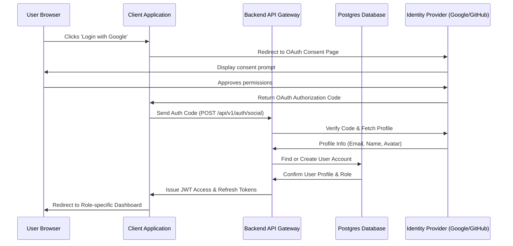

# Feature Specification: User Authentication & Role-Based Access Control (RBAC)

## 1. Feature Description
Build a secure authentication system that supports user registration, traditional email/password credentials, and social login (Google/GitHub OAuth). Users are partitioned into three roles: Students, Instructors, and Administrators, with distinct navigation flows and dashboard views assigned post-login.

---

## 2. Scope & Boundaries
* **In Scope:**
  * User Registration and Login UI with role selector (Student/Instructor).
  * Integration with OAuth providers (Google, GitHub) for single-sign-on (SSO).
  * JSON Web Token (JWT) session lifecycle management (login, refresh, logout).
  * Navigation/route guards based on role status.
  * Role-based workspace layout redirects (e.g., Instructors to `/instructor/dashboard`, Students to `/dashboard`).
* **Out of Scope:**
  * Multi-factor Authentication (MFA) - planned for future releases.
  * Enterprise SSO integrations (SAML, Active Directory).

---

## 3. User Stories
* **US-1.1:** As a new student, I want to sign up using my Google account so that I don't have to remember another password.
* **US-1.2:** As an instructor, I want to register an account using my corporate email and password so that I can keep my professional identity separate.
* **US-1.3:** As an administrator, I want the system to block non-admin users from accessing `/admin/*` routes to ensure platform security.

---

## 4. UI/UX Specifications
* **Login/Registration Screen:**
  * Harmonious center-aligned card with clean typography (Inter/Outfit).
  * Selectable tabs for "Sign In" and "Sign Up".
  * Switch toggle for selecting primary role (Student or Instructor) on registration.
  * Button grid for social logins with clear brand logos (Google, GitHub).
* **State Transitions:**
  * Success toast notification upon successful auth.
  * Shake animation on forms for verification errors.
  * Skeleton loader indicating route verification when redirects happen.

---

## 5. Technical Implementation & Flow

### 5.1. Database Schema Additions
* Ensure `User` model has:
  * `email` (unique, indexed)
  * `password_hash` (nullable for OAuth users)
  * `role` (enum: `student`, `instructor`, `admin`)
  * `avatar_url` (string)
  * `provider` (string: `local`, `google`, `github`)

---

## 6. Acceptance Criteria
* **AC-1.1:** Attempting to visit `/instructor/dashboard` as a user with the `student` role must trigger an HTTP 403 Forbidden page or redirect to `/dashboard`.
* **AC-1.2:** Form inputs must validate email structure and ensure password length is at least 8 characters containing numbers and symbols.
* **AC-1.3:** Logging out must invalidate the server-side refresh token and purge client-side local/session storage of all user details.
