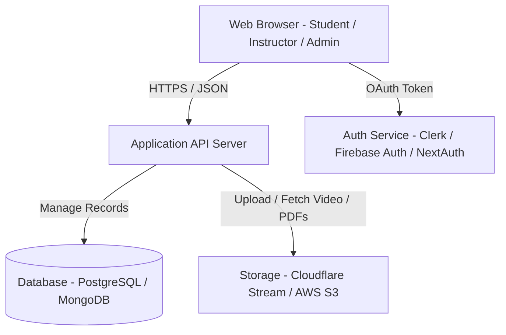

# Product Requirements Document (PRD)
## Project: Online Learning Management System (LMS)

---

## 1. Product Overview & Purpose
This Product Requirements Document (PRD) outlines the features, architecture, and specifications for building a responsive web-based LMS. The product enables instructors to curate educational curricula and students to enroll, consume content, test their knowledge, and receive verifiable certifications.

The goal is to deliver a premium, fast, and responsive user experience utilizing modern styling, clear micro-animations, and dynamic progress feedback.

---

## 2. User Personas & Journeys

### 2.1. Student (Sarah)
* **Profile:** Self-taught developer seeking to learn backend programming.
* **Flow:**
  1. Lands on the homepage, searches for "Node.js".
  2. Creates an account via Google OAuth.
  3. Enrolls in a free course.
  4. Consumes course video lectures and reads supplementary PDFs.
  5. Takes the end-of-section quiz, fails on the first attempt, reviews material, retakes and passes.
  6. Completes all lessons, triggers certificate creation, downloads the certificate PDF, and shares the verification link on LinkedIn.

### 2.2. Instructor (David)
* **Profile:** Software engineer sharing industry best practices.
* **Flow:**
  1. Registers as an Instructor.
  2. Enters the Course Builder and creates a new course outline.
  3. Uploads 10 video lectures (arranging them into 3 logical modules).
  4. Configures a 10-question multiple-choice quiz for the final module.
  5. Sets the pass mark to 80% and publishes the course.
  6. Monitors student enrollment rates and average quiz performance from the dashboard.

---

## 3. Product Architecture & Technical Specifications

### 3.1. High-Level System Architecture


### 3.2. Data Schema Model (Entity-Relationship Draft)
Below is the proposed relational model schema to support the database architecture:

```mermaid
erDiagram
    USER {
        uuid id PK
        string email
        string password_hash
        string full_name
        string role "student | instructor | admin"
        timestamp created_at
    }
    COURSE {
        uuid id PK
        uuid instructor_id FK
        string title
        text description
        string category
        string thumbnail_url
        string status "draft | published"
        timestamp created_at
    }
    SECTION {
        uuid id PK
        uuid course_id FK
        string title
        int order_index
    }
    LECTURE {
        uuid id PK
        uuid section_id FK
        string title
        string type "video | pdf | text"
        string resource_url
        text content_text
        int order_index
    }
    ENROLLMENT {
        uuid id PK
        uuid student_id FK
        uuid course_id FK
        timestamp enrolled_at
        float progress_percentage
        boolean completed
    }
    QUIZ {
        uuid id PK
        uuid section_id FK
        string title
        int passing_score "e.g., 80"
    }
    QUESTION {
        uuid id PK
        uuid quiz_id FK
        text question_text
        int order_index
    }
    ANSWER_OPTION {
        uuid id PK
        uuid question_id FK
        text option_text
        boolean is_correct
    }
    QUIZ_ATTEMPT {
        uuid id PK
        uuid student_id FK
        uuid quiz_id FK
        int score
        boolean passed
        timestamp submitted_at
    }
    CERTIFICATE {
        uuid id PK
        uuid student_id FK
        uuid course_id FK
        string verification_code UNIQUE
        timestamp issued_at
        string pdf_url
    }

    USER ||--o{ COURSE : "teaches"
    USER ||--o{ ENROLLMENT : "studies"
    USER ||--o{ QUIZ_ATTEMPT : "attempts"
    USER ||--o{ CERTIFICATE : "earns"
    COURSE ||--|{ SECTION : "contains"
    SECTION ||--|{ LECTURE : "houses"
    SECTION ||--o{ QUIZ : "contains"
    QUIZ ||--|{ QUESTION : "contains"
    QUESTION ||--|{ ANSWER_OPTION : "has"
    COURSE ||--o{ CERTIFICATE : "certifies"
```

---

## 4. Detailed Functional Requirements

### 4.1. Core Module: Authentication & Profiles
* **FR-Auth-1:** Secure sign-up/login screen with toggle fields for Student vs. Instructor account types.
* **FR-Auth-2:** Password reset workflow sending an OTP or reset link to user's email.
* **FR-Auth-3:** Profile editing (full name, avatar upload, short bio, change password).

### 4.2. Core Module: Course Builder (Instructors)
* **FR-Build-1:** Drag-and-drop hierarchy editor for Sections and Lectures. Instructors can reorder files/items easily.
* **FR-Build-2:** Lecture media uploader supporting video (`.mp4`, `.mkv`), documents (`.pdf`), and rich text summaries.
* **FR-Build-3:** Draft preview button letting the instructor experience the course exactly as a student would before publishing.

### 4.3. Core Module: Student Discovery & Dashboard
* **FR-Stud-1:** Smart search with autocomplete suggestions, showing match indicators (e.g., "Web Dev in JavaScript").
* **FR-Stud-2:** Advanced filter drawer for filtering by rating (4+ stars), difficulty level (Beginner, Intermediate, Advanced), and video duration.
* **FR-Stud-3:** Student Dashboard highlighting:
  * Carousel of "In-Progress" courses showing completion percentage bars.
  * Tab for "Recommended Courses" based on previously enrolled categories.
  * Tab for "Certificates" with PDF download controls.

### 4.4. Core Module: Course Player & Progress Tracking
* **FR-Play-1:** Sidebar displaying a full interactive curriculum list. Clicking a lecture loads it instantly in the content player. Completed lectures display a green checkmark icon.
* **FR-Play-2:** Video playback speeds (0.5x, 1x, 1.25x, 1.5x, 2x) and full-screen compatibility.
* **FR-Play-3:** System must auto-save lesson progress to server database every 10 seconds during active playback.

### 4.5. Core Module: Interactive Quizzes
* **FR-Quiz-1:** Quiz overlay mode blocking access to the next lesson until the quiz is submitted.
* **FR-Quiz-2:** Instant evaluation with visual indicators:
  * Green border for correct answers.
  * Red border for wrong answers, along with the correct option highlighted.
  * Scorecard showing: "Pass/Fail," percentage score, and a "Retry Quiz" button.

### 4.6. Core Module: Automated Certificate Generator
* **FR-Cert-1:** Dynamic creation of certificates using client-side or server-side canvas/PDF libraries (e.g., PDFKit, jsPDF).
* **FR-Cert-2:** Verification portal: A public route `/verify/:verification_code` displaying a validated certificate containing details of the user and course, validating academic completion.

---

## 5. Non-Functional Requirements (NFR)

### 5.1. Performance & Scalability
* **NFR-P1:** Video content must be optimized using HLS/DASH protocols for adaptive bitrate streaming, avoiding buffering issues for low-bandwidth users.
* **NFR-P2:** Static page loads must remain below 1.5s globally, employing aggressive caching via CDNs (e.g., Cloudflare).

### 5.2. Usability & Accessibility (a11y)
* **NFR-U1:** The platform must comply with WCAG 2.1 AA standards (high-contrast ratios, keyboard-navigable player, alt tags on thumbnails, screen-reader compatibility).
* **NFR-U2:** Responsive styling accommodating screens down to 320px wide without breaking content layouts.

### 5.3. SEO & Metadata Optimization
* **NFR-S1:** Server-Side Rendering (SSR) or Static Site Generation (SSG) for public course landing pages to enable search engine indexability.
* **NFR-S2:** Automatic generation of meta tags, schema markup (e.g., `schema.org/Course`), and OpenGraph images for courses to optimize social media sharing.

### 5.4. Security
* **NFR-Sec1:** All APIs must run over HTTPS.
* **NFR-Sec2:** JSON Web Tokens (JWT) used for session management must have short expiration windows (e.g., 1 hour) with secure refresh token cycles.
* **NFR-Sec3:** Video links must use signed URLs with short lifetimes to prevent link sharing and unauthorized video ripping.

---

## 6. Project Roadmap & Implementation Plan

### Phase 1: MVP Release (Current Goal)
* Basic authentication & role setup.
* Course uploads (Instructor builder workspace).
* Course player with standard video tracking.
* Automated quizzes and standard certificates.

### Phase 2: Engagement & Social Features
* Discussion boards under each lecture.
* Rating and review system for courses.
* Student-to-student sharing and notifications.

### Phase 3: Premium Scaling
* Paid courses, coupon generation systems.
* Multi-instructor revenue splitting dashboards.
* Native mobile applications wrapper.
