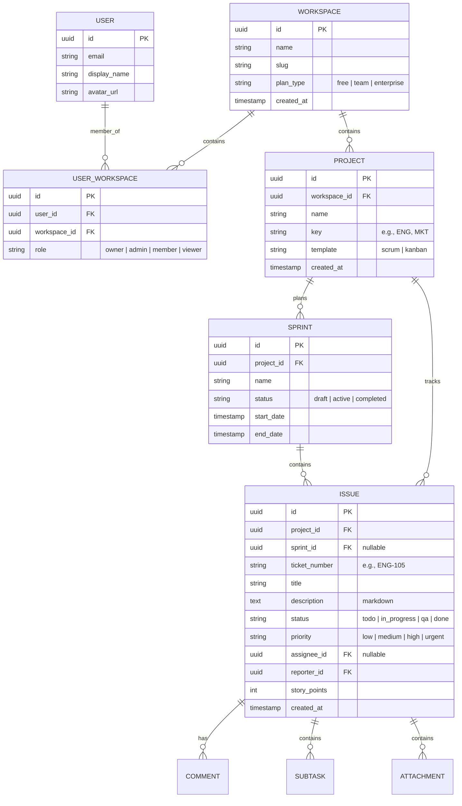

# Product Requirements Document (PRD)
## SaaS Project Management Platform (Jira/Trello Alternative)

### 1. Product Overview & Vision
The goal of this platform is to provide organizations with a fast, modern, and highly visual environment to plan, organize, and execute project deliverables. Combining the visual simplicity of Kanban board cards with the technical structure of Scrum sprints, backlogs, and detailed issue attributes, the product is optimized for software, marketing, and cross-functional teams.

---

### 2. User Stories & Epics

#### Epic 1: Multi-Tenant Workspace & Access Control
* **User Story 1.1:** As an Organization Owner, I want to create a workspace and invite my team members via email so that we can collaborate on our projects in isolation.
* **User Story 1.2:** As an Admin, I want to change user roles (Admin, Member, Viewer) so that I can regulate who can modify board configurations or add billing info.

#### Epic 2: Project & Board Management
* **User Story 2.1:** As a Project Manager, I want to create projects using Scrum or Kanban templates so that the workspace matches my team's preferred methodology.
* **User Story 2.2:** As a Member, I want to create custom workflow stages (e.g., "Ready for QA", "Blocked") on our board to accurately reflect our release pipeline.

#### Epic 3: Issue Tracking & Rich Text Editing
* **User Story 3.1:** As a Developer, I want to create detailed tasks with descriptions formatted in Markdown, assign checklists, upload attachments, and assign priority tags.
* **User Story 3.2:** As a Team Member, I want to view a full history/changelog of updates on a task (status changes, assignee changes) so I can audit task activity.

#### Epic 4: Scrum Sprint Lifecycle
* **User Story 4.1:** As a Scrum Master, I want to create Sprints, drag tasks from the Backlog into a Sprint, set start/end dates, and initiate the Sprint.
* **User Story 4.2:** As a Scrum Master, I want to complete a Sprint and choose whether unfinished tasks are moved back to the Backlog or carried over to a new Sprint.

#### Epic 5: Live Collaboration
* **User Story 5.1:** As a Team Member, I want to write comments on tasks and mention team members using `@username` to draw their attention to specific technical issues.
* **User Story 5.2:** As a User, I want to receive real-time updates when another member moves a card, assigns a task to me, or comments on my tasks.

---

### 3. Detailed Technical Requirements & Data Model

#### 3.1. Proposed Database Schema
To support high performance and multi-tenancy, the following relational schema outline is proposed:

---

### 4. Functional Specifications

#### 4.1. Core Board Functionality (Drag-and-Drop)
* Board must render columns corresponding to issue statuses.
* Drag-and-drop must update the issue's state on the server asynchronously.
* UI must show an optimistic update immediately and display a red toast notification if the network request fails, reverting the card position.

#### 4.2. Rich Text & Checklist Editor
* Task description should support rich Markdown editing (bold, code blocks, lists, headers).
* Users can add checklists. Each checklist item must be toggleable (checked/unchecked) and show percentage completion progress bars.
* Maximum upload limit for attachments is 15MB per file.

#### 4.3. Real-time Notifications & Collaboration
* WebSockets or Server-Sent Events (SSE) must trigger live UI updates.
* When `@username` is invoked, a notification object is stored and a badge triggers in the user's header notifications panel.
* If user is offline, an email summary of mentions should be dispatched.

---

### 5. API Endpoint Architecture

| Method | Endpoint | Description | Auth Required |
|---|---|---|---|
| **POST** | `/api/v1/auth/signup` | Create User & Tenant Workspace | No |
| **GET** | `/api/v1/workspaces` | Get workspaces the user belongs to | Yes |
| **POST** | `/api/v1/projects` | Create a new project in workspace | Yes (Admin/Owner) |
| **GET** | `/api/v1/projects/:projectId/issues` | List all issues in a project | Yes |
| **POST** | `/api/v1/projects/:projectId/issues` | Create new issue/task | Yes |
| **PATCH** | `/api/v1/issues/:issueId` | Update issue attributes (status, assignee) | Yes |
| **POST** | `/api/v1/projects/:projectId/sprints` | Create a Sprint | Yes |
| **PATCH** | `/api/v1/sprints/:sprintId/start` | Set active sprint status | Yes |
| **POST** | `/api/v1/issues/:issueId/comments` | Post a comment on a task | Yes |

---

### 6. Interface & UX Requirements
* **Color Palette:** Curated modern palette (Deep slates, electric purple accents, and warm amber for alerts). Full dark/light mode toggle with default matching the user's OS preference.
* **Layout Structure:**
  * Sidebar: Organization Selector, Projects list, Personal Inbox, Settings.
  * Header: Global Search Bar, Quick-Create Ticket Button, Notifications Icon, User Profile Dropdown.
  * Canvas: Responsive grid layout adjusting column widths based on browser size. Scroll locks on columns to allow vertical task scrolling without losing headers.
* **Transitions:** Smooth CSS animations (0.2s cubic-bezier transition speeds) on card hover, modal fade-ins, and column toggling.

---

### 7. Non-Functional Specifications (Detailed)

#### 7.1. Performance & Latency
* The server response time for updating task card status (drag and drop) must be under **80ms**.
* Visual transitions for dragging must maintain 60 FPS on standard desktop displays.

#### 7.2. High Availability & Scalability
* Database must utilize connection pooling to support up to 5,000 concurrent websocket connections.
* Read replicas must be configured to delegate analytical requests (dashboard queries) away from the primary transactional database.

#### 7.3. Compliance & Security
* Cross-Site Scripting (XSS) prevention: Markdown parser must sanitize output strings using safe lists (DOMPurify).
* Strict data tenant boundaries: Every database query must bind the `workspace_id` to prevent cross-tenant exposure.
* GDPR Compliance: Export Workspace Data and "Delete Organization" mechanisms must purge all file attachments and user mappings.
