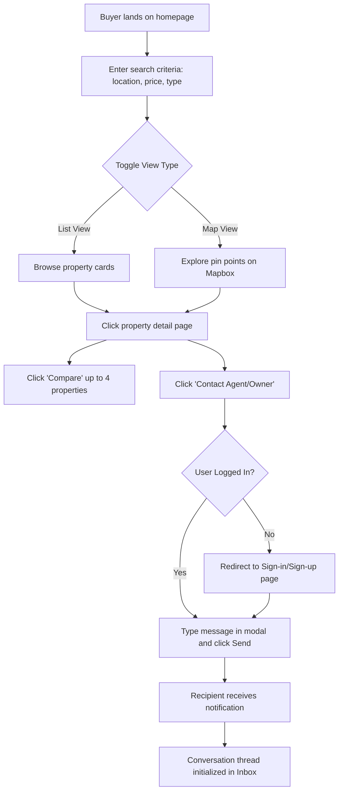
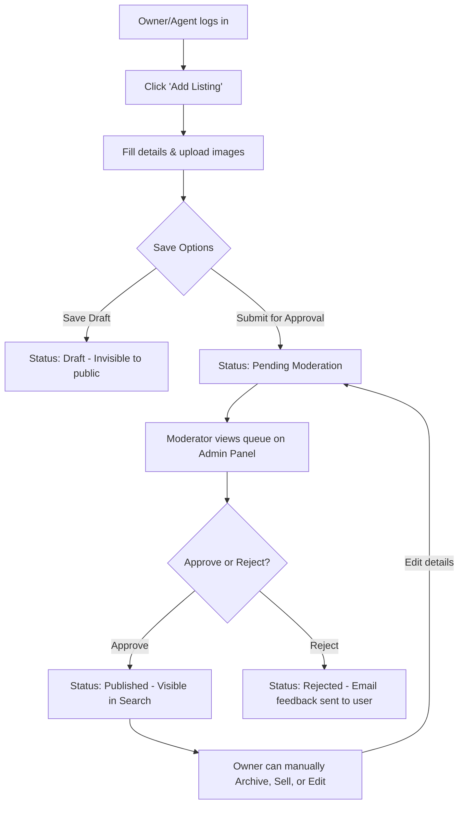
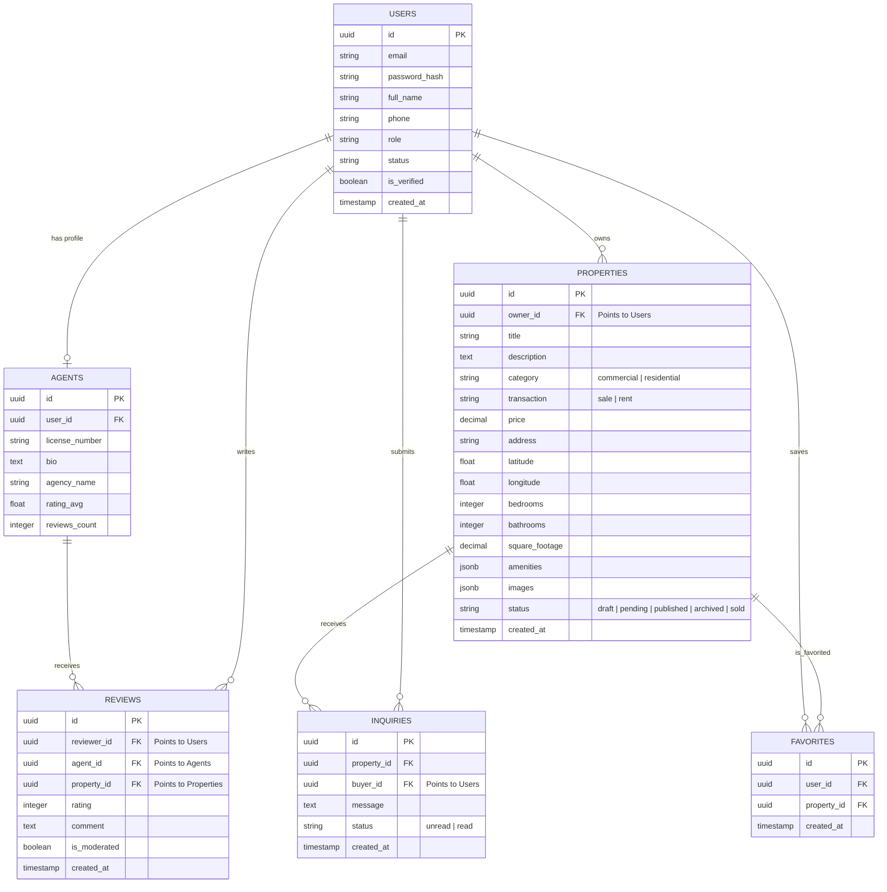

# Product Requirements Document (PRD)

## Project Name: Real Estate Listing, Discovery, and Management Platform
**Document Version:** 1.0.0  
**Date:** June 4, 2026  
**Author:** Senior Product Manager & Solution Architect  

---

## 1. Product Overview
The platform is a comprehensive real estate ecosystem that enables buyers, sellers (property owners), and licensed real estate agents to connect in a secure, efficient environment. The platform offers premium tools for property display, map-based radius searching, multi-property comparison, secure messaging, performance analytics, and strict administrative moderation.

---

## 2. User Roles

1. **UR-01: Buyer/Renter**
   * Can search, filter, view details, compare properties, save favorites, submit ratings/reviews, and contact property listers.
2. **UR-02: Property Owner**
   * Can list, update, and manage their residential or commercial properties. Can track performance analytics and communicate directly with interested buyers.
3. **UR-03: Real Estate Agent**
   * A premium user role. Can list properties on behalf of owners, customize an agent profile page, collect ratings/reviews, and receive qualified buyer leads.
4. **UR-04: System Administrator (Admin)**
   * Has full read/write access to the admin dashboard. Can approve/reject listings, verify agent licenses, moderate reviews, and ban/suspend users.

---

## 3. Epics, Features, & User Stories

### Epic 1: User & Agent Management (EPC-100)
#### Feature: Registration and Role Selection (FEAT-101)
* **US-101-1:** As a new user, I want to register an account choosing a default role (Buyer, Owner, Agent) so that my initial profile setup is tailored to my needs.
  * *Dependencies:* None.
  * *Edge Case:* User registers as an Owner but later wants to act as a Buyer.
    * *Resolution:* The platform interface supports an "agent/buyer/owner mode toggle" in the profile settings, but core account data remains unified.
* **US-101-2:** As a real estate agent, I want to submit my license number during onboarding so that I can apply for a "Verified Agent" status.
  * *Dependencies:* US-101-1.
  * *Edge Case:* Agent submits a license number that is already registered by another user.
    * *Resolution:* System blocks registration, flags the record, and triggers an alert for manual administrator investigation.

#### Feature: Agent Profile & Branding (FEAT-102)
* **US-102-1:** As a verified agent, I want to design my public profile page with my bio, agency logo, listings, contact details, and customer reviews to attract clients.
  * *Dependencies:* US-101-2.
  * *Edge Case:* Agent is suspended by admin.
    * *Resolution:* Their public profile page is immediately replaced with a 404 page, and all active listings are hidden from search results.

---

### Epic 2: Property Listings Management (EPC-200)
#### Feature: Property Creation Wizard (FEAT-201)
* **US-201-1:** As an Owner or Agent, I want to create a listing by filling out a form with property type (residential/commercial), transaction type (sale/rent), price, location details, amenities, and photos so that it can be reviewed and published.
  * *Dependencies:* US-101-1.
  * *Edge Case:* Owner uploads a photo file larger than 10MB or in an unsupported format.
    * *Resolution:* The UI performs client-side compression and validation, allowing only JPEG/PNG formats under 5MB per image.
* **US-201-2:** As an Owner or Agent, I want to save my progress as a "Draft" so that I can finish creating my listing at a later time.
  * *Dependencies:* US-201-1.
  * *Edge Case:* Network disconnects during submission.
    * *Resolution:* Auto-save drafts to local storage (browser cache) every 30 seconds to prevent loss of inputs.

#### Feature: Listing Status Lifecycle (FEAT-202)
* **US-202-1:** As an Owner or Agent, I want to archive or mark my property as "Sold" or "Rented" to stop receiving new inquiries.
  * *Dependencies:* US-201-1.
  * *Edge Case:* An active buyer has an open inquiry thread on a property that is suddenly archived.
    * *Resolution:* The inquiry thread remains active but displays a system notification banner: "This property is no longer active."

---

### Epic 3: Discovery & Advanced Search (EPC-300)
#### Feature: Keyword and Filtered Search (FEAT-301)
* **US-301-1:** As a Buyer, I want to filter properties by city, zip code, price range, bedrooms, bathrooms, and commercial/residential types so that I only see properties relevant to my criteria.
  * *Dependencies:* None.
  * *Edge Case:* A search yields zero results.
    * *Resolution:* The UI suggests nearby locations or displays a "Save Search & Notify Me" button.
* **US-301-2:** As a Buyer, I want to save my search configurations and subscribe to email alerts for new matching listings.
  * *Dependencies:* US-301-1.
  * *Edge Case:* Email automation triggers too frequently, causing users to mark them as spam.
    * *Resolution:* Provide daily/weekly digest options instead of immediate real-time notifications.

#### Feature: Interactive Map Discovery (FEAT-302)
* **US-302-1:** As a Buyer, I want to view search results plotted as markers on an interactive map and explore properties by zooming, panning, or drawing custom boundaries.
  * *Dependencies:* FEAT-301.
  * *Edge Case:* A highly dense area has 500+ properties, causing map lag.
    * *Resolution:* Implement map marker clustering at lower zoom levels and load properties progressively using viewport boundaries.

---

### Epic 4: Comparison & Favorites (EPC-400)
#### Feature: Property Comparison Matrix (FEAT-401)
* **US-401-1:** As a Buyer, I want to select up to four properties and compare their details (price, size, amenities, year built) in a clean comparison table to help me choose.
  * *Dependencies:* FEAT-301.
  * *Edge Case:* Buyer attempts to compare a residential studio apartment with a commercial warehouse.
    * *Resolution:* Allow the comparison but display a warning banner indicating that properties are of different primary categories (Residential vs. Commercial).

#### Feature: Saved Favorites (FEAT-402)
* **US-402-1:** As a Buyer, I want to save individual listings to my favorites list by clicking a heart icon so that I can review them later.
  * *Dependencies:* US-101-1.
  * *Edge Case:* Property is deleted by the owner while it is in the buyer's favorites list.
    * *Resolution:* The property is marked as "No Longer Available" in the favorites folder instead of silently disappearing.

---

### Epic 5: Inquiry & Lead Management (EPC-500)
#### Feature: Inquiry Messaging System (FEAT-501)
* **US-501-1:** As a Buyer, I want to submit an inquiry through a listing page so that I can ask the owner or agent questions directly.
  * *Dependencies:* US-101-1, FEAT-201.
  * *Edge Case:* The buyer sends repetitive inquiries within minutes.
    * *Resolution:* Enforce rate limiting of 1 inquiry per property per user every 10 minutes.
* **US-501-2:** As an Agent or Owner, I want to view, filter, and reply to all buyer inquiries from a central inbox dashboard.
  * *Dependencies:* US-501-1.
  * *Edge Case:* Agent reads message on external email and replies there.
    * *Resolution:* Mask sender and receiver emails via a secure relay system (e.g., `inbox-123@platform.com`) to track external replies inside the platform.

---

### Epic 6: Property Analytics (EPC-600)
#### Feature: Seller Dashboard Metrics (FEAT-601)
* **US-601-1:** As an Owner or Agent, I want to view charts showing page views, saves, and inquiries generated by my listings over the last 30 days to measure market interest.
  * *Dependencies:* FEAT-201.
  * *Edge Case:* Listing gets zero views over a long period.
    * *Resolution:* Provide tooltip recommendations on the dashboard (e.g., "Consider lowering price by 5% or adding more high-quality photos").

---

### Epic 7: Reviews & Feedback (EPC-700)
#### Feature: Agent and Property Reviews (FEAT-701)
* **US-701-1:** As a Buyer, I want to leave a rating (1-5 stars) and a written review for an agent after interacting with them to help maintain high quality on the platform.
  * *Dependencies:* US-101-1.
  * *Edge Case:* Agent submits fake positive reviews for themselves using dummy buyer accounts.
    * *Resolution:* Enforce system checks: a user can only review an agent if they have had an active inquiry thread that lasted for at least 3 message exchanges.

---

### Epic 8: Moderation & Control Panel (EPC-800)
#### Feature: Admin Queue & Moderation (FEAT-801)
* **US-801-1:** As an Admin, I want to view all newly submitted property listings in a pending queue to review their content and approve or reject them with feedback.
  * *Dependencies:* FEAT-201.
  * *Edge Case:* Massive spike in submissions causes backlog.
    * *Resolution:* Implement automatic AI preprocessing flags that mark listings containing blacklisted words or stock photos as "High Risk" for immediate human rejection.

---

## 4. Functional Requirements (FR)

| Req ID | Epic Reference | Description | Priority |
| :--- | :--- | :--- | :--- |
| **FR-101** | EPC-100 | The system must validate password complexity during registration (min 8 chars, 1 uppercase, 1 number, 1 special character). | High |
| **FR-102** | EPC-100 | The system must send a unique 6-digit confirmation token via email/SMS for account verification. | High |
| **FR-201** | EPC-200 | Listing creation form must require fields: Title (min 15 chars), Description (min 100 chars), Price, Address, Map Coordinates, and at least 3 photos. | High |
| **FR-202** | EPC-200 | Images uploaded to listings must be automatically compressed to WebP format for optimized loading. | Medium |
| **FR-301** | EPC-300 | Advanced search query engine must support full-text search index and respond in < 200ms. | High |
| **FR-302** | EPC-300 | Map integration must fetch boundaries and load property coordinates within the bounding box dynamically as the user pans. | High |
| **FR-401** | EPC-400 | Comparison tool must allow side-by-side view with sticky headers for up to 4 property columns. | Medium |
| **FR-501** | EPC-500 | System must trigger real-time WebSocket notifications and fallback email alerts when a new message is received in an inquiry thread. | High |
| **FR-601** | EPC-600 | System must compute and store aggregate page views, saves, and inquiries on a daily basis via background cron jobs to prevent load on active DB queries. | Medium |
| **FR-701** | EPC-700 | Review submissions must pass through an automated profanity/link-filtering check before publishing. | Medium |
| **FR-801** | EPC-800 | The Admin portal must show audit logs tracking which admin approved/rejected/modified any listing or user profile. | High |

---

## 5. User Flows

### Flow 1: Buyer Discovery and Inquiry Submission

### Flow 2: Property Creation and Moderation Lifecycle

---

## 6. Pages & Screens

1. **P-101: Homepage**
   * Features a clean, search-centric interface with background video/image slider, quick-select filters, and curated premium listing cards.
2. **P-102: Search & Map Interface**
   * Split screen layout: Left side contains scrollable property cards with filtering panels; Right side contains interactive map (Mapbox GL/OpenStreetMap). Fully responsive.
3. **P-103: Property Details Page**
   * Dynamic photo gallery carousel, pricing details, sticky contact widget, property parameters, interactive amenities list, localized map view, and a comparative matrix portal.
4. **P-104: Comparison Page**
   * Full-screen matrix grid displaying comparative properties side-by-side, highlight differences button, and direct action triggers (contact agent, save to favorites).
5. **P-105: User Inbox (Chat & Lead Management)**
   * Split pane: Left showing chat conversation lists; Right showing active conversation window with property details sidebar.
6. **P-106: Seller Dashboard & Analytics**
   * Sidebar navigation: Listings Management, Performance Analytics (Recharts showing click/inquiry rates), User Profile Settings.
7. **P-107: Admin Dashboard Portal**
   * Restricted route. Features moderation metrics, listing queues, user management list, review monitoring table, and platform audit logs.

---

## 7. API Requirements (JSON REST API)

### 7.1 Authentication & Profile
* **POST `/api/auth/register`**
  * Inputs: `email`, `password`, `fullName`, `role` (Buyer/Owner/Agent), `phone`, `licenseNumber` (optional)
  * Outputs: `201 Created` with verification token ID.
* **POST `/api/auth/login`**
  * Inputs: `email`, `password`
  * Outputs: `200 OK` with JSON Web Token (JWT) and user metadata.

### 7.2 Property Listings
* **GET `/api/properties`**
  * Inputs (Query params): `search`, `minPrice`, `maxPrice`, `type`, `bbox` (bounding box coordinates: minLng, minLat, maxLng, maxLat)
  * Outputs: `200 OK` array of matching property listings with paginated metadata.
* **POST `/api/properties` (Auth Required)**
  * Inputs: Multipart Form-Data (fields: `title`, `description`, `price`, `type`, `latitude`, `longitude`, files: `images`)
  * Outputs: `201 Created` with listing ID. Status initialized to `PENDING`.
* **PUT `/api/properties/:id` (Auth Required)**
  * Inputs: Updated properties.
  * Outputs: `200 OK` with updated details. Status reverts to `PENDING` if critical fields change.

### 7.3 Communication
* **POST `/api/inquiries` (Auth Required)**
  * Inputs: `propertyId`, `message`
  * Outputs: `201 Created` with conversation thread ID.
* **GET `/api/inquiries/threads` (Auth Required)**
  * Outputs: `200 OK` array of active chat threads for the logged-in user.

---

## 8. Database Entities (Relational Schema)

---

## 9. Security Requirements

| Req ID | Title | Description |
| :--- | :--- | :--- |
| **SEC-001** | Encryption in Transit | All communications must be encrypted using TLS 1.3 protocol. |
| **SEC-002** | Token Security | User authorization must be handled via HttpOnly, Secure, SameSite=Strict JWT cookies to prevent XSS (Cross-Site Scripting) and CSRF (Cross-Site Request Forgery) attacks. |
| **SEC-003** | Password Hashing | Passwords must be hashed using `bcrypt` with a minimum salt round of 12 before persistence. |
| **SEC-004** | Role-Based Access Control | API endpoints must validate user claims (e.g., `/api/admin/*` routes must strictly verify `role == 'admin'`). |
| **SEC-005** | SQL Injection Prevention | All database communications must use parameterized queries or a secure ORM (e.g., Prisma or Sequelize). |
| **SEC-006** | Rate Limiting | Core endpoints (login, register, contact submit) must enforce rate limiting (max 100 requests per 15 minutes per IP address). |

---

## 10. Non-Functional Requirements

| Req ID | Category | Metric Target |
| :--- | :--- | :--- |
| **NFR-001** | Performance | Web Core Vitals: Largest Contentful Paint (LCP) must be under 2.5 seconds on mobile and desktop over a 3G connection. |
| **NFR-002** | Scalability | System must handle up to 5,000 concurrent active users and auto-scale containers when CPU load exceeds 70%. |
| **NFR-003** | Availability | The platform service level agreement (SLA) must be 99.9% uptime, excluding planned maintenance windows. |
| **NFR-004** | Data Backup | Automated database backups must run every 24 hours, with backups stored in multi-region encrypted cloud object storage for disaster recovery. |
| **NFR-005** | Browser Compatibility| UI must render and function correctly across major evergreen browsers: Chrome, Safari, Firefox, and Edge. |

---

## 11. Technical Architecture
The platform is designed around a decoupled **Microservices/Modern Monolith (Modular)** architecture:
* **Frontend:** Single Page Application (SPA) using React.js/Next.js, styled with customized vanilla CSS variables to support sleek dark mode. Maps rendered client-side using Mapbox GL JS.
* **Backend:** Node.js API server (Express/NestJS) parsing RESTful actions and managing persistent WebSocket connections for real-time chat.
* **Database:** PostgreSQL for structured relational data and JSON storage. PostGIS extension enabled to handle quick spatial boundary search queries.
* **Caching:** Redis for API response caching, active user session management, and chat queue buffers.
* **Cloud Infrastructure:** Hosted on AWS / GCP using Docker containers orchestrated via Kubernetes, with static images distributed via CDN (Cloudflare).

---

## 12. Future Enhancements
* **FE-001:** Machine Learning valuation tool to auto-estimate property market value based on historical sales trends.
* **FE-002:** Integrated virtual staging and AI image enhancer for property listing photos.
* **FE-003:** Support for cryptocurrency listings and decentralized smart contracts for lease executions.
