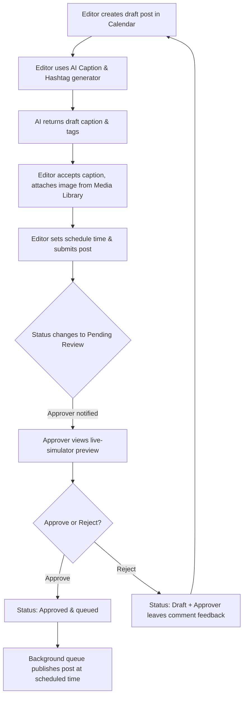
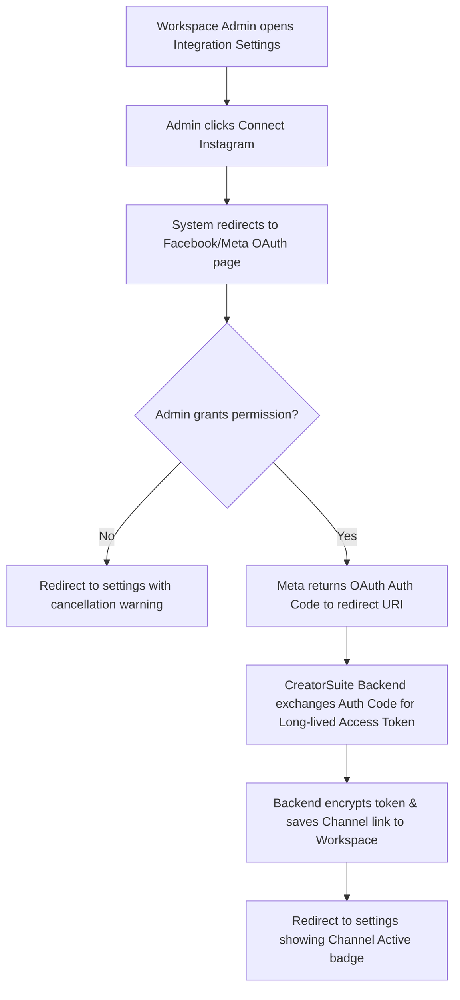
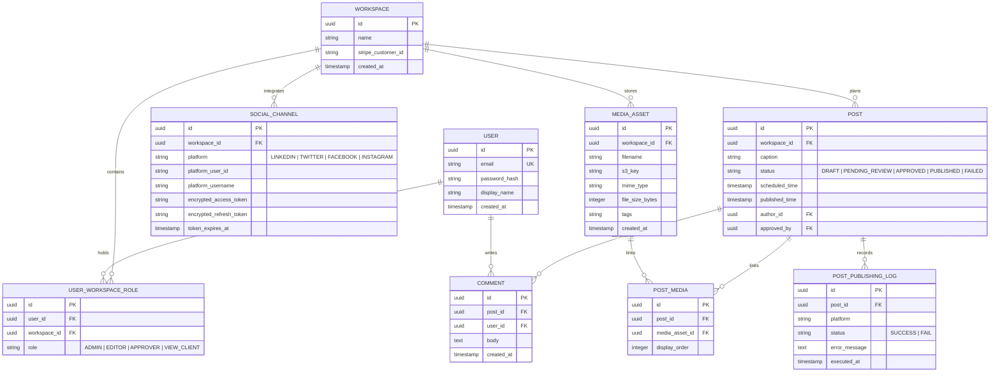
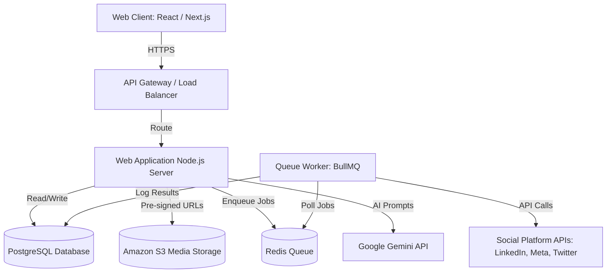

# Product Requirements Document (PRD)
## Project: CreatorSuite - Content Planning & Social Media Scheduler
**Version:** 1.0.0  
**Date:** June 4, 2026  
**Author:** Lead Product Manager & Solution Architect  

---

## 1. Product Overview
CreatorSuite is a multi-tenant Software-as-a-Service (SaaS) application that enables content creators, social media managers (SMMs), and brands to draft, enhance (using generative AI), collaborate on, schedule, publish, and track posts across LinkedIn, Twitter/X, Instagram, and Facebook. The platform centralizes assets inside a shared Media Library and runs a hard-gated Approval Workflow to prevent unapproved posts from going live.

---

## 2. User Roles & Access Matrix
The system supports the following role-based permissions at the **Workspace** level:

| Permission / Capability | Administrator (Admin) | Editor | Approver | Viewer (Client) |
| :--- | :---: | :---: | :---: | :---: |
| Manage Workspace Settings & Integrations | Yes | No | No | No |
| Invite Users & Assign Roles | Yes | No | No | No |
| Connect Social Media Accounts (OAuth) | Yes | No | No | No |
| Create / Edit Posts & Media | Yes | Yes | No | No |
| Generate Content with AI Assistant | Yes | Yes | No | No |
| Add Comments to Posts | Yes | Yes | Yes | Yes |
| Approve / Reject Scheduled Posts | Yes | No | Yes | No |
| View Calendar & Analytics | Yes | Yes | Yes | Yes |

---

## 3. Product Epics, Features, and User Stories

### 3.1 EPIC-100: Workspace & Authentication
* **Goal:** Enable users to authenticate, switch between workspaces, and link their social profiles securely.

#### Feature: FEAT-101: Workspace Setup and Invitations
* **US-101:** As a registered user, I want to create multiple workspaces so that I can keep different client projects separated.
* **US-102:** As a Workspace Admin, I want to invite team members via email and assign them roles (Editor, Approver, Viewer) so that they can collaborate with appropriate permissions.

#### Feature: FEAT-102: Social Account OAuth Integration
* **US-103:** As a Workspace Admin, I want to link our workspace to LinkedIn, Facebook, Instagram, and Twitter/X using secure OAuth consent flows so that CreatorSuite can publish posts on our behalf.

---

### 3.2 EPIC-200: Content Calendar & Planner
* **Goal:** Provide a centralized visual planning board for all social media channels.

#### Feature: FEAT-201: Interactive Drag-and-Drop Calendar Grid
* **US-201:** As a SMM, I want to view scheduled, draft, and approved posts in monthly, weekly, and daily calendar grids so that I can audit our content pacing.
* **US-202:** As a SMM, I want to reschedule a post by dragging it to a different calendar date/time slot so that I can adapt to changes quickly.

#### Feature: FEAT-202: Post Scheduler Engine & Queue
* **US-203:** As an Editor, I want to create a new post, select target social networks, input text, attach media assets, and set a specific future publication date and time.
* **US-204:** As an SMM, I want to view a timeline/list of queued posts filtered by social network, status, and author.

---

### 3.3 EPIC-300: AI Content Assistant
* **Goal:** Use AI language models to speed up copy drafting and tag generation.

#### Feature: FEAT-301: AI Caption Generator
* **US-301:** As an Editor, I want to select a text prompt, tone of voice (e.g., Professional, Playful, Bold), target platform, and length to generate optimized caption variations.

#### Feature: FEAT-302: Smart Hashtag Generator
* **US-302:** As an Editor, I want the system to scan my caption text and suggest 5-10 relevant and trending hashtags that I can insert with a single click.

---

### 3.4 EPIC-400: Media Asset Management
* **Goal:** Centralized, workspace-isolated media storage.

#### Feature: FEAT-401: Media Library & Asset Tagging
* **US-401:** As an Editor, I want to upload files (JPEG, PNG, MP4) directly into a media library, categorize them with tags, and search for them during post creation.
* **US-402:** As an Editor, I want to view file validation details (file size, format, image resolution, video duration) before uploading to verify platform compatibility.

---

### 3.5 EPIC-500: Team Collaboration & Approval Workflow
* **Goal:** Establish a review gate and centralize communications about specific posts.

#### Feature: FEAT-501: Status-based Approval Gate
* **US-501:** As an Editor, I want to submit a completed draft for review, change its status to `Pending Review`, and automatically notify the assigned Approvers.
* **US-502:** As an Approver, I want to review pending posts, view their live previews (desktop/mobile simulators), and either approve them (changing status to `Approved` and queuing them for release) or reject them (changing status to `Rejected/Draft`).

#### Feature: FEAT-502: Contextual Comments Feed
* **US-503:** As any team member, I want to leave comments and tag teammates directly on a post's detail view to discuss revisions.

---

### 3.6 EPIC-600: Analytics & Performance Reports
* **Goal:** Capture and display post engagement data.

#### Feature: FEAT-601: Metrics Dashboard
* **US-601:** As a Creator or SMM, I want to view core metrics (impressions, clicks, likes, shares, comments, engagement rate) aggregated across all connected platforms in a unified dashboard.

#### Feature: FEAT-602: Exportable Reports
* **US-602:** As a SMM, I want to export our dashboard analytics to a branded PDF or CSV file to send to clients.

---

## 4. Functional Requirements (FR)

### 4.1 Workspace & Authentication (EPIC-100)
* **FR-101:** The system MUST authenticate users via Email/Password and OAuth (Google).
* **FR-102:** A user MUST be associated with at least one Workspace. Users can switch between workspaces using a navigation dropdown without logging out.
* **FR-103:** Workspace tokens for external social networks MUST be encrypted at rest using AES-256-GCM.
* **FR-104:** The system MUST allow the Admin to revoke a social channel integration connection instantly, deleting associated access tokens from the database.
* **Dependency:** Connection success depends on external Social Network APIs (e.g., Meta Developer API, LinkedIn Developer API) being operational.
* **Edge Case:** If an OAuth token is expired during a publish attempt, the system MUST:
  1. Fail the post immediately.
  2. Change post status to `Failed`.
  3. Send an email alert to the Workspace Admin.
  4. Create an in-app error notification detailing the token failure.

### 4.2 Content Calendar & Planner (EPIC-200)
* **FR-201:** The Calendar Grid view MUST render drafts in grey, pending posts in yellow, approved/scheduled posts in green, published posts in blue, and failed posts in red.
* **FR-202:** Users MUST be able to drag-and-drop posts in monthly and weekly views. Dropping a post updates its scheduled publication date/time in the database automatically.
* **FR-203:** Post creation forms MUST validate inputs against target platforms:
  * Twitter/X: Maximum 280 characters.
  * LinkedIn: Maximum 3,000 characters.
  * Instagram: Must include at least 1 image or video.
* **FR-204:** The Scheduler Engine MUST poll the database every 60 seconds (using a background queue worker like BullMQ or Celery) to identify posts with status = `Approved` and `scheduled_time` <= current server time, then submit them to the respective social platform APIs.
* **Dependency:** Background queue execution relies on Redis status and uptime.
* **Edge Case:** When drag-and-dropping a post that is scheduled to go live in less than 5 minutes, block the operation and show an alert warning: *"Cannot reschedule posts scheduled within 5 minutes of publication."*

### 4.3 AI Content Assistant (EPIC-300)
* **FR-301:** The AI Caption Generator API call MUST construct prompts using the user instructions, selected tone (Professional, Casual, Humorous, Bold), length, and target platform rules before calling the LLM API.
* **FR-302:** The system MUST log token consumption against the workspace quota (`ai_quota_used` table). If the quota is exceeded, block generation requests and display a subscription upgrade call-to-action.
* **FR-303:** Hashtag suggestions MUST be extracted from the AI's response text and parsed into clickable items that insert directly at the end of the caption input box.
* **Dependency:** High-performance generative model API connectivity (e.g., Gemini or GPT-4o-mini).

### 4.4 Media Asset Management (EPIC-400)
* **FR-401:** The system MUST upload files directly from the browser to Amazon S3 (using pre-signed URLs) to minimize web server bandwidth usage.
* **FR-402:** Files MUST be validated prior to uploading:
  * Maximum image size: 10MB. Formats allowed: JPEG, PNG, WEBP.
  * Maximum video size: 150MB. Formats allowed: MP4, MOV.
* **FR-403:** The media library view MUST render pagination (24 assets per page) and search queries by tags or filenames.
* **Edge Case:** S3 upload interruption: If an upload fails midway, the system MUST catch the failure, delete the broken reference from the database, and display a "Upload failed, please try again" UI indicator.

### 4.5 Team Collaboration & Approval Workflow (EPIC-500)
* **FR-501:** A post in status `Approved` CANNOT be edited by an Editor unless its status is first reverted to `Draft` or `Pending Review`.
* **FR-502:** A post scheduled for publication within 10 minutes cannot have its status updated to `Draft` or `Rejected` to prevent concurrency issues with the background runner.
* **FR-503:** Comments feed MUST support real-time messaging using WebSockets (Socket.io). If Socket.io disconnects, fall back to polling the database every 10 seconds.
* **FR-504:** Email notifications for comments and status modifications MUST be batched if multiple triggers happen within 3 minutes, avoiding spamming users.

### 4.6 Analytics & Performance Reports (EPIC-600)
* **FR-601:** The Analytics engine MUST query the social platforms' APIs every 24 hours (nightly cron job) to pull updated post analytics (impressions, likes, clicks, shares) and store them in historical tables.
* **FR-602:** Exported PDF files MUST be generated on the backend (e.g., using Puppeteer or PDFKit) and uploaded to an S3 bucket with a signed link sent to the user via email.
* **Edge Case:** Missing data from social APIs: If a social platform API returns a 429 Rate Limit error, the scraper task MUST implement exponential backoff retry logic (up to 3 attempts) before skipping the workspace for that iteration.

---

## 5. User Flows

### 5.1 User Flow 1: Create, Refine, Approve, and Schedule Content


### 5.2 User Flow 2: Connect Social Media Channel


---

## 6. Screen Descriptions & Wireframe Layouts

### 6.1 Dashboard & Sidebar Navigation
A global left sidebar contains navigation links: Dashboard, Calendar, AI Assistant, Media Library, Analytics, and Workspace Settings. The top header displays the active Workspace name with a switcher dropdown and user profile controls.

```
+-----------------------------------------------------------------------------------+
|  Logo  | Workspace: Acme Agency [v]                          (Bell) [Profile Pic] |
+--------+--------------------------------------------------------------------------+
| (o) Calendar     |  [<] Today [>]    June 2026                 [ Month ] [ Week ] |
|                  +----------------------------------------------------------------+
| (a) AI Assistant |  SUN      | MON      | TUE      | WED      | THU      | FRI      |
|                  +-----------+----------+----------+----------+----------+--------+
| (m) Media Lib    |           | 1        | 2        | 3        | 4        | 5      |
|                  |           | [Insta]  |          | [Twit]   | [Lnkd]   |        |
| (n) Analytics    |           | Draft    |          | Pending  | Approved |        |
|                  +-----------+----------+----------+----------+----------+--------+
| (s) Settings     | 7         | 8        | 9        | 10       | 11       | 12     |
+------------------+-----------+----------+----------+----------+----------+--------+
```

### 6.2 Post Creation & Preview Modal
Splits screen into two main panes:
* **Left Pane (Composer):** Channel selectors, text editor (with AI Enhance button), media attachment tray, scheduler date/time selector, and Action buttons (Save Draft, Submit for Review).
* **Right Pane (Platform Previews):** Interactive tabs (LinkedIn, Twitter, Facebook, Instagram) displaying mobile mockups of how the media and text layout will actually render on the native platform feed.

---

## 7. API System Requirements

All endpoints require authentication (passed via header `Authorization: Bearer <JWT_TOKEN>`) and a valid Workspace header context (`X-Workspace-ID`).

### 7.1 Integration & OAuth Endpoints
* **GET `/api/v1/integrations`**
  * *Description:* Fetch all connected social channels in the workspace.
  * *Response:* `200 OK` with JSON array of active connections containing platform names, channel account names, and connection timestamps.
* **GET `/api/v1/integrations/oauth/:platform`**
  * *Description:* Initiates OAuth consent loop. Returns redirect URL.
* **POST `/api/v1/integrations/oauth/:platform/callback`**
  * *Description:* Handles redirect callback.
  * *Payload:* `{ "code": "xyz..." }`
  * *Response:* `200 OK` on successful validation.

### 7.2 Post Actions Endpoints
* **POST `/api/v1/posts`**
  * *Description:* Create a new post.
  * *Payload:*
    ```json
    {
      "platforms": ["linkedin", "twitter"],
      "caption": "Check out our new release!",
      "media_ids": ["uuid-asset-1"],
      "scheduled_time": "2026-06-15T15:00:00.000Z",
      "status": "DRAFT"
    }
    ```
  * *Response:* `201 Created` with post details.
* **PUT `/api/v1/posts/:id`**
  * *Description:* Edit an existing post.
  * *Payload:* Similar to POST. Cannot be edited if status is `APPROVED`.
* **POST `/api/v1/posts/:id/approve`**
  * *Description:* Transitions post to approved status.
  * *Role Required:* Admin or Approver.
  * *Response:* `200 OK` with updated status.

### 7.3 AI Endpoint
* **POST `/api/v1/ai/generate-caption`**
  * *Payload:*
    ```json
    {
      "prompt": "Create an announcement about sustainable packaging",
      "tone": "professional",
      "platform": "linkedin",
      "length": "medium"
    }
    ```
  * *Response:*
    ```json
    {
      "captions": [
        "We are proud to announce our shift to 100% sustainable packaging...",
        "Big news! Starting today, all orders ship in carbon-neutral packaging..."
      ],
      "tokens_consumed": 150
    }
    ```

---

## 8. Database Schema Design

This system uses a Relational Database (PostgreSQL) to enforce strict schema verification, data integrity, and workspace isolation.



---

## 9. Security Requirements
1. **At-Rest Token Encryption:** All external OAuth refresh and access tokens MUST be encrypted in the database using the `pgcrypto` extension or a backend encryption helper applying `AES-256-GCM`. The encryption key must be managed as an environment variable, stored outside the code repo.
2. **Transport Security:** All traffic MUST use HTTPS (TLS 1.3). APIs must refuse unsecured requests on HTTP port 80.
3. **Workspace Isolation Checks:** Every backend request controller MUST execute a verification check matching the authenticated user's ID and target workspace ID from the database/JWT context prior to retrieving or altering any records.
4. **CORS Policy:** Restrict cross-origin resource requests to authorized domains matching the client web app URLs.
5. **Secure Cookies:** Session identifiers and JWT tokens stored in browsers MUST use `HttpOnly`, `Secure`, and `SameSite=Strict` cookie headers.

---

## 10. Non-Functional Requirements (NFR)

* **NFR-001 (Performance):** Dashboard APIs must respond in <200ms under a load of 500 concurrent users.
* **NFR-002 (Availability):** Core calendar and post creation features must achieve 99.9% uptime (excluding external social network API outages).
* **NFR-003 (Scalability):** The background scheduler engine must handle concurrent publication queues of up to 10,000 active posts within a 60-second window.
* **NFR-004 (Compliance):** Built to respect GDPR and CCPA requirements. Users must be able to download their media and profile datasets, and delete their accounts entirely (hard-deletes of workspace data).
* **NFR-005 (Storage):** Media uploads must compress images client-side where possible to reduce network loads and AWS S3 storage consumption.

---

## 11. Technical Architecture & System Layout



---

## 12. Future Enhancements
* **Auto-generated Video Subtitles:** Leveraging whisper AI models to parse uploaded video files and generate automated caption overlays.
* **Sub-accounts for Freelancer Collaboration:** Special workspace portals giving external agencies sandbox permissions without workspace-admin overrides.
* **Smart Posting Time Analytics:** Analysis of historical platform metrics to automatically suggest optimal scheduling hours specific to each linked audience.
