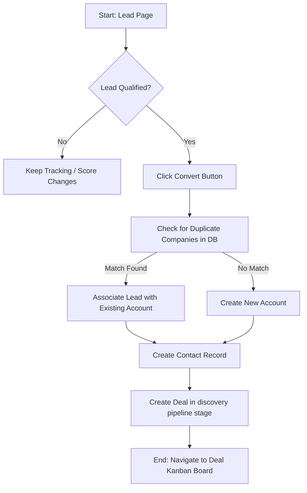
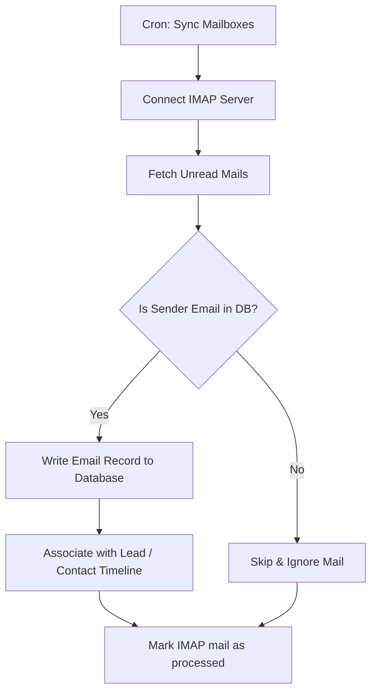
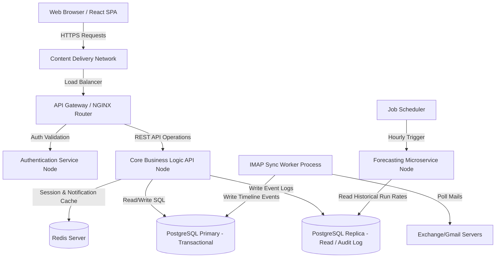

# Product Requirements Document (PRD)
## Document Control
* **Project Name:** ApexSales CRM Platform
* **Version:** 1.0.0
* **Author:** Senior Solution Architect & Principal Product Manager
* **Status:** Draft
* **Target Audience:** Solution Architects, Engineers, Designers, QA Engineers, AI Agents

---

## 1. Product Overview
ApexSales CRM is a web-based client relationship management platform built to accelerate sales execution. The system consolidates lead capture, contact directories, custom pipelines, automated tasks, email communication trackers, and analytics in a responsive, modern web application. Additionally, it features data-driven revenue forecasting engines based on historical trends and current pipeline values.

---

## 2. User Roles & Permission Model
The system operates on a role-based security framework:

| User Role | Description | Access Rights |
| :--- | :--- | :--- |
| **System Admin (AD)** | Manages tenants, database configuration, security policies, integration tokens, and system-wide dropdown variables. | Full Global CRUD permissions. Access to system audit logs. |
| **Sales Manager (SM)** | Manages sales teams, assigns leads, sets quotas, reviews reports, and inputs target adjustments. | CRUD permissions on all accounts, contacts, deals, and reports within their assigned Team. Read-only access to organization configs. |
| **Sales Representative (SR)** | Performs day-to-day sales tasks, logs client details, moves deals, sends emails, writes notes. | CRUD on records owned or explicitly shared. Read-only on team reports. Zero access to team quota settings or other teams' data. |

---

## 3. Product Epics & Features

### 3.1 EPIC-001: Lead & Contact Management (LCM)
* **Feature LCM-1 (Lead Capturing & Qualification):** Import leads via CSV or capture manually via a web form.
* **Feature LCM-2 (Unified Contacts & Company Directory):** Link individuals (Contacts) to their employers (Accounts).
* **Feature LCM-3 (Intelligent Activity Timeline):** Consolidate emails, calls, notes, and status changes in a chronological visual feed.

### 3.2 EPIC-002: Sales Pipeline & Deal Tracking (SPD)
* **Feature SPD-1 (Kanban Deal Board):** Drag-and-drop deals across customized sales stages with visual progression bars.
* **Feature SPD-2 (Multiple Sales Pipelines):** Create, name, and modify separate pipelines with independent stages.

### 3.3 EPIC-003: Communication & Task Automation (CTA)
* **Feature CTA-1 (Email Sync & Open Tracking):** Direct email connection via IMAP/SMTP with HTML-pixel tracking for email open events.
* **Feature CTA-2 (Task Trigger & Reminders):** Create calendar tasks (Calls, Emails, Tasks) with auto-triggers for in-app alert banners.

### 3.4 EPIC-004: Reports & Analytics (RPA)
* **Feature RPA-1 (Sales Dashboards):** Performance monitoring panels, lead progression charts, conversion ratios.
* **Feature RPA-2 (Revenue Forecasting Engine):** Weighted pipeline calculations and run-rate predictive forecasts.

### 3.5 EPIC-005: Team Administration & Security (TAS)
* **Feature TAS-1 (Team Directory & Quotas):** Set annual/quarterly financial targets for teams and individual reps.
* **Feature TAS-2 (Role-Based Access Control):** Enforce strict record ownership validation.

---

## 4. User Stories

| Story ID | Epic | As a/an... | I want to... | So that... |
| :--- | :--- | :--- | :--- | :--- |
| **US-LCM-001** | EPIC-001 | Sales Rep | Upload a CSV list of leads | I don't have to manually create 50 records one by one. |
| **US-LCM-002** | EPIC-001 | Sales Rep | Convert a Lead to a Deal/Contact | I can start working on the sales pipeline without re-entering details. |
| **US-LCM-003** | EPIC-001 | Sales Rep | View an Activity Timeline | I can see the entire history of interactions with a client in a single feed. |
| **US-SPD-001** | EPIC-002 | Sales Rep | Drag a Deal cards across stages | I can visually update deal progression instantly. |
| **US-SPD-002** | EPIC-002 | Sales Manager | Define customized stages for SMB vs Enterprise pipelines | The workflow mirrors our distinct sales strategies. |
| **US-CTA-001** | EPIC-003 | Sales Rep | Connect my email inbox | My conversations with leads automatically populate in their timeline. |
| **US-CTA-002** | EPIC-003 | Sales Rep | Set a task deadline with a reminder | I get notified prior to the call and never miss a follow-up. |
| **US-RPA-001** | EPIC-004 | Sales Manager | View individual and team quota progression bars | I know who is on track to hit targets and who needs coaching. |
| **US-RPA-002** | EPIC-004 | VP of Sales | View a monthly weighted revenue forecast | I can report accurate numbers to the executive board. |
| **US-TAS-001** | EPIC-005 | Admin | Restrict Reps to only see their owned Deals | I protect sensitive company accounts from unauthorized access. |

---

## 5. Functional Requirements (FR)

### 5.1 Lead & Contact Management (LCM)
* **FR-LCM-001:** System must allow importing files via `.csv` formats. Maximum file size: 10MB.
  * *Dependencies:* None
  * *Edge Case:* CSV contains corrupt data (invalid emails, missing names). System must reject corrupt rows, generate an error log download link, and import the valid rows.
* **FR-LCM-002:** The system must check duplicate emails during lead creation.
  * *Dependencies:* FR-LCM-001
  * *Edge Case:* Lead with the same email exists but is marked as "Closed-Lost". System must allow duplicate creation but append a warning banner alerting the rep of historical records.
* **FR-LCM-003:** Activity timelines must load updates dynamically without requiring a full page refresh.
  * *Dependencies:* None
  * *Edge Case:* Timeline logs simultaneous edits from two users. System must merge comments and show both entries sorted chronologically.

### 5.2 Sales Pipeline & Deal Tracking (SPD)
* **FR-SPD-001:** Users can change Deal stages by dragging cards on a Kanban board.
  * *Dependencies:* None
  * *Edge Case:* Deal is moved to "Closed-Won". The system must prompt a modal demanding the user enter "Actual Deal Value" and "Close Date" before the state change commits.
* **FR-SPD-002:** The system must recalculate the total value of each pipeline stage in real-time as deals are moved.
  * *Dependencies:* FR-SPD-001
  * *Edge Case:* Total pipeline stage value exceeds maximum numerical limit of DB field. Database must use a `NUMERIC(15, 2)` format to prevent overflow.

### 5.3 Communication & Task Automation (CTA)
* **FR-CTA-001:** The system must fetch new emails from the mail server via IMAP protocol every 5 minutes.
  * *Dependencies:* None
  * *Edge Case:* Email client credentials expire. System must send an in-app system warning and pause synchronization until the user re-authenticates.
* **FR-CTA-002:** The system must inject a tracking transparent 1x1 pixel image in all outbound HTML emails sent through the platform.
  * *Dependencies:* None
  * *Edge Case:* User sends plain text email. Tracking is impossible; system must flag tracking status as "Unsupported for Plain Text".
* **FR-CTA-003:** Trigger task notifications in-app and via email.
  * *Dependencies:* None
  * *Edge Case:* Task has no assignee. Notifications fallback to the owner of the associated Contact/Lead.

### 5.4 Reports & Analytics (RPA)
* **FR-RPA-001:** Dashboards must render data aggregated by current day, week, month, quarter, or custom date range.
  * *Dependencies:* None
  * *Edge Case:* User selects a date range with zero activities. The page must display empty states with a "No Data Found" illustration instead of throwing console exceptions.
* **FR-RPA-002:** Calculate revenue forecasting using formula:
  $$\text{Forecasted Value} = \sum (\text{Deal Value} \times \text{Stage Probability})$$
  * *Dependencies:* FR-SPD-001
  * *Edge Case:* Stage Probability is set to 0%. The deal value must contribute 0 to the forecast calculation.

### 5.5 Team Administration & Security (TAS)
* **FR-TAS-001:** Admins must configure permissions lists for roles.
  * *Dependencies:* None
  * *Edge Case:* Rep changes team mid-quarter. System must prompt option to transfer existing pipelines and histories to the new team or keep them with the legacy team.
* **FR-TAS-002:** System must log all CRUD events with Timestamp, User ID, Client IP, and Action details into an immutable audit table.
  * *Dependencies:* None
  * *Edge Case:* Audit logging fails. Database transaction must rollback to ensure no unlogged changes occur (Write-Ahead Logging).

---

## 6. User Flows

### 6.1 Lead Conversion Flow


### 6.2 Email Auto-Sync & Timeline Association Flow


---

## 7. Pages & User Interface Layouts

The ApexSales CRM will render a modern, dark-mode-first dashboard layout with dynamic visual feedbacks.

### 7.1 Page 1: Dashboard Home (Global Insights)
* **Header:** Search bar (global search contacts, deals), Notifications Bell, User profile avatar.
* **Sidebar:** Logo, Dashboard link, Leads directory, Contact directory, Kanban Pipeline, Task Scheduler, Reports Panel, Team Settings.
* **Main Area Grid:**
  - Card 1: Gauge chart showing current Rep quota progress (e.g. "$75,000 / $100,000").
  - Card 2: Revenue forecast bar chart comparing Expected Revenue vs Target.
  - Card 3: Recent Activity feed (timeline snippet).
  - Card 4: Urgent Task list (cards sorted by due date, highlighting overdue items in soft red glow).

### 7.2 Page 2: Kanban Pipeline View
* **Header:** Pipeline selector dropdown (Enterprise vs Mid-Market), Add Deal button.
* **Main Area:** 5 columns representing stages:
  1. *Discovery*
  2. *Proposal Sent*
  3. *Negotiation*
  4. *Contract Pending*
  5. *Closed (Won/Lost Drop zone)*
* **Deal Cards:** Displays Deal Name, Account, Value, Owner Avatar, Last Activity Date. Features a red warning dot if no activity logged in last 7 days. Supports Drag-and-drop to update stages.

### 7.3 Page 3: Profile Detail View (Leads, Contacts, Accounts)
* **Two-Column Split Layout:**
  - *Left Column (Details Card):* Editable data forms (Name, Email, Job Title, Company, Deal Stage, Pipeline Value, Assignee).
  - *Right Column (Activity Timeline):* Multi-tab container. Tab 1: Timeline (chronological scroll, custom icons for notes, email syncs, tasks), Tab 2: Add Note, Tab 3: Create Task, Tab 4: Connected Email client.

---

## 8. Database Architecture (Entity Relationship Diagram)

```mermaid
erDiagram
    TENANTS ||--o{ USERS : owns
    TEAMS ||--o{ USERS : "belongs to"
    USERS ||--o{ LEADS : "assigned to"
    USERS ||--o{ CONTACTS : "assigned to"
    USERS ||--o{ DEALS : owns
    USERS ||--o{ TASKS : assigns
    ACCOUNTS ||--o{ CONTACTS : employs
    ACCOUNTS ||--o{ DEALS : associates
    CONTACTS ||--o{ DEALS : associates
    LEADS ||--o{ ACTIVITIES : triggers
    CONTACTS ||--o{ ACTIVITIES : triggers
    DEALS ||--o{ ACTIVITIES : triggers
    DEALS ||--o{ PIPELINE_STAGES : categorizes

    TENANTS {
        uuid id PK
        string company_name
        timestamp created_at
    }
    TEAMS {
        uuid id PK
        string team_name
        numeric quota_target
    }
    USERS {
        uuid id PK
        string email UK
        string password_hash
        string first_name
        string last_name
        string role "Admin, Manager, Rep"
        uuid team_id FK
        boolean is_active
    }
    LEADS {
        uuid id PK
        string status "New, Contacted, Nurturing, Qualified, Unqualified"
        string email
        string first_name
        string last_name
        string company_name
        integer lead_score
        uuid owner_id FK
        timestamp created_at
    }
    ACCOUNTS {
        uuid id PK
        string name
        string industry
        string website
        uuid owner_id FK
    }
    CONTACTS {
        uuid id PK
        string email UK
        string first_name
        string last_name
        string phone
        uuid account_id FK
        uuid owner_id FK
    }
    DEALS {
        uuid id PK
        string name
        numeric value
        uuid account_id FK
        uuid contact_id FK
        uuid pipeline_stage_id FK
        uuid owner_id FK
        date close_date
        timestamp created_at
    }
    PIPELINE_STAGES {
        uuid id PK
        string pipeline_name "Enterprise, SMB"
        string stage_name "Discovery, Proposal, Closed-Won"
        integer position_order
        integer default_probability
    }
    TASKS {
        uuid id PK
        string title
        string type "Call, Email, Meeting, Todo"
        timestamp due_date
        string status "Pending, Completed"
        uuid assignee_id FK
        uuid lead_id FK
        uuid contact_id FK
        uuid deal_id FK
    }
    ACTIVITIES {
        uuid id PK
        string activity_type "Email, Note, Call, Stage_Change"
        string content TEXT
        timestamp created_at
        uuid created_by FK
        uuid lead_id FK
        uuid contact_id FK
        uuid deal_id FK
    }
```

---

## 9. API Specifications

All communications must pass over HTTPS. Requests/responses use JSON format.

### 9.1 Authentication & Authorization
* **Endpoint:** `POST /api/v1/auth/login`
* **Request Payload:**
  ```json
  {
    "email": "user@apexsales.com",
    "password": "SecurePassword123"
  }
  ```
* **Success Response (200 OK):**
  ```json
  {
    "status": "success",
    "token": "eyJhbGciOiJIUzI1NiIsInR5cCI6IkpXVCJ9...",
    "user": {
      "id": "f81d4fae-7dec-11d0-a765-00a0c91e6bf6",
      "email": "user@apexsales.com",
      "role": "Sales Representative"
    }
  }
  ```

### 9.2 Leads Management
* **Endpoint:** `POST /api/v1/leads`
* **Headers:** `Authorization: Bearer <Token>`
* **Request Payload:**
  ```json
  {
    "first_name": "John",
    "last_name": "Doe",
    "email": "john.doe@target.com",
    "company_name": "Target Corp",
    "phone": "+15550199"
  }
  ```
* **Response (201 Created):**
  ```json
  {
    "status": "created",
    "lead_id": "b3c9d74a-251f-44de-9e2d-e7dcf5a415ff",
    "lead_score": 15
  }
  ```

### 9.3 Deal Board (Pipeline Update)
* **Endpoint:** `PATCH /api/v1/deals/:id/stage`
* **Headers:** `Authorization: Bearer <Token>`
* **Request Payload:**
  ```json
  {
    "target_stage_id": "87920ab2-fc43-4e4b-9f93-131dbfa2cfd1",
    "actual_value": 50000.00
  }
  ```
* **Success Response (200 OK):**
  ```json
  {
    "status": "success",
    "deal_id": "52857e3f-67cf-4545-be02-4c2847a989ef",
    "old_stage_id": "c1f72922-a9b0-466d-888e-17ef367ba4f3",
    "new_stage_id": "87920ab2-fc43-4e4b-9f93-131dbfa2cfd1",
    "updated_at": "2026-06-04T10:48:00Z"
  }
  ```

---

## 10. Technical Architecture

The platform follows a modern microservices-adjacent architecture hosted on Cloud infrastructure:



---

## 11. Security Requirements
* **SE-001 (Data Encryption):** TLS 1.3 enforced for all transit paths. Database volumes must use AES-256 block-level encryption (Encryption at rest).
* **SE-002 (Access Audits):** All read operations on tables containing financial figures or client PII (names/phone/email) must append an access log entry detailing caller token, request context, and queried IDs.
* **SE-003 (Passcodes & Credentials):** Passwords hashed with `bcrypt` using cost factor of 12. Token systems must utilize JSON Web Tokens (JWT) with a maximum lifetime of 1 hour and refresh capabilities up to 24 hours.

---

## 12. Non-Functional Requirements (NFR)

### 12.1 Performance
* **NFR-PERF-001 (Latency):** API response times for read queries must remain below 200ms for 95% of requests under baseline load.
* **NFR-PERF-002 (Timeline Rendering):** Client timeline feeds must fetch and render within 1.2 seconds under simulated 3G networks.

### 12.2 Availability & Resilience
* **NFR-AV-001 (Uptime):** Platform must guarantee 99.9% application uptime, monitored hourly (maximum ~8.76 hours downtime/year).
* **NFR-AV-002 (Backup Recovery):** RTO (Recovery Time Objective) under 4 hours; RPO (Recovery Point Objective) under 1 hour using continuous database replication.

---

## 13. Future Enhancements

* **FE-001 (VoIP & Call Log Integration):** In-app dialer enabling representatives to perform and log cold-calling operations inside the CRM page.
* **FE-002 (Generative AI Email Drafting):** Integration with LLM frameworks to scan client timelines and automatically draft recommended follow-up replies for the Sales Rep.
* **FE-003 (External ERP Connector):** Automatic synchronization between Closed-Won deals and billing networks for invoicing.
