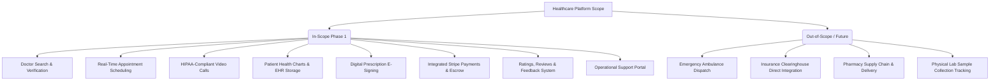

# Business Requirements Document (BRD)
## Project: Healthcare Platform (Telehealth Connect)
**Document Version:** 1.0.0  
**Date:** June 4, 2026  
**Authors:** Senior Product Management Team & Business Analysis Lead  
**Status:** Ready for Review  

---

### Table of Contents
1. [Executive Summary & Problem Statement](#1-executive-summary--problem-statement)
2. [Business Goals](#2-business-goals)
3. [Stakeholder Analysis](#3-stakeholder-analysis)
4. [User Personas](#4-user-personas)
5. [Project Scope (In-Scope & Out-of-Scope)](#5-project-scope-in-scope--out-of-scope)
6. [Business Requirements](#6-business-requirements)
7. [Business Rules](#7-business-rules)
8. [Risks, Assumptions, & Dependencies](#8-risks-assumptions--dependencies)
9. [Key Success Metrics (KPIs)](#9-key-success-metrics-kpis)

---

### 1. Executive Summary & Problem Statement

#### 1.1 Problem Statement
Modern healthcare ecosystems suffer from significant operational inefficiencies, geographical barriers, and data fragmentation. Patients face long wait times to secure appointments, struggle to find specialized medical professionals near them, and have limited access to remote care tools. Meanwhile, medical practitioners waste time on administrative overhead, fail to retain comprehensive digital health records (EHR) securely, and lose billing efficiency. Finally, patients' medical histories are siloed across clinics, making holistic diagnosis difficult.

#### 1.2 Solution Overview
"Telehealth Connect" is an integrated digital healthcare platform designed to bridge the gap between patients and verified medical professionals. It provides a secure environment for discovering doctor profiles, booking appointments, conducting high-definition video consultations, managing Electronic Health Records (EHR), generating digital prescriptions, processing secure payments, and acquiring patient feedback.

---

### 2. Business Goals

The primary business objectives for the first 12 months post-launch are:

| Goal ID | Goal Name | Description | Target Timeline | Target Metric |
| :--- | :--- | :--- | :--- | :--- |
| **BG-001** | Telehealth Adoption | Establish a reliable teleconsultation platform in target regions. | Launch + 6 Months | > 50,000 total consultations |
| **BG-002** | Patient Acquisition | Acquire and retain active patient accounts. | Launch + 3 Months | 15,000 registered active users |
| **BG-003** | Professional Network | Build a diverse network of verified specialists. | Launch + 4 Months | 500 verified doctors across 20 specialties |
| **BG-004** | Operational Wait Reduction | Decrease average time from booking request to consultation. | Launch + 2 Months | Average wait time < 15 minutes for on-demand consultations |
| **BG-005** | Revenue Viability | Generate steady commission revenue via transactions. | Launch + 12 Months | Positive cash flow via 15% platform transaction fee |

---

### 3. Stakeholder Analysis

| Stakeholder ID | Role | Business Interest | Key Responsibility |
| :--- | :--- | :--- | :--- |
| **SH-001** | Patients | Ease of access to care, medical record privacy, affordable consultations, user-friendly UI. | End-user; provides feedback and ratings. |
| **SH-002** | Doctors / Practitioners | Practice digitization, reduced administrative load, guaranteed timely payments, reliable video tools. | Service provider; conducts consultations, writes prescriptions. |
| **SH-003** | Platform Administrators | Operational monitoring, platform security, handling billing disputes, user verification, compliance management. | System operations, customer support, and security audits. |
| **SH-004** | Compliance & Legal Officers | Zero regulatory violations, HIPAA/GDPR alignment, avoidance of malpractice liabilities. | Audit system logs, review encryption standards, draft privacy terms. |
| **SH-005** | Executive Board / Investors | ROI, user growth, market share expansion, brand reputational equity. | Strategic decision making, funding allocation. |

---

### 4. User Personas

#### UP-001: Patient - Sarah Connor (The Busy Working Parent)
* **Age:** 34
* **Location:** Suburban Chicago, IL
* **Occupation:** Marketing Manager
* **Needs:** Quick, remote pediatric consultations for her young child without taking a half-day off work or sitting in waiting rooms.
* **Pain Points:** Hard to find local pediatricians with after-hours availability. Hard to keep track of physical immunization and health papers.
* **Goals on Platform:** Book same-day video appointments, receive digital prescriptions, and securely share pediatric health history with doctors.

#### UP-002: Doctor - Dr. Robert Chen (The Tech-Forward Specialist)
* **Age:** 45
* **Location:** Boston, MA
* **Specialty:** Cardiology
* **Needs:** A streamlined tool to expand his patient reach beyond Boston and manage follow-up consultations online.
* **Pain Points:** Manual appointment booking causes scheduling conflicts. Standard video tools (Zoom/Skype) are not HIPAA-compliant for transmitting patient records.
* **Goals on Platform:** Manage his availability calendar, view patient medical charts before calls, video-consult securely, and receive bi-weekly automated payouts.

#### UP-003: Administrator - Clara Jenkins (Operations & Support Lead)
* **Age:** 29
* **Location:** Austin, TX
* **Needs:** A powerful back-office dashboard to audit user reports, verify doctor medical licenses, and resolve transaction disputes.
* **Pain Points:** Manually validating state medical board registrations is slow. Patients requesting refunds due to connectivity issues need fast, audited overrides.
* **Goals on Platform:** Approve/reject doctor applications with clear audit logs, monitor system health, and process escrow refunds.

---

### 5. Project Scope

#### 5.1 In-Scope (Phase 1)
* **SC-001.1:** Verification workflow for doctors, validating credentials, medical license IDs, and government identity cards.
* **SC-001.2:** Multi-specialty doctor directory search with filters for availability, rating, fees, and language.
* **SC-001.3:** Calendar appointment scheduler supporting patient booking and doctor-managed availability blocks.
* **SC-001.4:** High-definition, encrypted, peer-to-peer audio-video consultation rooms.
* **SC-001.5:** Secured EHR vault allowing patients to upload, view, and share PDFs, images, and laboratory reports with chosen doctors.
* **SC-001.6:** E-Prescription module enabling doctors to issue secure digital medication forms during/after sessions.
* **SC-001.7:** Secure payment engine processing booking fees, managing pre-authorizations, and holding funds in escrow until checkout.
* **SC-001.8:** Rating and reviews framework with verified consultation linkage to prevent spam.
* **SC-001.9:** Notification dispatcher sending critical SMS, Email, and Push alerts for upcoming slots, medical records updates, and billing.
* **SC-001.10:** Admin console for verifying medical practitioners, tracking system metrics, and moderating reviews.

#### 5.2 Out-of-Scope (Deferred to Phase 2+)
* **SC-002.1:** Direct integrations with regional health insurance systems (e.g., Medicare/Medicaid or private commercial insurers) for direct copay processing.
* **SC-002.2:** Real-time emergency services dispatching (no 911 / EMS dispatch features).
* **SC-002.3:** Pharmacy inventory tracking and physical home delivery of medications.
* **SC-002.4:** Physical home medical testing or lab sample collection dispatch.

---

### 6. Business Requirements

All features developed must align with the following business-level requirements:

| ID | Category | Business Requirement Description | Priority |
| :--- | :--- | :--- | :--- |
| **BR-001** | Regulatory | The platform must achieve absolute compliance with HIPAA (Health Insurance Portability and Accountability Act) and GDPR (General Data Protection Regulation) regarding patient health information (PHI). | Critical |
| **BR-002** | Security | Personal Health Information (PHI) and Medical Records must be encrypted using AES-256 at rest and TLS 1.3 in transit. | Critical |
| **BR-003** | Operations | No doctor profile can appear in the search results without active, verified status approved by a platform administrator. | High |
| **BR-004** | Financial | Fees paid by patients during booking must be held in an escrow sub-account and only released to the doctor's payout wallet upon completion of the consultation. | High |
| **BR-005** | Quality | The system must monitor and report video consultation failure rates (e.g., dropped calls, failure to connect) to operational administrators. | Medium |
| **BR-006** | Usability | Accessibility compliance conforming to WCAG 2.1 Level AA must be maintained to support elderly and disabled patients. | Medium |
| **BR-007** | Data Retention | Audit trails for all prescription issuances, scheduling changes, and billing transactions must be immutable and retained for 7 years. | High |

---

### 7. Business Rules

Business rules define operational policies, constraints, and formulas enforcing platform logic:

* **BU-001: Cancellation & Refund Policy**
  * Patients may cancel a booked appointment up to 24 hours before the scheduled time and receive a 100% refund.
  * Cancellations made between 2 hours and 24 hours before the appointment receive a 50% refund, with the remaining 50% retained as a convenience fee.
  * Cancellations made less than 2 hours before the slot, or client "No-Shows," receive 0% refund, with the doctor receiving 85% of their fee and the platform retaining 15%.
* **BU-002: Doctor No-Show Policy**
  * If a doctor fails to join the video session within 15 minutes of the scheduled start time, the appointment is marked as "Doctor No-Show."
  * The patient receives an immediate 100% refund, and a penalty score is applied to the doctor's profile dashboard. Three consecutive no-shows trigger automatic profile suspension.
* **BU-003: Platform Commissions & Payouts**
  * The platform charges a standard commission of 15% on all successfully completed consultations.
  * Payout calculations: `Doctor Payout = Consultation Fee * 0.85`.
  * Doctor payouts are disbursed bi-weekly on the 1st and 15th of each month, subject to a minimum wallet balance of $50.00.
* **BU-004: Review & Rating Legitimacy**
  * A patient can only submit a review or numerical rating (1-5 stars) for a doctor if they have completed a paid consultation with that specific doctor.
  * Reviews must pass an automated profanity and privacy filter (blocking names, phone numbers, and direct email patterns).
* **BU-005: Prescription Issuance Rule**
  * Digital prescriptions can only be created, signed, and finalized by doctors during a live consultation window or within 4 hours of consultation closure. Patients cannot edit or create prescriptions.

---

### 8. Risks, Assumptions, & Dependencies

#### 8.1 Risks & Mitigation Strategies
* **RA-001: Data Breach of Patient Health Information (PHI)**
  * *Impact:* Extreme (regulatory fines, lawsuit, complete loss of brand trust).
  * *Mitigation:* Zero-trust network architecture, routine penetration testing, tokenized database fields, and strict access control list (ACL) rules for doctors.
* **RA-002: Lower Doctor Onboarding Rates**
  * *Impact:* High (patients cannot book visits, leading to churn).
  * *Mitigation:* Reduced commission promotion (e.g., 5% instead of 15% for the first 3 months) and partnership agreements with existing clinic networks.
* **RA-003: Poor Teleconsultation Quality in Rural Areas**
  * *Impact:* High (frustrated users, refund disputes).
  * *Mitigation:* WebRTC video implementation with dynamic bitrate adjustment and automated audio-only fallback logic when bandwidth drops below 300 Kbps.

#### 8.2 Assumptions
* Patients and doctors are assumed to have access to devices equipped with a functional camera, microphone, and internet connection of at least 1 Mbps.
* Doctors are responsible for maintaining valid medical licenses in their respective operating jurisdictions.

#### 8.3 Dependencies
* **Third-Party Video Infrastructure:** Agora.io or Twilio Programmable Video WebRTC SDKs.
* **Payment Processor:** Stripe API and Stripe Connect (for doctor onboarding, custom accounts, and split payouts).
* **SMS Gateway:** Twilio SMS API for real-time notification dispatches.

---

### 9. Key Success Metrics (KPIs)

These high-level business indicators will evaluate platform success:

| KPI ID | KPI Metric | Measurement Formula | Target Baseline |
| :--- | :--- | :--- | :--- |
| **SM-001** | Consultation Completion Rate | `(Completed Consultations / Scheduled Appointments) * 100` | ≥ 96% |
| **SM-002** | Customer Lifetime Value (CLV) | `Average Transaction Value * Annual Consultation Frequency` | ≥ $180 / Year |
| **SM-003** | Monthly Patient Retention | `(Patients booking in Month N+1 / Booking in Month N) * 100` | ≥ 45% |
| **SM-004** | Average Review Rating | `Sum of all ratings / Total number of ratings` | ≥ 4.2 / 5.0 |
| **SM-005** | Licensing Verification Time | `Time from Doctor signup completion to Admin approval/rejection` | < 24 Hours |
| **SM-006** | System Platform Uptime | `(Total Minutes - Downtime Minutes) / Total Minutes * 100` | ≥ 99.99% |
| **SM-007** | Payment Dispute Ratio | `(Disputed Transactions / Total Transactions) * 100` | < 0.5% |
