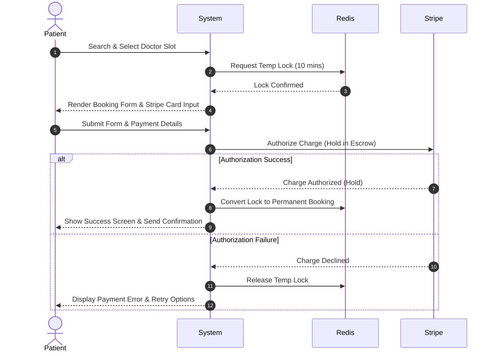
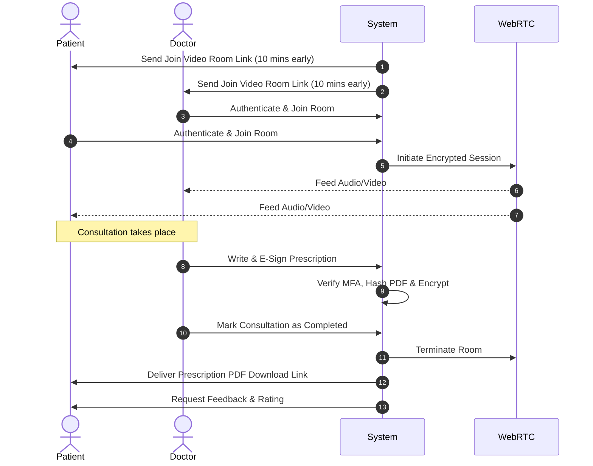
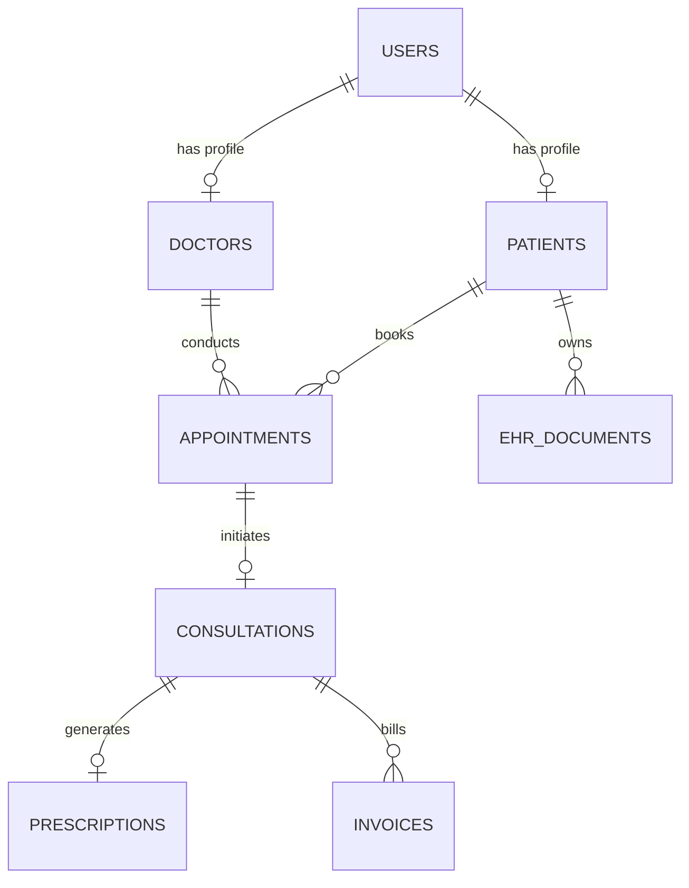

# Product Requirements Document (PRD)
## Project: Healthcare Platform (Telehealth Connect)
**Document Version:** 1.0.0  
**Date:** June 4, 2026  
**Authors:** Lead Product Manager & Solutions Architect  
**Status:** Ready for Review  

---

### Table of Contents
1. [Product Overview & Vision](#1-product-overview--vision)
2. [User Roles & Permissions](#2-user-roles--permissions)
3. [Epics & Features](#3-epics--features)
4. [User Stories](#4-user-stories)
5. [Functional Requirements](#5-functional-requirements)
6. [User Flows](#6-user-flows)
7. [Pages & Screen Wireframe Specifications](#7-pages--screen-wireframe-specifications)
8. [API Interface Specifications](#8-api-interface-specifications)
9. [Database Schema & Data Entities](#9-database-schema--data-entities)
10. [Technical Architecture Design](#10-technical-architecture-design)
11. [Security & Compliance Requirements](#11-security--compliance-requirements)
12. [Non-Functional Requirements (NFRs)](#12-non-functional-requirements-nfrs)
13. [Future Enhancements Roadmap](#13-future-enhancements-roadmap)

---

### 1. Product Overview & Vision
Telehealth Connect provides a web-based, mobile-responsive portal linking patients directly with healthcare specialists. The platform resolves scheduling inefficiencies, secures the delivery of patient medical reports, enables high-quality, direct video consultations without auxiliary applications, and handles automated invoicing, prescription issuing, and medical reviews. 

---

### 2. User Roles & Permissions

| Role ID | Role Name | System Access & Permissions |
| :--- | :--- | :--- |
| **UR-001** | Guest | Search and view verified doctor profiles; read reviews; register an account. Cannot view appointments, book sessions, or access medical vault features. |
| **UR-002** | Patient | Complete profile; upload/delete personal medical files in the vault; search and book appointments; submit payments; enter video rooms; view prescriptions; write doctor reviews. |
| **UR-003** | Doctor | Set availability calendars; view medical files shared by patients; initiate and join video rooms; write and digitally sign e-prescriptions; view payout reports. |
| **UR-004** | Admin | Full platform visibility; search and filter all records; access Audit Logs; verify doctor licenses; moderate reviews; issue escrow overrides and refunds. |

---

### 3. Epics & Features

```
EPIC-001: Doctor Profile & Registration
├── FEAT-101: Practitioner Signup & License Verification
├── FEAT-102: Search & Discovery Engine
└── FEAT-103: Dynamic Calendar Availability Builder

EPIC-002: Appointment Scheduling
├── FEAT-201: Slot Booking & Locking
└── FEAT-202: Rescheduling & Cancellation Engine

EPIC-003: Video Consultations
├── FEAT-301: Encrypted WebRTC Video Rooms
└── FEAT-302: Shared Consultation Space (Text Chat & Session Notes)

EPIC-004: EHR & Prescription Management
├── FEAT-401: Patient Secure EHR Vault
└── FEAT-402: E-Prescription Creator & Signer

EPIC-005: Financial Management
├── FEAT-501: Patient Payment Escrow
└── FEAT-502: Doctor Wallet & Split Payouts

EPIC-006: Patient Portal & Reviews
├── FEAT-601: Patient Consolidated Dashboard
└── FEAT-602: Verified Consultation Review System

EPIC-007: Management & Communications
├── FEAT-701: Back-Office Admin Operations
└── FEAT-702: Multichannel Notification Hub (SMS, Email, Push)
```

---

### 4. User Stories

| Story ID | Epic Link | User Persona | User Story Definition | Acceptance Criteria Links |
| :--- | :--- | :--- | :--- | :--- |
| **US-001** | EPC-001 | Patient | As a patient, I want to search for doctors by specialty, language, and ratings, so that I can choose the doctor best suited for my symptoms. | AC-102.1, AC-102.2 |
| **US-002** | EPC-001 | Doctor | As a doctor, I want to configure my calendar availability and lunch breaks, so that patients cannot book slots during my personal time. | AC-103.1, AC-103.2 |
| **US-003** | EPC-002 | Patient | As a patient, I want to select a doctor's slot, enter my reason for visiting, and pay securely, so that my appointment is guaranteed. | AC-201.1, AC-201.2 |
| **US-004** | EPC-003 | Doctor | As a doctor, I want to join the consultation via one click in my portal, so that I can conduct the video call without installing other software. | AC-301.1, AC-301.2 |
| **US-005** | EPC-004 | Patient | As a patient, I want to upload my laboratory blood reports to my secure vault and grant access to my cardiologist, so that he can review them on our call. | AC-401.1, AC-401.2 |
| **US-006** | EPC-004 | Doctor | As a doctor, I want to write and digitally sign a prescription form during the video call, so that the patient can access it instantly in their dashboard. | AC-402.1, AC-402.2 |
| **US-007** | EPC-005 | Patient | As a patient, I want to pay for my session using my credit card, knowing that my funds are held in escrow until the consultation is complete. | AC-501.1, AC-501.2 |
| **US-008** | EPC-007 | Admin | As an administrator, I want to review doctor verification files and verify licenses against the official registries, so that I can maintain medical standards. | AC-701.1, AC-701.2 |

---

### 5. Functional Requirements

#### 5.1 Doctor Profile & Search Requirements (EPC-001)

##### FR-101: License Audit Trail
* **Description:** When a doctor updates their profile details (such as medical registration number), the profile state must automatically transition to `Pending Verification`, hiding the profile from patient searches.
* **Dependencies:** None.
* **Edge Case:** Doctor updates profile while having active appointments booked. **Rule:** Existing bookings remain active and accessible in the doctor dashboard, but new bookings are blocked until re-verification.
* **Severity:** High

##### FR-102: Fuzzy Specialty Matching
* **Description:** The search engine must support fuzzy query matching (e.g., matching "pediatrician" for "kids doctor" or "pediatric").
* **Dependencies:** Elasticsearch search indices.
* **Edge Case:** Zero results found. **Rule:** The system must suggest the nearest geographic matches regardless of specialty, or suggest broader specialties.
* **Severity:** Medium

##### FR-103: Dynamic Slot Locking
* **Description:** Selecting an open slot on a doctor's calendar must temporarily reserve that slot for 10 minutes for that patient.
* **Dependencies:** Redis Cache Server.
* **Edge Case:** Two patients select the exact same slot at the exact same millisecond. **Rule:** The database transaction isolation level must set the first requester as locked and return a "Slot Locked by Another User" message to the second.
* **Severity:** Critical

#### 5.2 Appointment & Booking Requirements (EPC-002)

##### FR-201: Reschedule Threshold Constraint
* **Description:** Patients can reschedule appointments up to 24 hours prior to the slot time. Rescheduling is blocked within 24 hours of the start.
* **Dependencies:** Notification Hub.
* **Edge Case:** Doctor initiates the reschedule request. **Rule:** If the doctor reschedules, the patient has the right to accept the new time or cancel immediately for a 100% refund, bypassing the standard refund penalty.
* **Severity:** High

##### FR-202: Concurrent Session Blocker
* **Description:** A patient is prohibited from booking two overlapping appointments at the same date/time.
* **Dependencies:** Scheduling engine.
* **Edge Case:** Appointment spans multiple hours due to manual administrative extensions. **Rule:** Overlaps are computed using start time + standard consultation duration (45 mins).
* **Severity:** High

#### 5.3 Video Consultation Requirements (EPC-003)

##### FR-301: Cryptographic Video Handshake
* **Description:** Real-time WebRTC sessions must generate short-lived, encrypted tokens containing the channel ID, expiration time, and role.
* **Dependencies:** Video WebRTC Gateway (Agora/Twilio).
* **Edge Case:** The network disconnects during the call. **Rule:** The SDK must retry connection for 2 minutes. If it fails, the call status transitions to "Interrupted," making the session eligible for support review.
* **Severity:** Critical

##### FR-302: Synchronous Chat Vault
* **Description:** In-app session text chat logs must be encrypted using AES-256 and appended to the patient's consultation file.
* **Dependencies:** DB Storage.
* **Edge Case:** Patient sends HIPAA-restricted terms in chat. **Rule:** Chat must be filtered for validation rules and stored in the secure data vault.
* **Severity:** Medium

#### 5.4 Medical Records & Prescriptions (EPC-004)

##### FR-401: Document Access Expiry
* **Description:** A patient can assign temporary view permissions on any medical vault document to a doctor. This permission must expire exactly 48 hours after the scheduled appointment end.
* **Dependencies:** RBAC Engine, CRON scheduler.
* **Edge Case:** Consultation is rescheduled. **Rule:** The document permission window must dynamically adjust to end 48 hours after the *new* scheduled appointment date.
* **Severity:** Critical

##### FR-402: Digital Signature Integrity
* **Description:** Digital prescriptions must require a multi-factor authentication (MFA) check (e.g., OTP or biometric check) from the doctor's registered device prior to cryptographic signing.
* **Dependencies:** Auth0/SMS Gateway.
* **Edge Case:** Prescription signing fails due to bad internet. **Rule:** The signed payload must be buffered locally using Web Crypto API and dispatched once network restores, or warn the doctor to re-sign.
* **Severity:** High

#### 5.5 Payments & Escrow (EPC-005)

##### FR-501: Escrow Release Trigger
* **Description:** Payment capture from Stripe escrow must occur automatically exactly 15 minutes after the doctor marks the session as `Completed`.
* **Dependencies:** Stripe Connect API, Chrono Tasks.
* **Edge Case:** Patient disputes the session within the 15-minute window. **Rule:** The payout is suspended, and the transaction is flagged as `Disputed` for admin review.
* **Severity:** Critical

##### FR-502: Currency Conversion Lock
* **Description:** Consultation fees are displayed in the patient's local currency based on IP, but finalized in USD to prevent currency fluctuation risks during the escrow hold.
* **Dependencies:** Exchange Rate API.
* **Edge Case:** Rapid currency drop during the escrow period. **Rule:** The doctor payout amount is locked at the USD value agreed upon booking.
* **Severity:** Low

---

### 6. User Flows

#### 6.1 Patient Appointment Booking & Escrow Flow


#### 6.2 Consultation & Prescription Flow


---

### 7. Pages & Screen Wireframe Specifications

#### SCR-101: Doctor Directory Search Page
* **Layout:** Three-column layout. Left Sidebar contains search filter options. Center column contains the search results listing cards. Right column shows a map with location markers.
* **Components:**
  1. *Search Input:* Supports auto-complete for specialties.
  2. *Filter Accordion:* Specialty, pricing range slider, user ratings stars (4+ stars, 3+ stars), languages, and online status.
  3. *Doctor Cards:* Profile photo, name, badge (Verified), clinic address, pricing rate/hour, rating summary (e.g., 4.8 (120 reviews)), and "Book Appointment" primary button.

#### SCR-102: Consultation Video Interface
* **Layout:** Split-screen layout. Large viewport displaying patient/doctor video feeds. Right Sidebar houses the interactive panel (Chat tab, Prescription tab, Shared Notes tab).
* **Components:**
  1. *Video Feed:* Local user preview (picture-in-picture, bottom right), remote user primary feed.
  2. *Control Bar (Bottom Overlay):* Toggle Mute, Toggle Camera, Share Screen, View Medical History Vault, and End Call (red button).
  3. *E-Prescription Panel (Doctor Only):* Fields for patient name (pre-populated), diagnosis, medicine name input with dosage search, instruction text area, and "Sign & Issue" button.

#### SCR-103: Patient EHR Dashboard
* **Layout:** Grid cards layout. Left sidebar navigation for navigation (Dashboard, Records, Billing, Settings). Main body displays documents grid.
* **Components:**
  1. *Upload Area:* Drag-and-drop file uploader (supporting PDF, PNG, JPG up to 15MB) with progress bar.
  2. *Document Catalog Table:* Document Name, Upload Date, Uploaded By (Patient or Laboratory), Access Control settings, and Actions (Download, Delete, Manage Access).
  3. *Access Controller Modal:* Toggle checkboxes next to doctors to allow/revoke view permissions.

---

### 8. API Interface Specifications

#### API-101: Create Consultation Room
* **Endpoint:** `POST /api/v1/consultations`
* **Security:** Authenticated (Bearer JWT - Patient/Doctor)
* **Request Payload:**
```json
{
  "doctor_id": "doc-908123",
  "patient_id": "pat-120938",
  "appointment_id": "appt-449102",
  "reason": "Chronic cardiac palpitations review"
}
```
* **Response Schema (201 Created):**
```json
{
  "consultation_id": "con-309182",
  "webrtc_channel": "ch_con_309182",
  "token": "agora_token_string_here_expire_3600",
  "status": "scheduled",
  "created_at": "2026-06-04T16:12:00Z"
}
```

#### API-102: E-Sign Prescription
* **Endpoint:** `POST /api/v1/prescriptions/sign`
* **Security:** Authenticated (Bearer JWT - Doctor Only)
* **Request Payload:**
```json
{
  "consultation_id": "con-309182",
  "medications": [
    {
      "name": "Atorvastatin",
      "dosage": "20mg",
      "frequency": "Once daily at night",
      "duration_days": 30
    }
  ],
  "notes": "Monitor cholesterol and report any muscle pains.",
  "doctor_mfa_token": "887321"
}
```
* **Response Schema (200 OK):**
```json
{
  "prescription_id": "rx-772918",
  "status": "signed_and_issued",
  "digital_signature_hash": "sha256-df30ba2491fae29c8821a8d11c...",
  "signed_at": "2026-06-04T16:30:12Z"
}
```

---

### 9. Database Schema & Data Entities



#### DB-101: Users Entity (`users` table)
* `id` (VARCHAR(64), Primary Key) - User ID.
* `email` (VARCHAR(255), Unique, Indexed) - Account email.
* `password_hash` (VARCHAR(255)) - Argon2id crypt password.
* `role` (ENUM('admin', 'doctor', 'patient')) - System security role.
* `phone_number` (VARCHAR(32)) - Verified phone.
* `created_at` (TIMESTAMP)

#### DB-102: Doctor Details Entity (`doctors` table)
* `id` (VARCHAR(64), Primary Key, FK to `users.id`)
* `first_name` (VARCHAR(128))
* `last_name` (VARCHAR(128))
* `specialty` (VARCHAR(128), Indexed)
* `license_number` (VARCHAR(64), Unique)
* `verification_status` (ENUM('pending', 'verified', 'rejected'))
* `consultation_fee` (DECIMAL(10,2))
* `availability_settings` (JSONB) - Weekly schedule matrix.

#### DB-103: Appointment Entity (`appointments` table)
* `id` (VARCHAR(64), Primary Key)
* `patient_id` (VARCHAR(64), FK to `users.id`)
* `doctor_id` (VARCHAR(64), FK to `users.id`)
* `scheduled_time` (TIMESTAMP, Indexed)
* `duration_minutes` (INT)
* `status` (ENUM('locked', 'confirmed', 'completed', 'canceled', 'no_show'))

#### DB-104: EHR Document Entity (`ehr_documents` table)
* `id` (VARCHAR(64), Primary Key)
* `patient_id` (VARCHAR(64), FK to `users.id`)
* `document_name` (VARCHAR(255))
* `s3_object_uri` (VARCHAR(512)) - S3 path to file.
* `file_hash` (VARCHAR(64)) - SHA256 file verification.
* `access_acl` (JSONB) - List of user IDs permitted to access document.
* `uploaded_at` (TIMESTAMP)

---

### 10. Technical Architecture Design

The system is designed with a service-oriented, cloud-native architecture:

```
[Web App / Mobile Client] (React / Next.js)
         │  HTTPS / WSS
         ▼
[API Gateway] (Kong / AWS API Gateway) ── [Auth0 / Identity Provider]
         │
         ├──► [Scheduler Service] (Go / Node) ── Redis Cache
         ├──► [EHR Storage Service] (Node.js) ── AWS S3 Vault
         ├──► [Payment Service] (Python) ── Stripe Connect API
         ├──► [Video Coordinator] (Go) ── Agora Signaling / WebRTC
         │
         ▼
[Relational Database Cluster] (PostgreSQL - Main OLTP)
```

---

### 11. Security & Compliance Requirements

* **SEC-101: Encryption At Rest**
  * All medical text documents, chat records, and database tables containing PHI must be stored in encrypted volumes (AWS KMS managed keys with AES-256).
* **SEC-102: SSL/TLS In-Transit**
  * TLS 1.3 is enforced on all APIs and static content CDNs. SSL compression is disabled to prevent BREACH attacks.
* **SEC-103: API Authentication & JWT Signatures**
  * APIs verify signatures via RS256 JWT tokens. Token validity duration is capped at 15 minutes, with rotating refresh tokens stored inside Secure HttpOnly cookies.
* **SEC-104: Comprehensive Audit Trails**
  * Every write, update, read, and delete operation on EHR files and patient files must write to an immutable audit ledger (AWS CloudWatch/Kinesis logs) detailing: `Timestamp`, `ActorID`, `ActionType`, `SourceIP`, `ResourceID`.

---

### 12. Non-Functional Requirements (NFRs)

* **NFR-101: High Availability**
  * The production platform services must maintain a target availability of 99.99%, representing less than 53 minutes of unscheduled downtime annually.
* **NFR-102: Network Latency**
  * Global WebRTC video connection handshake latency must average under 800ms. In-call audio latency must remain under 150ms.
* **NFR-103: Transaction Security (ACID)**
  * Database transaction locks on appointment calendars must implement STRICT serializable isolation levels to eliminate double-booking bugs.
* **NFR-104: Compliance Standards**
  * The system must pass annual HIPAA SOC 2 Type II audit checklists.

---

### 13. Future Enhancements Roadmap

* **FE-201: AI Diagnosis Co-pilot**
  * Integration of Large Language Models (LLMs) to ingest transcripts of video sessions and pre-populate prescription draft logs and patient diagnostic summaries for doctors.
* **FE-202: Internet of Things (IoT) Wearable Links**
  * Direct synchronization with Apple HealthKit and Google Fit to feed real-time patient metrics (heart rate, blood pressure history) directly into the EHR panel.
* **FE-203: Automated Insurance Billing & Clearinghouse**
  * Integrating ANSI 837 EDI format workflows to auto-bill healthcare insurance carriers upon consultation finalization.
