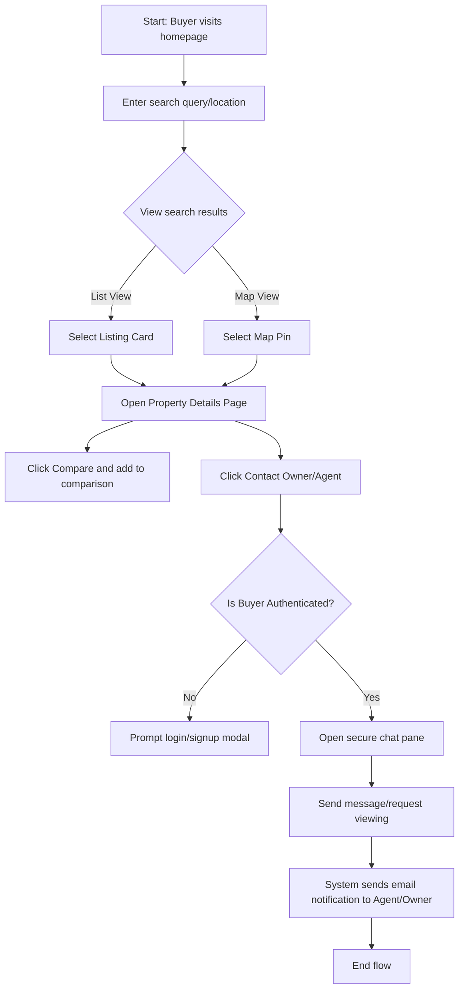
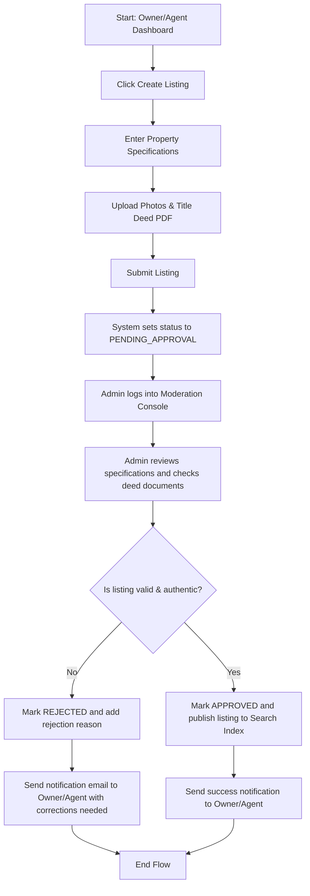
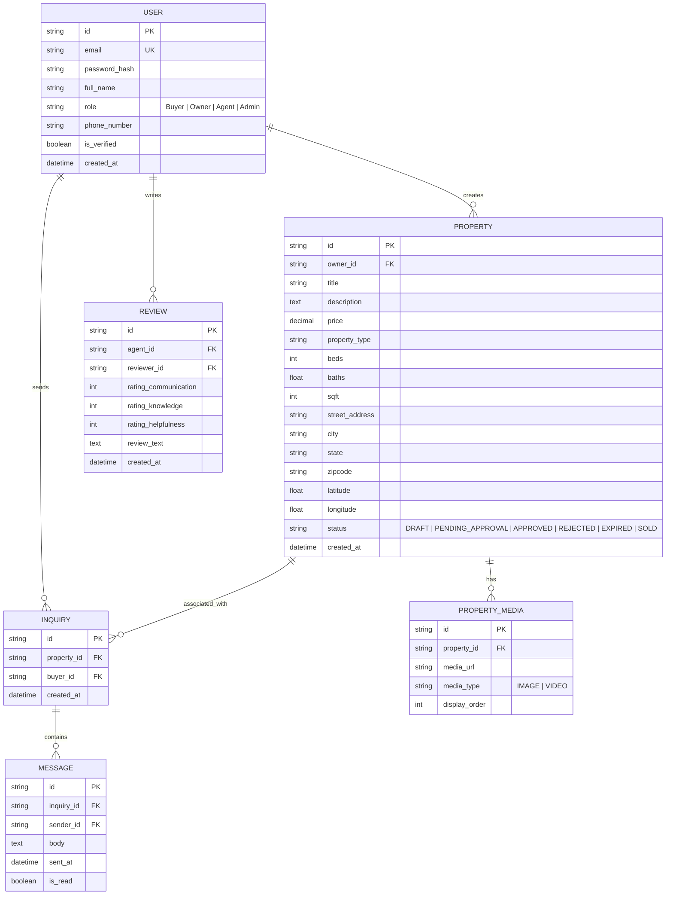

# Product Requirements Document (PRD) - PropConnect Marketplace

## 1. Document Control
* **Project Name:** PropConnect Real Estate Marketplace
* **Version:** 1.0.0
* **Date:** June 4, 2026
* **Author:** Solution Architect, Senior PM, and Tech Lead

---

## 2. Product Overview
PropConnect is a centralized, map-driven real estate marketplace facilitating direct transactions and collaborative listing discovery for Property Owners, Real Estate Agents, and Buyers. The product's main differentiators are strict admin moderation, verified agent review profiles, side-by-side comparison matrixes, built-in inquiry dashboards, and hyper-local neighborhood analytics.

---

## 3. User Roles & Permissions
The system enforces Role-Based Access Control (RBAC) across four primary roles:

* **Buyer:** Can search properties, view analytics, save favorites, compare listings, contact agents/owners, and write agent reviews.
* **Property Owner:** Can create, edit, or delete their own listings (capped at 2 active), respond to buyer inquiries, and view view-count analytics.
* **Agent:** Can create and manage unlimited property listings, customize public agent profiles, view advanced lead analytics, purchase premium listing promotions, and manage customer inquiries.
* **Admin:** Can review/approve/reject property listings, verify agent credentials, moderate reviews, and access the system audit log.

---

## 4. Epics & Features
Features are grouped into Epics and mapped to unique IDs.

### Epic 1: Auth & User Management (EP-01)
* **FT-1.1: Multi-role Registration & Authentication:** Secure signup/signin supporting social OAuth and email/password, with roles specified on sign-up.
* **FT-1.2: Agent Verification System:** Profile update portal for agents to upload licensing credentials, which locks the profile in a "Pending Verification" state until admin review.
* **FT-1.3: User Profile Dashboard:** Consolidated dashboard displaying settings, saved searches, and favorites.

### Epic 2: Property Listings Management (EP-02)
* **FT-2.1: Rich Listing Builder:** Form wizard for listing creation featuring autocomplete addresses, structured amenities lists, and multi-media drag-and-drop uploads.
* **FT-2.2: Advanced Search & Filtering:** High-performance search system filtering by location, price, property type, bed/bath count, square footage, amenities, and poster role.

### Epic 3: Map Integration (EP-03)
* **FT-3.1: Interactive Map Interface:** Map pane displaying search results as pins, featuring clustering, custom draw tools, and bounding box queries.
* **FT-3.2: Neighborhood Data Overlays:** Map layer selection allowing users to view nearby transit stops, school ratings, and noise indices.

### Epic 4: Comparison & Analytics (EP-04)
* **FT-4.1: Property Comparison Matrix:** Side-by-side spec comparison UI supporting up to 4 selected properties with highlighted differences.
* **FT-4.2: Listing Analytics & Trends:** Graphs on the listing page showing price history, neighborhood averages, and listing view counts over time.

### Epic 5: Inquiries & Interactions (EP-05)
* **FT-5.1: Monitored Chat System:** Real-time messaging platform between Buyers and listing Owners/Agents, with contact card exchange capabilities.
* **FT-5.2: Agent Reviews & Ratings:** System allowing buyers to rate agents on communication, market knowledge, and helpfulness, tied to inquiry verification.

### Epic 6: Moderation & Governance (EP-06)
* **FT-6.1: Admin Verification Console:** Dashboard for platform admins to review pending listings, verify agent credentials, and handle reported content.

---

## 5. User Stories
User stories are mapped to specific Features and reference Acceptance Criteria located in the [KPI.md](file:///d:/vibeCoding2026/practiceProjects/real-estate-marketplace/docs/KPI.md) document.

| Story ID | Epic | User Story Statement | KPI Ref |
| :--- | :--- | :--- | :--- |
| **US-1.1** | EP-01 | As a **Buyer/Owner/Agent**, I want to register and sign in securely so that my personal search history or listings are saved and private. | `AC-101`, `AC-102` |
| **US-1.2** | EP-01 | As an **Agent**, I want to submit my brokerage license details so that I can get a "Verified" badge and publish unlimited listings. | `AC-103`, `AC-104` |
| **US-2.1** | EP-02 | As a **Property Owner or Agent**, I want to build a property listing using a step-by-step wizard so that my listing has all required tax and physical specs. | `AC-201`, `AC-202` |
| **US-2.2** | EP-02 | As a **Buyer**, I want to filter listings using specific attributes (e.g., HVAC, pool, HOA fees) so that I do not waste time viewing unsuitable homes. | `AC-203`, `AC-204` |
| **US-3.1** | EP-03 | As a **Buyer**, I want to search for homes on an interactive map using custom polygon bounds so that I can search within a highly specific school district. | `AC-301`, `AC-302` |
| **US-4.1** | EP-04 | As a **Buyer**, I want to add up to 4 listings to a comparison matrix so that I can analyze physical parameters and price per sqft side-by-side. | `AC-401`, `AC-402` |
| **US-4.2** | EP-04 | As an **Agent**, I want to view a dashboard tracking search impressions, listing clicks, and inquiry rates so that I can optimize my listing content. | `AC-403`, `AC-404` |
| **US-5.1** | EP-05 | As a **Buyer**, I want to send an inquiry directly to a listing owner or agent through a secure chat panel so that I can schedule a tour. | `AC-501`, `AC-502` |
| **US-5.2** | EP-05 | As a **Buyer**, I want to write a public review for an Agent who closed my deal so that other users can verify their service quality. | `AC-503`, `AC-504` |
| **US-6.1** | EP-06 | As an **Admin**, I want to review flagged listings and verify real estate licenses so that I can keep the marketplace clean of scammers. | `AC-601`, `AC-602` |

---

## 6. Functional Requirements (FR)

### Epic 1: Auth & User Management (EP-01)

#### FR-101: Role Assignment on Register
* **Description:** The system must enforce mandatory role selection (Buyer, Owner, Agent) during registration.
* **Inputs:** Registration details (email, password, full name, role).
* **Outputs:** Created user record with corresponding system role flags.
* **Dependencies:** None.
* **Edge Case:** User tries to bypass role selection using API injection. System must validate role parameters against an enum backend-side.

#### FR-102: Agent Credentials Submission
* **Description:** Allow agents to input license number, state of issuance, and brokerage name.
* **Inputs:** Text fields, PDF scan of license.
* **Outputs:** Saved credential records, status set to `PENDING_VERIFICATION`.
* **Dependencies:** `FR-101`.
* **Edge Case:** Agent registers but doesn't upload license. Profile remains active as `UNVERIFIED` with limited listing capabilities (treated as standard Owner listing cap of 2).

---

### Epic 2: Property Listings (EP-02)

#### FR-201: Listing Creation Wizard
* **Description:** Step-by-step form validation ensuring all required attributes (price, location, type, bed/bath count, square footage, deed verification document) are filled.
* **Inputs:** Form data, image files, document files.
* **Outputs:** Property record created with status `DRAFT` or `PENDING_APPROVAL`.
* **Dependencies:** `FR-101`.
* **Edge Case:** Media upload fails midway. System must save drafts locally in browser cache and resume once internet connection is restored.

#### FR-202: Advanced Search Indexing
* **Description:** High-performance index searches utilizing ElasticSearch/Postgres Full-Text Search.
* **Inputs:** Text query, range values (price, rooms, size), boolean values (amenities).
* **Outputs:** Matching properties array.
* **Dependencies:** `FR-201`.
* **Edge Case:** Zero results found. System must suggest broadening radius or stripping the most restrictive filter (e.g., showing listings 5 miles away instead of 1).

---

### Epic 3: Map Integration (EP-03)

#### FR-301: Bounding Box Map Search
* **Description:** Dynamically reload listing markers based on active viewport coordinates of the map canvas.
* **Inputs:** Viewport boundaries (North-East, South-West coordinates).
* **Outputs:** Listing coordinates, pricing tags, and mini-cards.
* **Dependencies:** `FR-202`.
* **Edge Case:** Extremely dense listing regions (e.g., center city). Map must cluster markers and display dynamic count bubbles; clicking the cluster zooms map in by 2 increments.

---

### Epic 4: Comparison & Analytics (EP-04)

#### FR-401: Side-by-Side Comparison Generator
* **Description:** Dynamically map property attributes to a comparative grid.
* **Inputs:** Array of property IDs (minimum 2, maximum 4).
* **Outputs:** Transposed grid matrix highlighting discrepancies (e.g., cell color change for lowest price/sqft).
* **Dependencies:** `FR-201`.
* **Edge Case:** Comparing different property types (e.g., commercial warehouse vs residential condo). Matrix must dynamically hide irrelevant rows (e.g., bedrooms count) and display a warning banner.

---

### Epic 5: Inquiries & Interactions (EP-05)

#### FR-501: Real-Time Chat Gateway
* **Description:** WebSockets-based messaging platform.
* **Inputs:** User messages, attachment files.
* **Outputs:** Message records in DB, WebSockets broadcast, push/email notification.
* **Dependencies:** `FR-101`.
* **Edge Case:** Agent is offline. System must trigger an email summary notification to the agent after 15 minutes of unread message status.

---

## 7. User Flows

### A. Buyer Search & Inquiry Flow


### B. Listing Submission & Admin Moderation Flow


---

## 8. Pages / Screens & UI Layouts

### 1. Homepage
* **Header:** Logo, Search Bar, Favorites, Messages, User Profile Dropdown, "List Property" button.
* **Hero Section:** Centered search inputs (Location, Property Type, Budget) against a modern glassmorphism gradient backdrop.
* **Featured Listings Carousel:** Sliding cards of verified properties with high ratings.
* **Footer:** Navigational links, terms of service, and cookie consent banners.

### 2. Search & Map View (Split Screen)
* **Left Pane (50% width):** Active filters toolbar at top, scrollable grid of property result cards (with image sliders, price, beds/baths/sqft, verification badge, and favorite heart button).
* **Right Pane (50% width):** Mapbox/Google Map canvas with floating search control (Draw Area, Radius, Overlay Toggles).

### 3. Property Details Page
* **Hero Media Gallery:** Large slider showing interior/exterior pictures and embedded video/matterport iframe.
* **Property Details Header:** Large pricing label, address, owner/agent contact widget (sticky card on right).
* **Specifications Grid:** Standardized badges for beds, baths, garage, HOA, square footage, building year, heat source.
* **Interactive Map Integration:** Zoomed-in local map showing exact property radius, neighborhood transit scores, and school locations.
* **Historical Analytics Chart:** Line chart displaying property listing price trends over 12 months vs neighborhood median.

### 4. Comparison Screen
* **Layout:** Grid structure with up to 4 columns (1 per property) + 1 descriptor column.
* **Features:** "Highlight Differences" toggle, "Hide Same" toggle, direct contact action button at the bottom of each column.

### 5. Chat & Inbox (User Dashboard)
* **Left Sidebar:** Conversation list sorted chronologically, displaying listing thumbnail, sender name, and snippet of last message.
* **Main Messaging Area:** Header indicating referenced property details (linkable), chat thread (text, images, PDFs), and a primary call-to-action to "Request Viewing Appointment".

---

## 9. API Requirements

### 1. User Authentication
* **Endpoint:** `POST /api/v1/auth/register`
* **Request Body:**
```json
{
  "email": "user@example.com",
  "password": "StrongPassword123!",
  "fullName": "Jane Doe",
  "role": "Agent",
  "phoneNumber": "+1234567890"
}
```
* **Response (201 Created):**
```json
{
  "userId": "usr_902341234",
  "token": "eyJhbGciOiJIUzI1NiIsIn...",
  "role": "Agent"
}
```

### 2. Search Property Index
* **Endpoint:** `GET /api/v1/properties`
* **Query Parameters:** `q`, `minPrice`, `maxPrice`, `propertyType`, `beds`, `baths`, `latMin`, `latMax`, `lngMin`, `lngMax`
* **Response (200 OK):**
```json
{
  "count": 1,
  "results": [
    {
      "propertyId": "prop_8820349",
      "title": "Modern Suburban Villa",
      "price": 450000,
      "address": "123 Maple Street",
      "coordinates": { "lat": 37.7749, "lng": -122.4194 },
      "beds": 3,
      "baths": 2.5,
      "sqft": 1850,
      "isVerified": true,
      "thumbnailUrl": "https://cdn.propconnect.com/media/prop_8820349_thumb.jpg"
    }
  ]
}
```

### 3. Create Property Listing
* **Endpoint:** `POST /api/v1/properties`
* **Headers:** `Authorization: Bearer <token>`
* **Request Body (Multipart Form):**
  * Fields: `title`, `description`, `price`, `address`, `propertyType`, `beds`, `baths`, `sqft`, `amenities[]`
  * Files: `images[]` (binary), `deedFile` (PDF binary)
* **Response (201 Created):**
```json
{
  "propertyId": "prop_8820349",
  "status": "PENDING_APPROVAL",
  "createdAt": "2026-06-04T18:29:00Z"
}
```

### 4. Create Inquiry Thread
* **Endpoint:** `POST /api/v1/inquiries`
* **Headers:** `Authorization: Bearer <token>`
* **Request Body:**
```json
{
  "propertyId": "prop_8820349",
  "initialMessage": "Hi, I'm interested in scheduling a viewing this Saturday."
}
```
* **Response (201 Created):**
```json
{
  "inquiryId": "inq_5510239",
  "createdDate": "2026-06-04T18:29:05Z"
}
```

---

## 10. Database Schema (Entities)



---

## 11. Security Requirements
* **SEC-101: JWT Authentication:** JSON Web Tokens (JWT) must be used for session management with an expiration time of 2 hours, stored securely in HTTP-only cookies.
* **SEC-102: Data Encryption:** All transit data must run on TLS 1.3 (HTTPS). Sensitive database columns (e.g., tax IDs, user phone numbers) must be encrypted at rest using AES-256.
* **SEC-103: Input Sanitization:** Prevent SQL injection, Cross-Site Scripting (XSS), and HTML injection by sanitizing all rich text listing fields backend-side.
* **SEC-104: Rate Limiting:** Apply rate limiters to authentication endpoints (`/auth/register`, `/auth/login` capped at 5 attempts per 15 minutes) and API query endpoints (capped at 60 requests per minute per IP).

---

## 12. Non-Functional Requirements (NFR)
* **NFR-101: Latency:** The primary Map-Search API endpoint must respond in less than 200ms under a load of 1,000 concurrent requests.
* **NFR-102: Scalability:** The database structure and indexing strategy must support up to 500,000 active property listings without performance degradation.
* **NFR-103: Availability:** High-availability deployment targeting 99.9% uptime (excluding planned maintenance), utilizing multi-availability-zone hosting.
* **NFR-104: Accessibility:** UI designs must comply with WCAG 2.1 Level AA guidelines, ensuring clean screen reader compatibility and semantic contrast.

---

## 13. Technical Architecture
* **Frontend:** Single Page Application built using React.js/Next.js and styled with Vanilla CSS.
* **State Management & Routing:** Redux Toolkit + React Router / Next App Router.
* **Backend:** Node.js (TypeScript) + Express.js API Gateway.
* **Database:** PostgreSQL for structured data and transactional integrity, PostGIS extension for geo-spatial spatial queries.
* **Cache & Search Index:** Redis for session caches and Map API pagination caching; Elasticsearch for fast text filtering and auto-completion.
* **Object Storage:** Amazon S3 or Google Cloud Storage for raw property photos, licensing PDFs, and documents, integrated with Cloudflare CDN for media caching.

---

## 14. Future Enhancements
* **FE-001: VR Home Tour Engine:** Integration of WebGL/Three.js-based rendering libraries to support virtual property exploration directly on-page.
* **FE-002: Smart Mortgage Underwriting:** Partner integration with bank APIs to allow pre-qualification checks on the detail page.
* **FE-003: MLS Synced Node:** Real-time cron sync pipelines connecting local MLS listing feeds with the PropConnect Postgres DB automatically.
