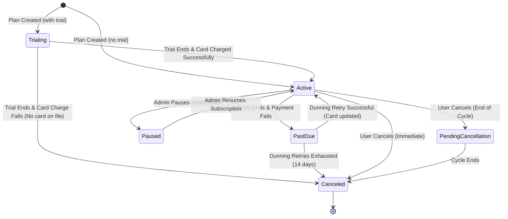
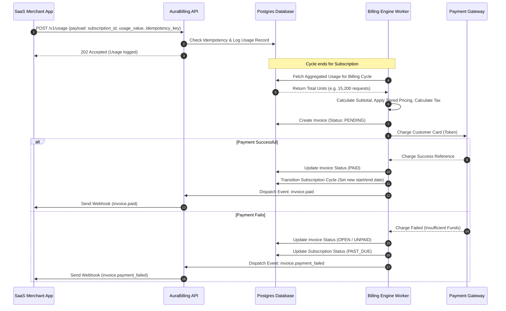
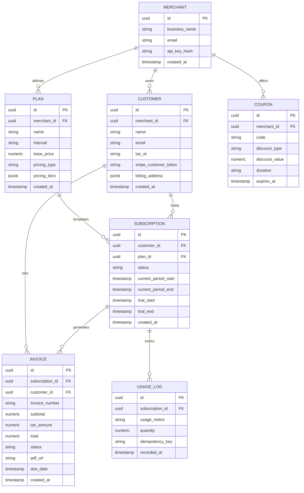
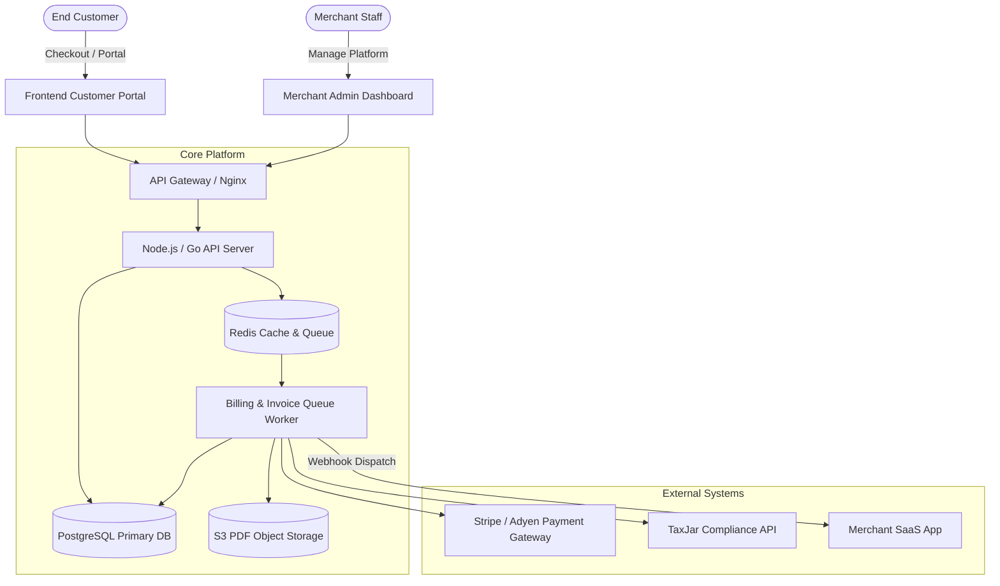

# Product Requirements Document (PRD)
## Project: SaaS Billing Platform (AuraBilling)

---

### 1. Document Control & Metadata
* **Document Version:** 1.0.0
* **Date:** 2026-06-04
* **Author:** Senior Product Manager & Solution Architect
* **Status:** Initial Draft

---

### 2. Product Overview
**AuraBilling** is a subscription billing and invoice management engine designed to help SaaS companies quickly implement pricing changes, process payments globally, manage lifecycle states, and monitor key revenue telemetry. It consists of a merchant-facing **Admin Dashboard**, developer-friendly **REST APIs / Webhooks**, and a customer-facing self-service **Customer Portal**.

---

### 3. User Roles & RBAC (Role-Based Access Control)
The platform defines access permissions based on roles:
1. **Merchant Administrator:** Full write/read access to all plans, customer details, invoices, refunds, API settings, and developer logs.
2. **Merchant Support Representative:** Read-only access to customer profiles, subscriptions, and logs; write access only to issue refunds and add comments/notes.
3. **Merchant Analyst:** Read-only access to revenue dashboards, reports, and invoices. No write permissions or access to API tokens.
4. **End Customer (Subscriber):** Direct passwordless access (via magic link) to their billing profile to download past invoices and modify their payment methods.

---

### 4. Product Epics & Features

| Epic ID | Epic Name | Description | Features Included |
| :--- | :--- | :--- | :--- |
| **EPIC-SUB** | Subscription & Plan Management | Define pricing plans and manage subscriber state transitions. | FEAT-SUB-01: Plan Builder<br>FEAT-SUB-02: Lifecycle Engine<br>FEAT-SUB-03: Proration Engine |
| **EPIC-PAY** | Payment Processing | Card charging, vaulting, and automatic dunning retries. | FEAT-PAY-01: Vaulting & Checkout<br>FEAT-PAY-02: Retry & Dunning |
| **EPIC-INV** | Invoicing & Taxation | Generation of compliant PDF documents and tax calculation. | FEAT-INV-01: PDF Invoice Generator<br>FEAT-INV-02: Tax Engine Integration |
| **EPIC-PORT** | Customer Portal | Self-service billing area for subscribers. | FEAT-PORT-01: Passwordless Magic-Link Access<br>FEAT-PORT-02: Card & Plan Management |
| **EPIC-COUP** | Coupons & Promotions | Creating discount rules for marketing. | FEAT-COUP-01: Coupon Code Manager |
| **EPIC-MTR** | Usage Metering | Recording events for usage-based billing. | FEAT-MTR-01: Ingestion API<br>FEAT-MTR-02: Usage Aggregator |
| **EPIC-API** | Webhooks & Developer Tools | Integrations, alerts, and debug tools. | FEAT-API-01: Event Stream & Webhooks<br>FEAT-API-02: Dev Sandbox & API Keys |
| **EPIC-ADMN** | Admin Dashboard & Analytics | Merchant reporting and operations console. | FEAT-ADMN-01: Core Financial Analytics Dashboard<br>FEAT-ADMN-02: Operations Console |

---

### 5. User Stories & Acceptance Criteria

#### Epic: Subscription & Plan Management (EPIC-SUB)
* **US-SUB-01 (Plan Configuration):** As a Merchant Administrator, I want to create subscription plans with monthly/yearly pricing options and define flat-rate or tiered structures, so that I can sell products with diverse packages.
  * *Acceptance Criteria:*
    * Mapped to `FEAT-SUB-01`.
    * Admin can set plan name, description, trial period (days), interval (monthly, yearly), and pricing model.
    * Tiered pricing must allow defining price points (e.g., $10/unit for first 10 units, $8/unit for next 40, etc.).
* **US-SUB-02 (Mid-Cycle Proration):** As a Subscriber, I want to upgrade my subscription plan mid-cycle, so that I immediately access new features, only paying the prorated difference.
  * *Acceptance Criteria:*
    * Mapped to `FEAT-SUB-03`.
    * Upgrades must adjust client access immediately.
    * The next invoice must credit the unused portion of the old plan based on `RULE-001` (BRD) and charge the remaining portion of the new plan.

#### Epic: Payment Processing (EPIC-PAY)
* **US-PAY-01 (Secure Card Vaulting):** As a Subscriber, I want to save my payment card during checkout without exposing raw numbers to the merchant's servers, so that I feel secure.
  * *Acceptance Criteria:*
    * Mapped to `FEAT-PAY-01`.
    * Direct integrations with Stripe/Adyen Elements to tokenize credit cards.
    * Database stores payment token ID, last 4 digits, brand, and expiration date. No raw PAN/CVV stored.
* **US-PAY-02 (Automated Dunning Alerts):** As a Merchant Administrator, I want the system to notify customers automatically when a payment fails and schedule card retries, so that I can prevent passive churn.
  * *Acceptance Criteria:*
    * Mapped to `FEAT-PAY-02`.
    * On payment failure, send email with a secure link to update credit card.
    * Schedule retries at +1, +3, +7, and +14 days. State transitions to `past_due` on day 1.

#### Epic: Invoicing & Taxation (EPIC-INV)
* **US-INV-01 (Automated Invoicing):** As a Finance Manager, I want the system to automatically generate a localized, tax-compliant PDF invoice when a subscription is paid or a cycle closes, so that I do not have to write them manually.
  * *Acceptance Criteria:*
    * Mapped to `FEAT-INV-01`.
    * Generated PDF contains unique invoice number, merchant details, customer tax ID, line items, calculated tax, net total, and payment status.
    * File stored securely in object storage (S3-compatible) with temporary pre-signed links.
* **US-INV-02 (Dynamic Tax Calculation):** As a Subscriber, I want my invoice to show the correct local tax based on my country, so that I can comply with local accounting policies.
  * *Acceptance Criteria:*
    * Mapped to `FEAT-INV-02`.
    * Tax rate computed dynamically by sending address details to the tax engine integration.

#### Epic: Customer Portal (EPIC-PORT)
* **US-PORT-01 (Passwordless Login):** As a Subscriber, I want to log into my billing dashboard using a one-time magic link sent to my registered email, so that I can log in instantly without remembering another password.
  * *Acceptance Criteria:*
    * Mapped to `FEAT-PORT-01`.
    * Click "Manage Billing" on the SaaS application, receive email containing tokenized, one-time link valid for 15 minutes.

---

### 6. Functional Requirements (FR)

| ID | Requirement Details | Epic Mapped | Dependency | Edge Case Handled |
| :--- | :--- | :--- | :--- | :--- |
| **FR-001** | Support monthly, yearly, and custom duration billing frequencies. | EPIC-SUB | None | Leap-year billing cycles: subscription renewed on February 28/29 is charged on the 28th of next February or end of month. |
| **FR-002** | Perform proration credits for upgrade/downgrade of subscription plans. | EPIC-SUB | FR-001 | A mid-month downgrade that results in negative net value results in a credit balance applied to future invoices, not an immediate cash refund. |
| **FR-003** | Save credit card tokens from third-party gateway SDK without saving raw card numbers. | EPIC-PAY | None | Expired card token: checkout must fail immediately with friendly front-end validation. |
| **FR-004** | Execute credit card retries on failed payments at Day 1, 3, 7, and 14. | EPIC-PAY | FR-003 | Card expires mid-dunning: system detects card is expired, halts dunning retries, sends immediate expiration notice. |
| **FR-005** | Calculate taxes dynamically based on Customer Location criteria from `RULE-002`. | EPIC-INV | None | Invalid zip code matching address: tax engine falls back to country-level default standard rate. |
| **FR-006** | Export financial reports (MRR, ARR, Cash Flow, Churn) in CSV and JSON formats. | EPIC-ADMN | FR-001 | Void/refunded transactions: revenue charts must subtract refunds from the specific month the refund occurred, not the original payment month. |
| **FR-007** | Ingest metered usage logs through REST API endpoint in bulk. | EPIC-MTR | None | Double-reported usage: client sends duplicate payload transaction ID; system dedupes using idempotent key. |
| **FR-008** | Send webhook payloads with signature header to confirm authenticity. | EPIC-API | None | Merchant endpoint timeout: retry webhook queue using exponential backoff up to 8 times over 24 hours. |
| **FR-009** | Apply single-use, multi-month, or permanent discount codes to subscription plan. | EPIC-COUP | FR-001 | Percentage discount combined with flat-rate discount: order of operations defined (percentage applied first to subtotal, then flat-rate discount). |
| **FR-010** | Provide hosted, secure, mobile-friendly invoice downloads and portal views. | EPIC-PORT | FR-001 | Subscriber has multiple active subscriptions: portal aggregates all active subscriptions on a single profile dashboard. |

---

### 7. User Flows

#### 7.1 Subscription Lifecycle Flow
The diagram below details the state machine transitions of a customer subscription.



#### 7.2 Metered Usage Ingestion & Billing Flow
The sequence diagram below displays how usage logs are ingested, aggregated, and billed at cycle end.



---

### 8. Pages / Screens & UI Wireframe Outlines

#### 8.1 Admin Dashboard Console
* **Navigation Sidebar:** Dashboard Overview, Customers, Subscriptions, Invoices, Coupons, Developer Settings (API Keys/Webhooks), Audit Logs.
* **Dashboard Overview Page:**
  * *Top Ribbon Metric Cards:* MRR ($ Value & Trend), Churn Rate (Percentage & Trend), LTV ($ Avg), Active Subscriptions (Count).
  * *Main Component:* Highcharts line graph displaying Revenue Trend over 30d, 90d, 12mo.
  * *Recent Transactions Table:* Columns: Date, Invoice ID, Customer Email, Amount, Status Badge (Paid, Pending, Failed).
* **Subscriptions Detail Page:**
  * *Customer Profile Summary Card:* Name, ID, Signup Date, Address, Currency.
  * *Active Subscriptions Card:* Plan Name, billing cycle period, next payment date, current accrued metered usage.
  * *Billing History Table:* Clickable list of past invoices with download links.
  * *Administrative Action Buttons:* [Refund Transaction], [Pause Plan], [Change Plan], [Apply Discount].

#### 8.2 Customer Portal View
* **Access Mode:** Hosted layout, mobile-responsive, CSS variables mapping customer's brand colors.
* **Summary Card:** Display current subscription level, price, renewal date.
* **Manage Card Component:** Displays saved card type logo, last 4 digits, expiration date. Button: `[Update Payment Method]` which reveals Stripe Element input modal.
* **Billing History Section:** List of all invoices sorted chronologically. Rows have columns: Date, Invoice Number, Amount, Status Badge, and download `[PDF]` icon button.

---

### 9. API Requirements

All API payloads use JSON. Authentication is handled via Bearer API token keys: `Authorization: Bearer sk_live_...`.

#### 9.1 Create Customer
* **Endpoint:** `POST /v1/customers`
* **Request Payload:**
```json
{
  "email": "customer@company.com",
  "name": "Acme Corp",
  "description": "Enterprise customer",
  "tax_id": "EU123456789",
  "address": {
    "line1": "123 Tech Boulevard",
    "city": "Berlin",
    "state": "Berlin",
    "postal_code": "10115",
    "country": "DE"
  }
}
```
* **Response Payload (201 Created):**
```json
{
  "id": "cust_8f9024j94j",
  "object": "customer",
  "email": "customer@company.com",
  "name": "Acme Corp",
  "tax_id": "EU123456789",
  "created_at": 1780598400
}
```

#### 9.2 Create Subscription
* **Endpoint:** `POST /v1/subscriptions`
* **Request Payload:**
```json
{
  "customer_id": "cust_8f9024j94j",
  "plan_id": "plan_enterprise_gold",
  "coupon_code": "SUMMER30",
  "payment_method_id": "pm_1H2i3o4k5j"
}
```
* **Response Payload (201 Created):**
```json
{
  "id": "sub_92k02kasj8",
  "object": "subscription",
  "customer_id": "cust_8f9024j94j",
  "plan_id": "plan_enterprise_gold",
  "status": "active",
  "current_period_start": 1780598400,
  "current_period_end": 1783190400,
  "discount": {
    "coupon": "SUMMER30",
    "amount_off": null,
    "percent_off": 30
  }
}
```

#### 9.3 Ingest Metered Usage
* **Endpoint:** `POST /v1/usage`
* **Headers:** `Idempotency-Key: idemp_key_uuid_123`
* **Request Payload:**
```json
{
  "subscription_id": "sub_92k02kasj8",
  "usage_metric": "api_calls",
  "quantity": 150,
  "timestamp": 1780602000
}
```
* **Response Payload (202 Accepted):**
```json
{
  "id": "usg_0ak293ka82",
  "object": "usage_record",
  "subscription_id": "sub_92k02kasj8",
  "quantity": 150,
  "status": "accepted"
}
```

---

### 10. Database Entities (Entity Relationship Design)



---

### 11. Security Requirements
* **SEC-001 (PCI-DSS Compliance):** The application backend must not process or store credit card Primary Account Numbers (PAN) or verification values (CVV) in logs or databases. Tokenized frames (Stripe Elements) must handle payment input fields directly.
* **SEC-002 (Data Encryption):** All user data must be encrypted in transit using TLS 1.3, and all databases must use AES-256 transparent data encryption at rest. Secret API keys (`sk_live_...`) must be hashed using SHA-256 before database storage.
* **SEC-003 (Webhook Security):** All webhook payloads must contain a `X-Aura-Signature` header computed as a HMAC-SHA256 signature using a merchant-specific secret key over the request body to prevent verification spoofing.
* **SEC-004 (Rate Limiting):** API limits will be enforced to prevent abuse: Maximum of 100 requests per minute per IP for anonymous requests, and 5000 requests per minute per authenticated API credential.

---

### 12. Non-Functional Requirements (NFR)
* **NFR-001 (Latency):** API response times for payment intent initiation and validation requests must remain under 200 ms (p95), excluding payment gateway network hops.
* **NFR-002 (High Availability):** The database and API endpoints must achieve an uptime of 99.95% using multi-AZ deployment configurations and database replication.
* **NFR-003 (Write Throughput):** Usage ingestion endpoint must scale dynamically to handle spike workloads of up to 10,000 requests per second using queue-based buffering (Redis/SQS).
* **NFR-004 (Data Retention):** Historical transaction and invoicing data must be preserved securely for a minimum of 7 years to satisfy general tax compliance audits.

---

### 13. Technical Architecture Overview
The system relies on a microservices-inspired multi-tier architecture to scale ingest queues independently from the web dashboards.



---

### 14. Future Enhancements (Roadmap)
* **Auto-Routing (V2):** Route transactions automatically across different payment gateways (Stripe, Adyen, Braintree) based on historical success rates and transaction costs.
* **AI Dunning Optimization (V3):** Leverage machine learning to predict the optimal retry time for failed card charges (e.g., retrying cards at 10 AM on a customer's payday) to maximize cash collection.
* **Native ERP Integrations (V2):** Native synchronization hooks to push ledger transactions straight into QuickBooks, NetSuite, and Xero.
