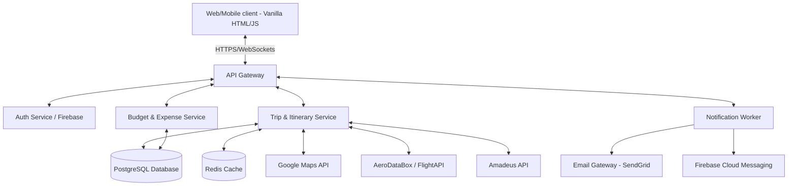
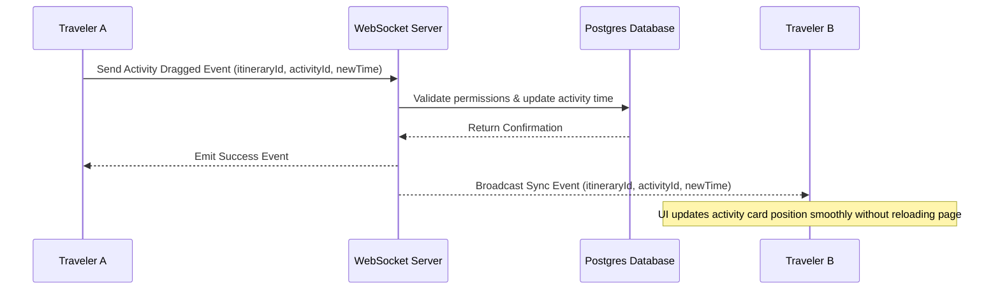
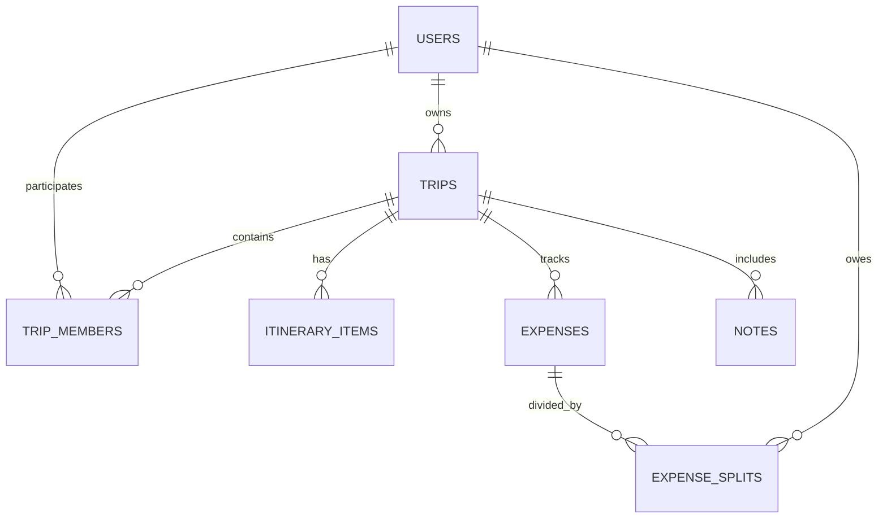

# Product Requirements Document (PRD)
## Project: Globetrotter - Travel Planning Platform
**Document Version:** 1.0.0  
**Author:** Solution Architect & Senior Product Manager  
**Date:** June 4, 2026

---

## 1. Product Overview
Globetrotter is a modern, collaborative travel platform that assists users in discovering new destinations, planning daily itineraries, managing shared trips, calculating dynamic budgets, tracking flights in real time, and receiving localized recommendations. Designed for both solo and group travelers, Globetrotter brings all travel coordination into one visually premium, high-performance web interface.

---

## 2. User Roles & Access Control

* **UR-01: Anonymous Visitor:** Can browse landing pages, search public destinations, and estimate basic trip budgets using mock data. Cannot create trips, save plans, or collaborate.
* **UR-02: Registered User (Owner):** Can create trips, invite co-travelers, add itinerary items, add custom notes, set budgets, configure notifications, and delete their own trips.
* **UR-03: Co-Traveler (Collaborator):** A registered user invited to a trip by the Owner. Depending on permission levels, they can either have **Read-Write** permissions (modify plans, expenses, notes) or **Read-Only** permissions (view plans). They cannot delete the trip.

---

## 3. Product Epics & Features

### EP-001: Trip Lifecycle & Workspace Setup
* **FE-101: Trip Creator & Planner:** Standard CRUD operations on trips.
* **FE-102: Collaborative Workspace (Shared Trips):** Invite collaborators via secure tokenized links, manage permissions, and stream live editing sessions.

### EP-002: Dynamic Itinerary & Geography
* **FE-201: Drag-and-Drop Itinerary Builder:** Multi-day calendar view for planning activities, meals, and transit.
* **FE-202: Interactive Map Integration:** Plotting itinerary points on a map, providing navigation routes, and estimated travel times.
* **FE-203: Shared Travel Notes:** A rich-text note editor for checklists, passport details, and general trip notes.

### EP-003: Discovery & Recommendations
* **FE-301: Destination Discovery Feed:** Curated search engine for travel locations with filters (cost, style, weather).
* **FE-302: Smart Hotel & Lodging Recommendations:** Tailored lodging suggestions matching itinerary hubs and user budgets.

### EP-004: Budget Management
* **FE-401: Budget Calculator & Expense Tracker:** Setting a trip budget ceiling, tracking expenses by category, support for multiple currencies, and automatic division of group expenditures.

### EP-005: Travel Logistics & Real-Time Alerts
* **FE-501: Commercial Flight Tracker:** Live flight searching, parsing status updates, and automatic schedule injection.
* **FE-502: Push & Email Notification System:** Real-time push alerts for itinerary updates, expense additions, and flight changes.

---

## 4. User Stories & Functional Requirements

Every functional requirement is numbered and specifies its dependencies and edge cases.

### 4.1 Epic: EP-001 - Trip Lifecycle & Workspace Setup

#### User Story: US-101 (Create Trip)
> As a Registered User, I want to create a new trip with a destination, start/end dates, and a title, so that I can begin planning my itinerary.
* **FR-1.1:** The system shall display a trip creation wizard prompting for Title, Primary Destination, Start Date, End Date, and Trip Style (Backpacker, Moderate, Luxury).
  * *Dependency:* UR-02 (Registered User role).
  * *Edge Case:* If the End Date is before the Start Date, block submission and output error code `ERR_TRIP_DATE_01`.
* **FR-1.2:** The system shall fetch a high-resolution cover image of the destination from Unsplash/Pexels API. If the image fetch fails, default to a fallback generic travel graphic.
  * *Dependency:* None.
  * *Edge Case:* Handle API down times gracefully by using a local SVG placeholder image.
* **FR-1.3:** The system shall validate that the total trip duration does not exceed 90 days.
  * *Dependency:* None.
  * *Edge Case:* Show warning `ERR_TRIP_LIMIT` if user selects >90 days and restrict submission.

#### User Story: US-102 (Collaborative Invites)
> As a Trip Owner, I want to share a secure link with friends, so that they can join the workspace as co-travelers.
* **FR-1.4:** The system shall generate a unique cryptographic tokenized URL (valid for 7 days) to invite co-travelers.
  * *Dependency:* FE-101.
  * *Edge Case:* If the link is clicked after 7 days, render an "Invite Expired" screen with a prompt to contact the owner.
* **FR-1.5:** The system shall allow the Owner to toggle permissions of co-travelers between `Read-Write` and `Read-Only`.
  * *Dependency:* UR-02, FE-102.
  * *Edge Case:* If the owner downgrades a user to `Read-Only` while they are actively editing, revoke edit tokens immediately via WebSockets.

---

### 4.2 Epic: EP-002 - Dynamic Itinerary & Geography

#### User Story: US-201 (Itinerary Building)
> As a Collaborator, I want to add, edit, and drag-and-drop activities in a daily calendar interface, so that we can organize our days chronologically.
* **FR-2.1:** The system shall provide a multi-day timeline showing columns for each day of the trip, supporting time-slotted activity blocks.
  * *Dependency:* FE-101.
  * *Edge Case:* Multi-day activities (e.g., overnight train) must span multiple day columns visually.
* **FR-2.2:** The system shall automatically update the itinerary chronologically when an activity card is dragged to a different time slot or day.
  * *Dependency:* None.
  * *Edge Case:* If two activities overlap in time, highlight both in amber to flag a scheduling conflict, but do not prevent the action.

#### User Story: US-202 (Map Integration)
> As a Traveler, I want to see our itinerary stops plotted on an interactive map, so that I can visualize our travel path and optimize travel routes.
* **FR-2.3:** The system shall integrate Google Maps API/Mapbox to automatically place markers for each itinerary activity that has a valid location/address.
  * *Dependency:* FE-201.
  * *Edge Case:* If a location geocoding fails, render the activity card without a map marker and display a "Resolve Address" warning indicator.
* **FR-2.4:** The system shall draw optimized driving/walking routes between sequential activities on the same day, calculating travel time and distance.
  * *Dependency:* FR-2.3.
  * *Edge Case:* If activities are on different islands or separated by major water bodies without bridges, skip line-drawing and display a "Ferry or Flight needed" label.

#### User Story: US-203 (Rich Travel Notes)
> As a Collaborator, I want to write markdown-based notes, so that we can store hotel reservation details and packing lists.
* **FR-2.5:** The system shall provide a collaborative Markdown editor supporting checklists, headers, and hyperlinks.
  * *Dependency:* FE-102.
  * *Edge Case:* If concurrent users edit the same paragraph, merge changes based on cursor position. If merge fails, highlight conflict and save a backup copy.

---

### 4.3 Epic: EP-003 - Discovery & Recommendations

#### User Story: US-301 (Destination Discovery)
> As a User, I want to search destinations based on my budget level and interests, so that I can decide where to go.
* **FR-3.1:** The system shall allow users to search and filter destination databases by Region, Trip Budget Category, Weather, and Tag (Adventure, Culture, Culinary, Beach).
  * *Dependency:* None.
  * *Edge Case:* If search returns zero matches, provide at least three alternative recommendations based on matching single tags.

#### User Story: US-302 (Lodging Recommendations)
> As a Planner, I want to see hotel options near our planned activities, so that I can book lodging efficiently.
* **FR-3.2:** The system shall query hotel APIs (e.g., Amadeus/Booking.com) within a 5-mile radius of the user's primary itinerary stops.
  * *Dependency:* FE-101, FE-202.
  * *Edge Case:* If no hotels are found within 5 miles, expand radius automatically to 15 miles and notify the user of the radius change.

---

### 4.4 Epic: EP-004 - Budget Management

#### User Story: US-401 (Expense Tracker & Splitter)
> As a Group Traveler, I want to add expenses, assign who paid, and select who splits the bill, so that we can keep track of finances.
* **FR-4.1:** The system shall allow users to log expenses with a Title, Cost, Currency (USD, EUR, GBP, local destination currency), Payer, and Split-ratio (Equal, Custom).
  * *Dependency:* FE-102.
  * *Edge Case:* Handle division of odd cents (e.g., split $10.00 among three people as $3.34, $3.33, $3.33) without losing balances.
* **FR-4.2:** The system shall convert foreign expenses to the primary trip currency using live API exchange rates cached daily.
  * *Dependency:* None.
  * *Edge Case:* If currency API is offline, fall back to the last cached exchange rate and add an asterisk stating "Exchange rate as of [date]".
* **FR-4.3:** The system shall compute a debt matrix displaying who owes whom how much, and display an option to mark balances as settled.
  * *Dependency:* FR-4.1.
  * *Edge Case:* Settled amounts must write a compensating balance transaction to prevent retroactive ledger alterations.

---

### 4.5 Epic: EP-005 - Travel Logistics & Real-Time Alerts

#### User Story: US-501 (Flight Tracker)
> As a Traveler, I want to input my flight code and receive automatic schedule updates, so that I know if our flights are on time.
* **FR-5.1:** The system shall validate flight codes (e.g., LH430, UA101) against flight status databases and display Departure/Arrival gates, terminal, and status.
  * *Dependency:* None.
  * *Edge Case:* If a flight code is valid but has no scheduled data (e.g., flight is 6 months away), set status to "Pending Schedule" and schedule active tracking starting 72 hours before departure.
* **FR-5.2:** The system shall automatically append verified flight legs to the user's daily itinerary planner as fixed activity blocks.
  * *Dependency:* FE-201.
  * *Edge Case:* If a flight time changes and conflicts with manual activities, shift the flight block and flag conflicts on the overlapping manual items.

#### User Story: US-502 (Real-Time Notifications)
> As a Collaborator, I want to receive immediate alerts when flight statuses change or when group members edit our plans.
* **FR-5.3:** The system shall trigger email and push notifications for:
  1. Flight status changes (Delays, cancellations, gate changes).
  2. Trip budget exceeding 90% of total limit.
  3. Co-traveler edits on collaborative itinerary.
  * *Dependency:* FE-102, FE-401, FE-501.
  * *Edge Case:* If a user is offline, queue notifications on the backend and deliver them immediately upon login.

---

## 5. Technical Architecture & Data Flows

### 5.1 System Architecture Diagram


### 5.2 Dynamic Real-Time Collaboration Flow


---

## 6. Database Schema (Entities & Relationships)

### 6.1 Entity-Relationship Table Mapping



#### `users` Entity
* `id` (UUID, Primary Key)
* `email` (VARCHAR, Unique)
* `password_hash` (VARCHAR)
* `display_name` (VARCHAR)
* `avatar_url` (VARCHAR, Nullable)
* `created_at` (TIMESTAMP)

#### `trips` Entity
* `id` (UUID, Primary Key)
* `owner_id` (UUID, Foreign Key referencing `users.id`)
* `title` (VARCHAR)
* `destination` (VARCHAR)
* `start_date` (DATE)
* `end_date` (DATE)
* `budget_limit` (DECIMAL)
* `currency` (VARCHAR, Default 'USD')
* `created_at` (TIMESTAMP)

#### `trip_members` Entity (Collaboration Mapping)
* `id` (UUID, Primary Key)
* `trip_id` (UUID, Foreign Key referencing `trips.id`)
* `user_id` (UUID, Foreign Key referencing `users.id`)
* `role` (VARCHAR, 'owner' or 'editor' or 'viewer')
* `joined_at` (TIMESTAMP)

#### `itinerary_items` Entity
* `id` (UUID, Primary Key)
* `trip_id` (UUID, Foreign Key referencing `trips.id`)
* `title` (VARCHAR)
* `description` (TEXT)
* `start_time` (TIMESTAMP)
* `end_time` (TIMESTAMP)
* `location_name` (VARCHAR)
* `latitude` (DECIMAL)
* `longitude` (DECIMAL)
* `category` (VARCHAR, 'flight', 'lodging', 'activity', 'food', 'transit')
* `external_id` (VARCHAR, Nullable) -- e.g., Flight code or Google Place ID

#### `expenses` Entity
* `id` (UUID, Primary Key)
* `trip_id` (UUID, Foreign Key referencing `trips.id`)
* `payer_id` (UUID, Foreign Key referencing `users.id`)
* `amount` (DECIMAL)
* `currency` (VARCHAR)
* `exchange_rate` (DECIMAL) -- To convert to trip primary currency
* `category` (VARCHAR, 'food', 'stay', 'tickets', 'transit', 'shopping', 'other')
* `spent_at` (DATE)

#### `expense_splits` Entity
* `id` (UUID, Primary Key)
* `expense_id` (UUID, Foreign Key referencing `expenses.id`)
* `debtor_id` (UUID, Foreign Key referencing `users.id`)
* `amount` (DECIMAL) -- Share of expense owed by debtor

---

## 7. API Requirements (Restful Endpoints)

All request/response bodies require JSON payloads. Authed headers mandate `Authorization: Bearer <JWT_TOKEN>`.

### 7.1 Authentication & Profile
* **POST `/api/auth/register`**: Register user.
* **POST `/api/auth/login`**: Authenticate user & return JWT token.

### 7.2 Trip Management
* **GET `/api/trips`**: Retrieve all trips associated with logged-in user.
* **POST `/api/trips`**: Create new trip workspace.
* **DELETE `/api/trips/:tripId`**: Delete trip (Owner only).

### 7.3 Collaboration
* **POST `/api/trips/:tripId/invite`**: Generate invitation link token.
* **POST `/api/trips/join/:token`**: Add user to trip member directory.
* **PATCH `/api/trips/:tripId/permissions`**: Modify user roles (Owner only).

### 7.4 Itinerary Management
* **POST `/api/trips/:tripId/itinerary`**: Add activity card.
* **PUT `/api/trips/:tripId/itinerary/:itemId`**: Update activity details/timestamps.
* **DELETE `/api/trips/:tripId/itinerary/:itemId`**: Delete activity card.

### 7.5 Expenses & Budgets
* **POST `/api/trips/:tripId/expenses`**: Log expense transaction and calculate splits.
* **GET `/api/trips/:tripId/budget/summary`**: Retrieve budget vs. actual analytics.

### 7.6 Integration Proxies
* **GET `/api/flights/status/:flightCode`**: Proxies requests to flight tracking providers.
* **GET `/api/hotels/recommend`**: Fetches lodging options matching geo-coordinates and price parameters.

---

## 8. Pages & Screens Layout (UI Wireframes)

### 8.1 Desktop Navigation & Workspace Screen Layout
```
+-------------------------------------------------------------------------------+
|  [Globetrotter LOGO]     Trips  |  Discover  |  Profile          [Logout]     |
+-------------------------------------------------------------------------------+
|  +---------------------+  +-------------------------------------------------+ |
|  | MY TRIPS            |  | PARIS SUMMER TRIP (July 10 - 20)     [Share Link]  | |
|  | - Paris Trip (Active)|  +-------------------------------------------------+ |
|  | - Tokyo 2025        |  |  [ Itinerary ]  [ Budget ]  [ Map ]  [ Notes ]      | |
|  | - Bali Weekend      |  +-------------------------------------------------+ |
|  |                     |  | Day 1 - July 10 (Tuesday)                       | |
|  | [ + Create Trip ]   |  | -- 09:00 AM: Flight UA101 Landing [Track]       | |
|  |                     |  | -- 12:00 PM: Check-in Hotel Lutece [Hotel Info] | |
|  |                     |  | -- 03:00 PM: Louvre Museum Tour [View Map]      | |
|  |                     |  |                                                 | |
|  |                     |  | [ + Add Activity ]  [ Drag-and-drop handles ]   | |
|  +---------------------+  +-------------------------------------------------+ |
+-------------------------------------------------------------------------------+
```

---

## 9. Security Requirements

* **SEC-101: Encryption in Transit & Rest:** All communications must utilize TLS 1.3. Database storage drives must use AES-256 block encryption. Passwords must be hashed using `bcrypt` with a minimum cost factor of 12.
* **SEC-102: Cross-Origin Resource Sharing (CORS):** Strict CORS policies restricting API access only to authenticated client domains.
* **SEC-103: API Authentication & Authorization:** All API requests except register/login must authenticate using JSON Web Tokens (JWT) signed with a rotateable HS256 key. Permissions must be validated against `trip_members` role levels before processing changes.
* **SEC-104: Secure WebSocket Channels:** WebSocket connections must mandate auth validation on connection handshake, discarding subscriptions if user validation fails.
* **SEC-105: Input Sanitization:** Prevent SQL injection using parameterized queries. Clean all notes input using DOMPurify before rendering markdown.

---

## 10. Non-Functional Requirements (NFR)

* **NFR-201: Performance (LCP):** The Largest Contentful Paint (LCP) must occur under 2.0 seconds on standard 4G connections.
* **NFR-202: Scalability:** The backend must handle up to 5,000 concurrent active WebSocket connections during peak periods without performance degradation.
* **NFR-203: Reliability:** The application must maintain 99.9% uptime (excluding pre-scheduled monthly maintenance windows under 2 hours).
* **NFR-204: Browser Compatibility:** Fully functional on all modern web browsers: Chrome 90+, Safari 14+, Firefox 88+, and Edge 90+.
* **NFR-205: Localization:** Interface must adapt to system local time formats (12-hour or 24-hour) and currencies.

---

## 11. Future Enhancements

* **FE-901: Offline Mode with Conflict Resolution:** Local Storage queueing of edits while offline, syncing on network reestablishment.
* **FE-902: AI Auto-Itinerary Generator:** Generating optimized activity sheets given keywords (e.g. "Paris, 3 days, family, art").
* **FE-903: Live Currency Ledger Settling:** Linking external payment APIs for digital settling of bills.
